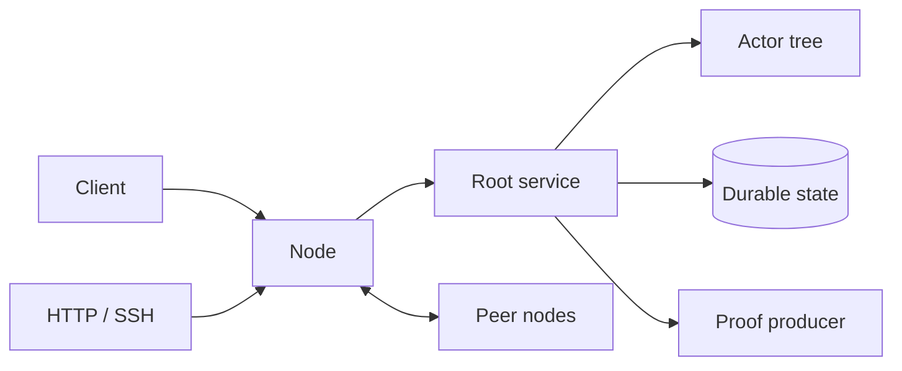

# VOS

VOS runs signed actors across a group of operator-owned nodes. Actors are
small Rust programs with durable state, typed messages, explicit authority,
and a chosen consistency model.



The repository contains one application model:

- `#[actor]` defines an actor.
- `vosx build` creates a signed `.vos` package.
- `vosx space publish` records that exact package by content hash.
- `vosx space install` creates a root service from it.
- Local, Raft, and CRDT roots share the same actor and package APIs.

## Start here

```bash
cargo run -p vosx -- new hello
cargo run -p vosx -- build hello --name hello
cargo run -p vosx -- space new demo
cargo run -p vosx -- space up demo \
  --service-pvm services/vos-service/vos-service.pvm \
  --allow-conformance
```

In another terminal:

```bash
cargo run -p vosx -- space publish demo hello dist/hello.vos
cargo run -p vosx -- space install demo hello --consistency local
cargo run -p vosx -- hello value --space demo
```

See [Getting started](docs/getting-started.md),
[Architecture](docs/architecture.md), and
[Operations](docs/operations.md).

## Repository map

| Path | Purpose |
| --- | --- |
| `vos/` | Actor SDK, service runtime, replication, networking |
| `vosx/` | Build, space, and operator CLI |
| `pvm/` | Bytecode runtime, compiler, codec, and proof system |
| `services/` | Generic service guest |
| `actors/` | Platform actors |
| `examples/` | Small supported applications |
| `extensions/` | Trusted request/response host workers |

HTTP and SSH are built-in ingress adapters. HTTP exposes package schemas and
actor methods; SSH serves a semantic terminal for members to discover and
manage the space. Native extensions remain request/response workers called by
actors and never own public listeners.

## Development

```bash
just build-test-artifacts
cargo test --workspace
```

Artifacts committed under `services/` and `vosx/blobs/` are protocol
identities. Rebuild them only through the checked release recipes.

## License

VOS-owned code is licensed under the GNU Affero General Public License,
version 3 or later. The imported PVM crates retain their Apache-2.0 license;
their provenance and license are documented in [`pvm/`](pvm/README.md).
