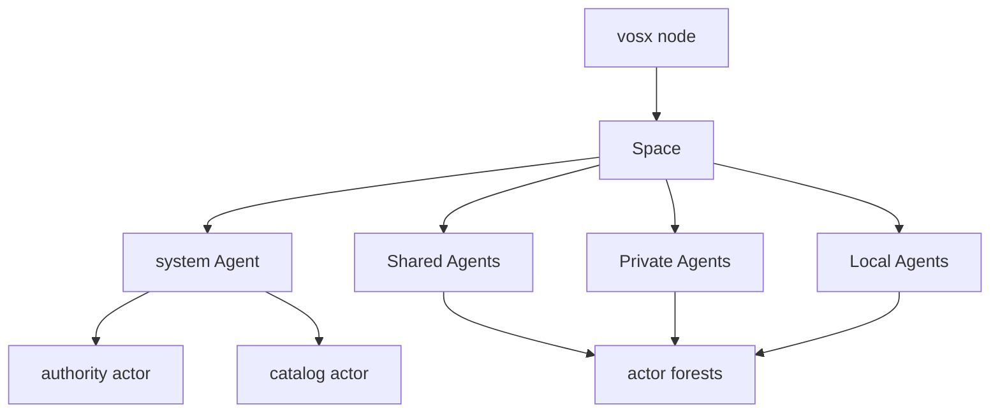

# VOS

VOS runs durable Agents across operator-controlled nodes. Each Agent owns an
immutable profile, one runtime, one replica set, explicit permissions, and a
forest containing zero or more signed actors. The standard runtime and both
system actors are embedded in the `vosx` binary, so a fresh installation does
not need an auxiliary execution program.



Profiles determine placement and replication:

- Local: exactly one node; all state stays on that node.
- Shared: catalog-visible, with Raft-ordered Linear state, convergent Merge
  state, and per-replica Local state.
- Private: visible only to one Principal's authorized Nodes, with encrypted
  Merge and Local state. Linear state is deliberately unavailable here.

Principal, Node, and Credential identities are distinct. A client credential
authenticates a Principal; the full transport identity authenticates a Node;
neither can be substituted for the other.

## First Agent

```bash
vosx space new demo
vosx space up demo

vosx agent create demo notes --profile shared
vosx agent show demo/notes

vosx actor new board
vosx actor build board --name board
vosx actor install demo/notes board/dist/board.vos --name board

vosx call demo/notes/board add-task --id 1 --text "Ship it"
```

`vosx actor build` creates one signed `VOS3` envelope. Actor and custom
AgentRuntime packages use the same envelope with an explicit package kind.
Human-readable names are mutable directory aliases; durable work binds exact
content, deployment, Agent, actor, and invocation identities.

HTTP uses `/<agent>/<actor>/<method>`. The SSH terminal follows the same
Space → Agents → Actors → Methods hierarchy and reports profile, state lane,
freshness, attestation, and idempotency requirements before invocation.

Read [Getting started](docs/getting-started.md),
[Architecture](docs/architecture.md), [Actors and packages](docs/actors.md),
and [Operations](docs/operations.md).

## Repository map

| Path | Purpose |
| --- | --- |
| `vos-agent-sdk/` | public no-std Agent contracts and wire formats |
| `vos/` | Agent hosts, replication, networking, and ingress |
| `vosx/` | authoring, node, and operator CLI |
| `actors/` | authority and catalog system actors |
| `services/agent-runtime*` | embedded standard AgentRuntime |
| `pvm/` | standard-program runtime, compiler, and proof implementation |
| `examples/` | small maintained actor and custom-runtime examples |

## Development

```bash
just build-test-artifacts
cargo test --workspace -- --test-threads=1
```

Committed artifacts under `vosx/blobs/` are protocol identities. Reproduce
and verify them only through the checked release recipes.

## License

VOS-owned code is licensed under the GNU Affero General Public License,
version 3 or later. Imported PVM crates retain their Apache-2.0 license; their
provenance and license are documented in [`pvm/`](pvm/README.md).
