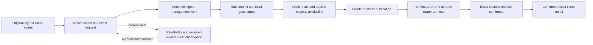

# Agent saga: v1 release checklist

This is the single live plan. [The review guide](agent-saga-review.md) is the
sole reviewer entry point. Implementation, integration and qualification are
different milestones. Internal tests or a checkpoint do not constitute release.

## Approved scope and next integrated milestone

Ship Linux x86-64, a fixed authenticated three-node Shared deployment,
production image-based Local Agents, and one external-state Shared Clerk.
Fresh external roots are required; no migration or public external-Local cutover.
The workload, latency, recovery and correctness targets below are unchanged.

Approved next priority (2026-10-02): replace internal durable Authority reads
with scoped observations and remove the obsolete read lifecycle. Fresh v1
spaces are required, including System/control and Shared roots; existing
experimental spaces stay untouched and are unsupported by the new binary.
Local execution/format remains image-based. No migration or legacy-read fallback.

The next milestone is the **released three-process Shared Clerk workflow**:
public Create/Install/Invoke, lost response, restart/catch-up and leader loss,
recovering the exact result through real filesystem owners and public routing.
Acceptance uses packaged artifacts and ordinary authenticated identities, not
test signers, environment-only guests, fake quorum or hand-edited journals.
A small vertical slice proves integration only, not capacity or service targets.

Review branch: `e6f2bb45` on `saga/agents`. Original replacement source `8128e677`
and its role bundle `7085c220` precede the decoder/integration correction.
Corrected source is frozen at `2e19cd17` on `wip/ch08-runtime-directory`;
two independent builds match both runtime roles, Authority, Catalog and signed
Clerk bytes. The coherent pin update is frozen at `da86c686`, with verifier
provenance at `39f1f6bb`. These
checkpoints are not a release promotion.
Verify actual heads/cleanliness before assuming promotion.
`master` remains `d2378274`. No push, master change, artifact pin promotion or
deployment is automatic.

## Current position

Latest admitted evidence is bound to clean
`7c53fbf35969d19ccfcc5923b9eb804491e68ae0`.
[Completed R63](#completed-r63-borrowed-recovery-call-attribution) measures four
original-owner borrowed recovery calls returning Unavailable, with direct
durations 14.889635s, 3.174096s, 7.814612s and 11.710376s. The helper returns
Unavailable at 37.619044s; its constructor returns Err at 57.248496s.
Scoped/quiet fixtures fail Shared recovery before routes, not the later whole30
assertion. Exact Install finalization is accepted and issuer-saved; retirement
then refuses. The later original ACK reaches durable anchors, buffer Ready and
completed result wait, then separately refuses availability. Successful owner
ACK, terminal persistence and release remain unproved.

Next bounded attribution concerns original-owner ACK recovery/capsule waiting,
leader capacity/preparation and post-wait availability, plus earlier exact
finalization-registration refusals. ACK already uses one capacity-and-manifest
audit; only final Invoke owns two separately fresh absence audits.
[R64 capacity-context diagnostics](#r64-custody-capacity-context-attribution--applied)
are applied, awaiting a new checkpoint/build/reader/fixture. No audit
suppression or behavior remedy is selected.
R62's accepted late release/66.719104s Ok constructor and R60's separate refusal
remain frozen histories; current timings do not retrospectively explain them.
Required earlier-Create fresh verification remains mandatory. Latest ordinary
CLI stays R57: Local Create/Install complete, then Query authorization preparation
fails HTTP 503 before Invoke. M1 remains open. No new behavior candidate,
architecture, authority, cap/deadline extension, controlled speedup or promotion.

### Completed R56 registration-fold attribution

Continue the authorized causal investigation after completed R55 below. The
largest measured branch is registration folding, but its removable share is
unknown. R56 measures the existing checked request, incoming verification,
prospective evidence, constructed-slot validation, changed-candidate validation,
manifest finalization and physical commitment comparison. Reuse one std-only
gated timing helper, existing release/observation spans and exact registration
commitments; no body, signature, memory address or diagnostic input is exported.

All original calls, Result propagation, signature-before-retry, validation,
candidate assignment, physical reads, guards and deadlines retain their order.
This is diagnostic only, not a sixth behavior candidate, fresh-audit suppression,
guest change, architecture replacement or cap extension. The function timings
are nested; repeated metadata/registration identities do not identify attempts
or permit adjacency-based pairing.

**Implementation:** diagnostic source is frozen at
`53b7be162e122be3e8eb76a3add57ac5cb9862a7`. Independent source reviews pass. The
finite reader retains both original audit validators and all admission fences;
**54 acceptance / 72 refusal** synthetic cases and privacy/alias checks pass
without loading helpers or private inputs.

**Integration:** current portable main/harness pass **391.898s / 459.891s**,
strict six-file verification **0.101s**. One isolated scoped all-cold attempt
fails **245.670s**, one failed test, exhausted noninterrupted owned group. Exact
source/artifact/environment/binary/input/before-after fences pass. The reviewed
reader admits **15,518 records / 622 explicit edges / zero unknowns**. All 427
complete audit bodies satisfy the four-branch partition; all 5,788 leaf records
satisfy the finite source/context schema. No quiet R56 attempt was run.

Create root `id24` reaches public Applied and exact Applied replay
(e5698/e5756), including actual original-owner release completion after an
earlier refusal. Install root `id159` crosses the verified pending cut/cold entry
(e10973/e10994). Its retained family is unchanged: invocation/work/authorization
`id158/id160/id161`, root member `id170`; registration `id186` sequence 5 binds
final child invocation/work/authorization/member `id183/id184/id185/id188`.
Root-bound issuer save (e14748) requires accepted finalization, exact reply and
durable replay equality. Both ACK availability pairs, runtime retirement and
terminal persistence complete (e14987/e14994/e15188/e15195/e15196/e15199).

Original owner `id6` release `id195`, scope `id194`, then records 12 absent polls
at `(49,2)` and timeout **1.847626s** (e15409–11), before leader `id5` proposal
(e15434–35). The leader later confirms that exact release at `(50,2)` and
completes custody/commit (e15516–18). This does not qualify original-owner
confirmation, routes or whole30. Aliases are report-local; metadata identifies
an immutable release, not a unique attempt.

The exact release's two audit bodies take **982.647ms / 964.606ms**, with
**0µs / 0µs** ledger acquisition and **0µs / 1µs** read start. Each has
**49 rows / 5 registrations / 1 historical release / 14 Ordered**. Each explicit
stage has one acquisition pair/body and 35 successful leaf records: seven per
distinct registration, with no duplicate group-phase key. These are groups,
not inferred call/row/attempt identities.

| Existing registration phase, total across five registrations | Signed validation | Capacity |
| --- | ---: | ---: |
| Checked request | 116.951ms | 114.891ms |
| Incoming verification | 35.478ms | 34.987ms |
| Prospective evidence | 32.871ms | 32.401ms |
| Constructed slot validation | 33.892ms | 34.576ms |
| Changed-candidate validation | 46.148ms | 47.345ms |
| Manifest finalization | 7.206ms | 7.664ms |
| Physical commitment comparison | 23.059ms | 22.975ms |
| Seven phase totals | 295.605ms | 294.839ms |
| Enclosing registration branch | 410.793ms | 411.143ms |

The seven brackets are sequential existing phase samples within the enclosing
registration branch, not additional costs to add to that branch or either audit.
They cover about 72% of registration folding. Residual **115.188ms / 116.304ms**
includes untimed anchor/commitment work, clones/searches/positions and diagnostic
identity hashing/tracing; its removable, CPU or diagnostic share is unproven.
The largest timed phase is checked request. Incoming verification is only
**8.64% / 8.51%** of registration cost and includes required signature, scope
and bounds checks. Its entire **70.465ms** across both audits is only an upper
bound on the repeated request validation proposed for reuse, not measured savings.
The target-only `r56-registration-verification-proposal.patch` remains unapplied,
uncompiled and unmeasured; this evidence does not prioritize a sixth tiny pass.

Leader admission reaches commit start at **2.181219s**, after owner timeout.
Later leader confirmation separately records **1688.862ms** host wait, followed
by **140µs** drain and **101.365ms** manifest verification. Holder/work remain
unknown; source proposal exclusion rules out competing proposal-first work on
the same handler, not apply work, host-only paths, other shared-host handlers or
scheduling. Unscoped rows are not assigned by proximity. Late leader presence
follows the unchanged presence-before-expiry waiter ordering.

Evidence below `target/task-tmp`:

- `r56-cli-build-53b7be16/provenance.json`, SHA
  `81eee2338384098672d6bb43ae3b6d94479df2b047375e1d59265d6da19288f9`.
  Main/harness SHA
  `f42b52e1293c2ca0c8966b2f37a2a4023e2e27b5f8a8e2eef59011ab63a46da0` /
  `3675f06a8fe5a03cd1b8848e3a37bf2ea56c2547b3534062feef66837d73e009`.
- `r56-pending-all-cold-scoped-53b7be16/registration-fold-safe.json`, SHA
  `7a85c8a2913fc0e091a4d9b02018ecfd05d8498a179df04333644a7ce547d5ba`.
  Reviewed reader `r56-registration-fold-safe-reader.py`, SHA
  `030b07709fe5089e7a5096685e6bb06cf21df5ecfc9de58945df6ceb54770c22`.
- `r56-registration-fold-synthetic-result.json`, SHA
  `55f607c19e678259a1516212cb6bff8cd3f9ec2646a344ba8c6b3fb217049da1`.

**Qualification at this frozen boundary:** original-owner terminal-release
confirmation remained blocked; no recovery, controlled speedup or release benefit
was credited. The reviewed combined release-admission proposal below
was explicitly authorized for implementation and qualification on 2026-10-06:
the existing full authenticated management preflight view contains both request
validation facts and capacity. Derive scalar capacity in that same fresh guarded
transaction, preserving driver provenance/signature order and the final worker
barrier/prefix-checked proposal. This changes internal coordination and removes
the second read/error boundary. This approval does not authorize a further
candidate, redesign or week-cap extension. No view or authority
may be cached/exported. The later host holder remains a separate unknown.
Actual ordinary CLI, remaining packaged gates, M2 and local/external M3 remain
open. Remedy/source hours and aggregate milestone effort are still unknown;
this completed diagnostic attempt cost is not a recovery or remaining-work ETA.

### Completed R57 combined release admission

On 2026-10-06 the user approved **"approved, just keep going"** in response to
reviewed `r56-signed-release-capacity-proposal-v4.patch`, SHA
`dee945322575f55bb23097db0ecbd55a774f1ff259fb4230d76ee0bb6f18af90`.
Root applied that exact bounded release-only coordination change after checking
clean `e30e7b03` and unchanged product source. All original limits and the
engineering-week cap remain unchanged; the tiny verification proposal is excluded.

**Implementation:** corrected source is frozen at
`4b5e3b8e2d818e3f8230ede6757ba490791e5a52`; independent source/test reviews pass.
The core build passes **36.541s**, and all **19 exact preservation units** pass
with **13.127s summed unit elapsed**, not runner wall time. They exercise the
new checked entry, original general checked APIs, signed refusals/no writes,
current-byte corruption, retained/reopened release, reservation/committee/tail
barriers and real worker progress. The fixed-three worker cases use actual
storage and quorum replies under existing limits. Later follower samples cover
the generic barrier; a separate leader case covers last/commit prefix refusal.
They prove component preservation, not public host/custody recovery or M1.

Preserve the failed compilation at `b3caa646` (**31.932s**, service/SDK test-node
type mismatch) and the `1c5279d4` fixture run (first 13 pass, unit 14 fails
**0.201s**, later five unrun) as distinct frozen evidence in
`r57-core-build-b3caa646`, `r57-core-build-1c5279d4` and
`r57-preservation-19-1c5279d4`. Corrections are test-only. The current committee
fixture confirms Prepare refuses any canonical recovery manifest, live or
released, without writes; a separate legal ledger with identical signed scope
proves transition-barrier ordering before absent-slot lookup. This does not
qualify retained Shared committee migration. The source-specific reader passes
**51 acceptance / 96 refusal** synthetic cases and privacy/alias checks with no
helper loads/private input reads.

The combined checked ledger API retains full signed release verification,
the existing writes guard, one read transaction, complete management preflight
and exact authenticated-slot/request checks, then derives scalar capacity within
that same view. No view, permit or authority is exported. Driver provenance and
host lease/SystemBootstrap restrictions stay before this signed ledger boundary.
Exact sender/route, uninterrupted guards, current worker role/term/commit/last,
audited apply equality and prefix-checked proposal remain mandatory. Registration's
actual capacity call/order is unchanged. Removing the second read removes its
independent I/O/corruption observation opportunity; same-snapshot validation order
is preserved, without claiming identical inter-read failure behavior.

**Integration:** current portable main/harness pass **430.947s / 528.764s**;
strict unchanged six-file verification passes **0.201s**. Source, artifact,
environment, binary and before/after fences pass; owned groups are exhausted
and noninterrupted. First quiet/scoped all-cold attempts fail **132.155s /
134.950s** in public Create before proof of the target combined release path.
The quiet result exposes only the typed retryable Create timeout. The scoped
result provides no combined-release execution proof; missing markers do not
establish nonexecution. Standalone guest halts/previews do not prove accepted
finalization. Neither result defines the repeated run's failure.

The repeated scoped attempt fails **251.574s**. Its reviewed reader admits
**14,424 records / 404 explicit edges / zero unknowns**. Create root `id24`
reaches public Applied and exact Applied replay. Verified pending cut/cold entry
are e9518/e9539. Install root `id194`, invocation/work/authorization
`id193/id195/id196`, retains root member `id202`; registration `id224`, sequence
5, binds final child invocation/work/authorization `id221/id222/id223` and
member `id226`. Root-bound issuer save e12981 proves accepted exact finalization
and durable replay equality. Complete-member ACK availability precedes runtime
retirement, terminal persistence and retention release (e13443/e13446/e13448).
Aliases are report-local; repeated metadata does not identify unique attempts.

Exact release `id233`, scope `id232`, retains registration `id224` and original
owner `id5`; leader is `id6`. Its **one** release-bound signed-ledger audit body
e13617 takes **1.048938s**, with **50 rows / 5 registrations / 1 historical
release / 14 Ordered**. Counts describe the retained generation, not this
Install family; the historical release row is not `id233`. Its recovery-fold
sample **789.158ms** partitions into registration **441.766ms**, historical
release **97.699ms**, Ordered **249.691ms** and other **0.002ms**. The 35
successful registration leaf records are nested samples, not additive audit
costs or unique attempt identities. Signed validation completes in
**1.056841s**; derived capacity is recorded at cumulative **1.310281s**, the
final barrier at **1.316181s**, and commit starts at **1.316203s**. The recorded
release-bound body and derived-capacity phase agree with the source call graph.
The one-management-preflight/zero-generic-capacity counter proof belongs to the
component tests; the packaged harness links `vos` without its `cfg(test)`
assertions. No separate capacity audit is fabricated and no controlled speedup
is claimed.

After ten absent polls at `(50,3)`, the original owner confirms exact release
presence at `(51,3)` (e13859), cumulative **4.905637s**, then completes local
custody and root retention release (e13860/e13861). Leader custody/commit finish
later (e13864/e13865), cumulative **4.938622s**. Their host waits are
**3.247490s / 3.272231s**; overlap and holders remain unknown, so do not add them
or attribute either to a named holder. Existing waiters test exact presence
before expiry: late Present is accepted under unchanged semantics. This is
original-owner confirmation, not timely 1.8s confirmation or a deadline waiver.

**Qualification:** the repeated run fails the unchanged whole pending-Install
**30s** recovery assertion at `member_cold_install_tests.rs:277`. Root-bound
finalization/release do not prove client SIR1 Applied, serving routes or fresh
Query. The actual ordinary three-process CLI workflow also fails **131.247s**:
image Local Create completes in **33.304s / 2 attempts** and Install in
**70.208s / 8 attempts**, with normal CLI completion verified against source;
Query's authorization preparation returns HTTP 503/CLI exit 1 **before Invoke**.
This does not demonstrate an actor Query failure. Shared/reopen stages are
unreached. Three launches leave zero survivors, but the cleanup row exits 1;
cleanup is not credited as passing. M1, M2 and locally possible/external M3
remain open; no sufficient recovery or service benefit is credited.

Evidence below `target/task-tmp`:

- `r57b-core-build-4b5e3b8e/provenance.json`, SHA
  `7583f87d440744fef68c6542e4503e655ffc813d410ecb3880a8b27e8685701a`;
  `r57b-preservation-19-4b5e3b8e/safe-summary.json`, SHA
  `e743d4a10df6991b5544dc4c6c823ea729b049fc92427cacafbcf3531e25491a`.
- `r57-cli-build-4b5e3b8e/provenance.json`, SHA
  `1b59d5e02a75757ee29dc4f12d2a692a68a6bf332f6dc07b043d11b62b12f980`.
  Main/harness SHA
  `8cf3176c30987e933247c4f9d449dbf999eb7892584aaadc00d538833bfbbe97` /
  `829bdbee4bc4b758424e6fd016ff699c26d36901b5cb65f38984673821827c1e`.
- `r57-pending-all-cold-quiet-4b5e3b8e/quiet-stage-safe-summary.json`, SHA
  `6d731953aecbac14044e4b2d5acaa77c75885e4d4b563782109bc33dda4a79e9`;
  `r57-pending-all-cold-scoped-4b5e3b8e/single-preflight-safe.json`, SHA
  `5c9f915858f9986e4e14d05ada2627c1ab349c36db69b6d4866197f2ac172e60`.
- `r57b-pending-all-cold-scoped-4b5e3b8e/single-preflight-safe.json`, SHA
  `41cbd4fd40565aeb6aacb5392fcfef527b16ca9048abbb0919cc34ba5fc985a4`.
- `r57-current-actual-cli-4b5e3b8e/finite-ordinary-safe-summary.json`, SHA
  `02b51e4cd02bed74ad4dca8cfccf65b38614e43ed6204f21e6991ffbe0a09fea`;
  `finite-local-query-error-safe.json` in the same directory, SHA
  `5d13aadfe5375bf589910920e861b45de22bd80b9f55ecba87a341d052d6970c`.
- Reviewed preservation runner `r57-combined-release-preservation-units.py`, SHA
  `957fa64a23d27ae62339eade27aa91d7779c37a0b980f344768814a9567782f0`;
  reader `r57-single-preflight-safe-reader.py`, SHA
  `2294a473496da622f12f8a43338fbb9252e26a596267702a0f9400ed410eddac`;
  pure synthetic result `r57-single-preflight-synthetic-result.json`, SHA
  `45585158f86c6f5c0e7d798de7a268921a766e2a593dff8a96cb1ee021e92cf6`.

Remaining source effort and aggregate integration/qualification effort are
unknown; recorded attempt costs are not an ETA. No deployment, master/reviewer
promotion, new authority or automatic further candidate follows.

### Completed R58 custody and startup attribution

**Implementation:** diagnostic-only source is frozen at
`7870d4982d8a38fb978250a5d06f4b6c785b7461`. Independent reviews preserve original
calls, checks, errors, guards/drop order, guest bytes, pins and limits/deadlines.
Three exact-work budget/preparation spans, the existing worker snapshot and
applier scalar brackets add no reads, cache, authority or behavior candidate.

**Integration:** portable main/harness pass **419.537s / 462.088s** and strict
unchanged six-file verification **0.101s**, with clean before/after source,
empty release RUSTFLAGS and exhausted noninterrupted owned groups. One isolated
scoped all-cold attempt fails **267.691s**. The original reader refuses two
existing release-scoped admission scalars and writes no SAFE report. Reviewed v2
admits only the source's successful driver `manifest_evidence` inside exact
signed-release validation; original fences stay intact. Its pure synthetics pass
**115 acceptance / 187 refusal**, privacy/aliases, zero helper/private-input loads.

The same completed immutable input is then reread through reviewed startup v4,
without another build or fixture run. It admits **18,498 records / 578 explicit
edges / zero unknowns**, adding 119 closed scalar records to v2's 18,379. Every
original record, identity, thread alias and edge is preserved except event-index
shifts. V4 pure synthetics pass **145 acceptance / 269 refusal** and privacy.

**R58 blocking boundary (historical):** one lifecycle constructor reaches cumulative
**70.734s before return**. The fixture starts recovery before spawning three
locked constructors, joins all three, then passes that unchanged start to
`member_cold_install::finish`. Its line 277 assertion precedes the public retry
and fails the unchanged **30s** bound. Thus this helper already exceeds the bound
before its public retry; this is not an actor Query failure. Source anchors are
`clean_startup_tests.rs:1935`/constructor join and `member_cold_install_tests.rs:277`.

| Post-cold cumulative phase (ms; three samples per phase, unpaired) | Recorded values |
| --- | --- |
| Lifecycle constructor: shared lifecycle recovery | 22,279 / 26,101 / 70,733 |
| Lifecycle constructor: controller completion | 22,280 / 26,102 / 70,734 |
| Lifecycle constructor: System owner complete | 15,768 / 16,513 / 19,637 |
| Separate owner entry clock: open Shared host | 9,448 / 10,022 / 10,236 |
| Separate owner entry clock: drain entries | 11,470 / 12,246 / 12,595 |

The nine lifecycle phase points use each function instance's own clock after preflight
(`clean_startup.rs:1218`). Owner recovery and attached-bootstrap clocks start
separately (`clean_bootstrap.rs:2451`/`:2813`). No record declares node/thread/call
identity: do not pair these lists, subtract phases or treat cumulative points as
isolated work. The last lifecycle stages include synchronous Shared runtime-admission
recovery, endorsement callback installation, operations and admins; the sample
does not isolate those components or measure endorsement execution.

Exact Install root `id171` retains invocation/work/authorization `id170/id172/id173`
and root member `id179`. Final child `id192/id193/id194`, registration `id195`
sequence 5/member `id197`, preserves original authorization after fresh candidate
refusals. **V2 indexes:** issuer save e17113 proves accepted exact Done/Bool(true)
and durable replay equality; both member ACK availability completes e17400/e17630,
retirement e17633, terminal persistence e17637 and owner release e18080 complete.
Release `id204`, scope `id203`, is confirmed by owner `id5` at **4.591318s**;
leader `id6` completes earlier at **4.500218s**. Host waits **2.968715s / 2.907577s**
have unknown holders/overlap. Presence-before-expiry remains unchanged, without
timely 1.8s confirmation credit. V4 shifts cold entry e12999→e13067, first final
child e15777→e15894 and release completion e18080→e18197; never mix report indexes.

The final child's explicitly scoped custody/singleton absence audits take
**1.117393s / 1.205947s**; budget samples **1.473447s / 1.486434s** and preview
**600.041ms** are nested costs, not additive totals or unique attempts. Worker
snapshot samples are tens of microseconds. Its exact release records one audit
**1.007761s**, 49 rows/5 registrations/1 historical release/14 Ordered, and commit
start **1.251922s**. Rows are generation history, not one family or accounts.

There are **18 System applier samples per phase after cold entry**, versus 183
mixed-agent samples across the whole run. System drain median/max are
**942.621ms / 2.958973s**; host-work median/max **961.283ms / 2.978737s**;
attachment **12.435–20.853ms**. These prove expensive applier work exists, not
which work held a particular wait. Drain aggregates repeated `apply_next` and
waiter collection. Brackets overlap; host-work ends before final trace/unlock.
Independent absence snapshots and pre/post-apply progress/corruption checks retain
different obligations; no audit suppression or cross-guard loan is justified.

**Qualification:** whole30, client Applied, routes and fresh Query remain open.
R57b and R58 both confirm late release but differ in schedule/history; no controlled
speedup or general guest-stack verdict follows. Small release-audit savings alone
cannot close the observed constructor overrun. Latest ordinary CLI remains R57's
Local Create/Install success then Query authorization-preparation HTTP 503 before
Invoke; no R58 ordinary CLI run occurred. Next attribution concerns constructor
recovery, explicitly bound owner authorization/observations and slow drain internals.
Unlinked projection deadline refusals do not establish Install-root causality.
No further behavior candidate, redesign, cap extension or milestone ETA follows.

Evidence below `target/task-tmp`:

- `r58-cli-build-7870d498/provenance.json`, SHA `deebcfb97205ac77c32c380624fc27aee50e0695275beb928b2e543cdd48bf3a`;
  main/harness SHA `24b8e063f88e01a997aba014f19b7858a0d6f267eaf0c243fedbec53909dd4fa` / `bfc466fd9c83c91dd65ae81ab4ccfb587d0c34daeafa601b4fad3b2cb9ab4553`.
- `r58-pending-all-cold-scoped-7870d498/custody-cost-safe-v2.json`, SHA `098f23e1bd4fea89d6407df421f4fe865ed0dfcd91e9f2f516ca58391decc99f`;
  `startup-cost-safe-v4.json`, SHA `2e40f00e4c033666bbd2f0a836242ca08aabe9f2ff954350985ed95fe402471f`; `safe-summary.json`, SHA `3ea74500ccbd207a7b6904f52ffac26d902d5fc21f1c94170a38880556d09c05`, in the same directory.
- Reviewed `r58-custody-cost-safe-reader-v2.py` / `r58-startup-cost-safe-reader-v4.py`, SHA `d3373a03142e42db320f61a46b662306f13257947ef813ef63c3c8b3ec76d8de` / `c029a250009b3f814a9284f16bc29860e4a8aa1a97f0e869b3e38bdc0758505b`;
  pure result SHA `e8f58b539bfbd5ae07f5363bacf2483c883bef95e9995ab518f422bbae587739` / `e0c84ad0e2d9d05091cf39527a8a157df8f8c111cd64c9d079cce5cef8df5ff1`.

### Completed R59 retained Install interval attribution

**Implementation:** diagnostic-only source is frozen at
`d94b7e33a2d242378470bf7beb303aa569719f9e`. Four std/env-gated brackets copy the
original invocation around existing retained-owner lookup, management submission
and durable/issuer observations. Independent source-preservation reviews pass:
no new hashes/reads, changed calls, checks, Result/guard/drop ordering, guest
bytes, bundle pins, limits or deadlines. This is not a behavior candidate.

**Integration:** portable main/harness pass **418.124s / 511.230s**, strict six-file
verification **0.101s**; source is clean before/after, release RUSTFLAGS empty,
owned groups exhausted/noninterrupted. The original pure harness fails after
166 acceptance/343 refusal cases because its authorization-child positive used
a bare root instead of source Option framing. A reviewed harness-only correction
passes **181 acceptance / 398 refusal**, privacy/aliases and zero helper/private
input loads; the reader stays unchanged. A relative-provenance preflight refusal
executes no fixture; correcting the required absolute path precedes measurement.

One scoped attempt fails **287.509s**, exit 101/one failed test/exhausted. Strict
admission yields **18,440 records / 560 explicit edges / 221 aliases / 47 threads /
270 phase groups / zero unknowns**. One quiet attempt on the same frozen binaries fails
**216.134s**, exit 101/one failed test/exhausted/noninterrupted. Its literal-only
HEAD adapter preserves the original grammar/fences; finite admission records
Shared recovery before routes Unavailable once, public panic
`clean_startup_tests.rs:1989:29`, zero unknown locations and no proven bound labels.
Backtrace was unset at invocation; metadata does not record that fact.

This differs from R58's line-277 whole30 assertion. Scoped finite summary also
records Shared recovery before routes/Unavailable once, no pending-fixture source
rows, and seven startup samples except six Shared-recovery/controller completions.
Source `clean_startup.rs:1655–1657` propagates this constructor error to the join
panic at `clean_startup_tests.rs:1988–1989`, before a successful whole constructor
join/public retry. Post-cold controller completions are **25.250s / 28.350s**;
unbound cumulative clocks do not identify a node or the failed constructor's cost.

Explicit authorization-child records bind root `id189` to original invocation
`id188`, work `id190`, authorization `id191`, node `id5`/System agent `id2`.
Candidate authorizations `id201/id202` remain distinct. Six new cost records
bind that original invocation without assigning individual attempts:

| Existing call interval | Recorded elapsed/status |
| --- | --- |
| Retained-owner lookup | 53.744ms / 54.435ms, both Ok |
| Management submission | 3.505647s refused; 11.662ms Ok |
| Durable observation | 50.160ms, Ok |
| Issuer observation | 3.467ms, Ok |

Ok is the existing API Result, not an Applied/Authority-finality claim. Submission
includes nested waits; durable observation includes host acquisition and fresh
replay; issuer observation covers terminal signing/storage. Earlier descriptor/
receipt work and later Authority finalization/retirement are outside these four
brackets. No proximity pairing, cumulative/nested-clock addition or unique-attempt
inference follows.

Public Create root `id24` reaches retained Applied/exact replay. Verified pending
cut e14324 and cold entry e14349 exist. Install final child `id213/work214/auth215`,
registration `id216` sequence 5/member `id218`, extends root member `id197`.
Candidates `id219/id220` remain distinct; extension errors e17650/e17867 precede
extension complete e18140, then original-owner Invoke error e18347. Twelve exact
owner polls report absent at retained frontier (46,2). No accepted finalization
issuer save, retirement or release proof appears in the declared-root subset.
Work `id214` has three completed-Done previews, including e18426; these do not
prove accepted guest finalization or nonexecution of an unlogged phase.

Forwarding cumulative points are sent e18209 **1,076,028us** and custody timeout
e18345 **2,884,664us**, both declaring work `id214`/node `id5`/thread33 under the
source forwarding clock. Their **1.808636s** difference is derived, not a reported
OrderedReplyWaiter scalar/interval. Repeated identities do not identify a unique
attempt or holder; collector wall-clock spacing is not used. Leader prepare/propose
points are **4.414915s / 4.419233s** on another clock. Child-bound audits
**1.053244s / 0.890237s**, budgets **1.424541s / 1.131181s** and preview **0.513088s**
are nested/repeated costs, not removable totals or a controlled speedup. Existing
waiter Debug prints only four input bytes and cannot join full input `id221`.
[Completed R60](#completed-r60-ordered-publication-attribution) supplies the later
full-input/local-append join; R59's truncated-input boundary remains frozen.
Quorum/application and accepted result attribution remain open.

**Qualification:** startup/recovery whole30, client Applied, routes/fresh Query and
the remaining M1 gates stay open. Quiet labels locate a public startup refusal,
not its inner cause or exact scoped family. R58/R59 outcomes are uncontrolled
schedules/history, not a measured regression/speedup. Latest ordinary CLI remains
R57's Query authorization-preparation HTTP 503 before Invoke; no R59 ordinary
workflow ran. No new behavior candidate, authority, cap/deadline extension,
readiness claim or aggregate milestone ETA follows.

Evidence below `target/task-tmp`:

- `r59-cli-build-d94b7e33/provenance.json`, SHA `66ce8c938caf543c4560fb719d41234b270fb4549d3ebf95fe45e4d622099ca1`; main/harness SHA `aa15ef7bd3ed810fa636e04de305a5ae7adecff1017e219cf089bbd94acaaf2b` / `990c4ad7653ea8662b865ee313d899c96dd2eeaea6019082c1b6dfd2cf23e8ff`.
- `r59-pending-all-cold-scoped-d94b7e33/install-cost-safe.json`, SHA `38160d4416a2d16bb91230caccf3abafbb91e555e15bf8902ac2c6779440c9db`; `safe-summary.json` in that directory, SHA `4aee8350cc0cd3f4356ed46e5e6d7ee79dc3ed3175e458fa41139bfddb9a7084`.
- `r59-pending-all-cold-quiet-d94b7e33/quiet-stage-safe-summary.json`, SHA `191e698b4f1803d44ab0e2488742788d6e781295213dc63a2d8cf26bf8a4ae29`; scoped/quiet readers SHA `eaa8f57e30d7bb7ca6561d07771a9e804c556c5cb93b469ef6893fd9992dcbe7` / `6e8896f91a0d33b67298c6f0757c8bde2e93e975e4973fb090b560c0f71702d5`.
- `r59-install-cost-synthetic-failure.json`, SHA `1efaa7035080c32c968421ef4b28c5e0eb2a36fa1ac814883000e8cde3965417`; corrected `r59-install-cost-synthetic-result-v2.json`, SHA `663e412b330c64488a93b4c7eb411130a323f8c0eb707de83d5bb8c8ce0b5479`.
- `r59-scoped-preflight-refusal.json`, SHA `6c140583254009fcb86b1c61b217ab56bb27b196cbc8aaa3d4026eae2ff1fc70`, is nonexecution evidence only.

### Completed R60 ordered publication attribution

**Implementation:** diagnostic-only source is frozen at
`2d2ce1dd41351f7648276c2e2ac7f9cb810e64f1`. Independently reviewed patch
`r60-ordered-publication-diagnostic-proposal-v2.patch`, SHA
`8376b82bd1267015a95ce855b3d6291bad3c96485e9dc05b8e17c9b5db7954e7`,
reports full existing waiter input/returned proposal index and positive
committed-seen/anchor/result-poll/Waiting→Ready facts. No new hash, I/O, cache,
clone or API. Original checks, guard/drop ordering, limits and deadlines remain
unchanged, as do guest bytes/pins. This is not a behavior candidate.

**Integration:** portable main/harness pass **458.977s / 575.718s**, strict
six-file verification **0.201s**, with the original source/command/environment,
frozen-binary and exhausted/noninterrupted ownership fences. Independent review
found the initial reader draft's source/proposal constants unenforced; corrected
v2 enforces them before private evidence execution. The initial draft was not
run on private evidence. Reviewed pure synthetics pass **201 acceptance /
557 refusal**, plus **8 source-enforcement refusals**, alias/privacy checks and
zero helper/private-input loads.
One scoped fixture fails **291.822s**, exit 101/one failed test/exhausted/
noninterrupted. Strict admission yields **16,616 records / 383 explicit edges /
263 identity aliases / 52 thread aliases / zero unknowns**. One quiet fixture fails **244.365s**
on the same frozen binaries, likewise exhausted/noninterrupted. Its literal-only
HEAD adapter preserves the original grammar/fences.

Quiet admission records Shared recovery before routes Unavailable once and public
panic `clean_startup_tests.rs:1989:29`, zero unknown locations and no proven bound
labels. Scoped finite summary has the same refusal, no pending-fixture source
rows, and seven startup phase samples except six Shared-recovery/controller
completions. This is a constructor refusal before successful full join/public
retry, not R58's line-277 whole30 assertion or an actor Query verdict.

Public Create root `id30` reaches Applied/exact replay. Verified pending cut
e12426 and cold entry e12470 precede unbound post-cold controller completions
e14501 **29.158s** and e14820 **32.127s**; Shared-recovery points e14500/e14819
are **29.156s / 32.126s**. Each is cumulative on its own helper's clock, starting
after readonly preflight (`clean_startup.rs:1218`), before constructor return and
public retry. No node/call pairing, subtraction, global clock or failed-owner
binding follows. The 32.127s helper sample itself exceeds the unchanged 30s
target; the actual public panic remains the constructor refusal.

Declared Install root `id225` retains original invocation/work/authorization
`id224/id226/id227` on owner `id1`/System agent `id2`; candidate authorizations
remain distinct. Original-invocation intervals record retained-owner lookup
**51.663ms / 56.861ms** Ok, submission **3.352023s** refused/**11.656ms** Ok,
durable observation **50.776ms** Ok and issuer observation **3.459ms** Ok.
These API Results do not identify attempts, cover all startup work, or prove
accepted finalization; nested/repeated clocks are not added.

Final child `id255/work256/auth257`, registration `id258` sequence 5/member
`id260`, extends root member `id236`. Candidates `id261/id262` stay separate
from original `id257`. Extension completes e16303, then owner Invoke starts
e16304. Owner records fourteen absent polls at retained frontier (47,3), custody
timeout e16528 and Invoke Unavailable e16530. The declared-root subset supplies
no accepted finalization issuer save, retirement, terminal/full-member ACK or
release proof. Three completed-Done previews for work `id256` are not those
accepted boundaries or a general guest-stack verdict.

Leader `id6` explicitly prepares full input `id263` e16602 with invocation/
work/auth `id255/id256/id257` and returns **local append index 48** e16605.
Result poll e16609 declares the same input absent; waiter failure e16612 declares
that full input and **1,800,073us waiting_timeout**. The latter two records have
no node/thread/attempt identity. Repeated immutable input/work identifies exact
content, not a unique attempt. Owner and leader clocks remain independent.
No exact input263 positive durable-anchor/Waiting→Ready record is admitted;
local append is not quorum commit/application proof and missing markers do not
prove nonexecution. Seven earlier full inputs have positive anchors on all
three nodes and true result-poll/Waiting→Ready records, a component-positive
diagnostic control, not client delivery/ACK proof. Early committed-seen has no
input; index alone cannot join work. Anchor input is Some only from the existing
registered lookup, None otherwise; commit frontier is the original slot snapshot.

The consuming Shared constructor propagates recovery error and drops lifecycle
ownership (`local_lifecycle.rs:3951–3963`). The lifecycle owns its System-owner
Arc (`local_lifecycle.rs:3536`); that owner holds the network host
(`clean_bootstrap.rs:1653`). Releasing the last owner can invoke owning retirement
before/independently of test joins. Separately, join panic can unwind returned
owner values (`clean_startup_tests.rs:1984–1992`). Actual teardown, attachment/
voter stop and any quorum effect remain unobserved source-only hypotheses.

Source inventory is complete: existing records do not prove attachment/voter
stop or the exact post-append frontier. A new frontier sample would require an
extra read. [Completed R61](#completed-r61-attachment-retirement-attribution)
observes existing owning-retirement boundaries and accepts a different exact
finalization/release history. R60's application/teardown gap remains frozen;
neither boundary supplies a behavior remedy.

**Qualification:** whole30, client Applied, routes/fresh Query and M1 remain
open. Quiet labels do not establish scoped inner causes. R58/R59/R60 are
uncontrolled outcomes, not a speedup/regression measurement. No current ordinary
CLI workflow ran; R57's Query authorization-preparation HTTP 503 remains latest.
No new authority, behavior candidate, cap/deadline extension or readiness follows.

The initial quiet permission review timed out before process creation. Its
nonexecution record states no unsafe verdict and permits one identical retry;
that retry produced the single measured quiet fixture, not a second test attempt.

Evidence below `target/task-tmp`:

- `r60-cli-build-2d2ce1dd/provenance.json`, SHA `a341a8183384e07df78fb308439ecad7908e50f5b8a3bb2af16746f18b9db5e3`; frozen main/harness SHA `e3f82b4da6413eb487f1e576d744f469c0a13e7c6b771489a15ba43e89d8c016` / `c01a09bdac32bfcbfef3b91dc0a6d24488153dcddcdf49de0ea5862a74c58d9d`; strict verification result SHA `26cb54391b2e5603ab6322ac93b78cff6d8faf6cd6fb6873c69fea153a92deda`.
- `r60-pending-all-cold-scoped-2d2ce1dd/ordered-publication-safe-v2.json`, SHA `312b685d1cd3b8d7e20f8f3765a6ccc2d519f4bfc70d0e7b71363f0b636c35ab`; `safe-summary.json` in that directory, SHA `32a24f0a888afaa129a03168f62da2ad415e3480aa066cd9ce6ca8853e1f684d`.
- `r60-pending-all-cold-quiet-2d2ce1dd/quiet-stage-safe-summary.json`, SHA `00a322533a0b5cebdcef29d3c887222d8d26eee4b4fe4c3570134eaa05365f24`; scoped/quiet reader SHA `fe2e3296b4f8c8ffab6334890f0717b6bf202400a24d0ce845f59cf112c2b531` / `fad5775fe9aa8ec92bdd75cee44462b55344a8ad6cef91d9018af783b40f1979`.
- `r60-ordered-publication-v2-synthetic-result.json`, SHA `fb8a96c245a682edc31e77683d2e3703cdf1c9d4b695c1fe9ecaba37c56357e1`; `r60-quiet-launch-permission-timeout.json`, SHA `350e12e31e01c3dd04413d1fd0070d613eb6b2d287a64fcd7d768b2bdb70b2ff`, is nonexecution evidence only.

### Completed R61 attachment retirement attribution

**Implementation:** diagnostic-only source is frozen at
`f7d894649afcf798c333c6ce3d8e36cc238a10a8`. Independently reviewed
`r61-retirement-boundary-diagnostic-proposal.patch`, SHA
`575a77e5abca2bd9c3e6f345446fc25d821c1e45c93b1ad5a7c5f126317861c0`,
adds six std/env-gated owning-retirement phases in
`vos/src/network/shared_agent.rs`, source SHA
`eea71b6ac11ed4c80386d5c721b9c9057e271ec89d0d4ef67d3741a893f6b40d`.
It copies node/agent/route and the existing ingress-removal boolean. No new
hash, ledger/frontier I/O or API; original checks, calls, guard/drop ordering,
guest/pins, limits and deadlines remain unchanged. This is not a behavior candidate.

**Integration:** portable main/harness pass **402.228s / 453.086s**, strict
six-file verification **0.101s**, with the original source, portable command/
environment, bundle/Clerk, frozen-binary and owned-group fences. Reviewed pure
synthetics pass **208 acceptance / 715 refusal**, **8 existing / 3 retirement
source-enforcement refusals**, alias/privacy checks and zero helper/private loads.
One scoped fixture fails **236.565s**, exit 101/one failed/exhausted/noninterrupted;
strict admission yields **18,529 records / 568 explicit edges / 214 identity
aliases / 52 thread aliases / 276 phase groups / zero unknowns**. One quiet
fixture on the same frozen binaries fails **219.740s**, likewise one failed/
exhausted/noninterrupted; the literal-only HEAD adapter preserves original fences.

Both locate the unchanged whole pending-Install 30s assertion. Quiet records
`whole_pending_install_30s=1` and public panic
`member_cold_install_tests.rs:277:9`, no Shared-before-routes refusal and zero
unknown locations. Scoped summary has source row 277, seven completions of each
lifecycle-helper phase and no constructor-refusal label. Quiet labels locate
that public bound, not the scoped inner cause. This differs from R60's constructor
refusal at `clean_startup_tests.rs:1989`. Whole30 still includes every locked
constructor/attachment, not only the later public retry.

Verified pending cut e13010/cold entry e13071 precede unbound post-cold helper
controller completions e15161/e15178/e18174 **20.487s / 20.698s / 66.435s**.
Each uses its own helper clock after readonly preflight; no node/call pairing,
subtraction, global stopwatch or root association is inferred. The 66.435s
helper sample alone exceeds the 30s target before public retry.

Install root `id166` explicitly retains original invocation/work/authorization
`id165/id167/id168` on owner `id5`/System agent `id2`. Prospective authorizations
`id178/id179` remain distinct. Final child `id193/work194/auth195`, registration
`id196` sequence 5/member `id198`, extends root member `id174`. Earlier
extension refusals e16171/e16418 and owner Invoke refusal e16884 are followed by
a source-bound accepted recovery history; repeated values do not identify attempts.
Original-invocation lookup costs **48.954/50.806ms**, submission **3.268558s**
refused/**11.542ms** Ok, durable/issuer observation **41.855/3.328ms** Ok remain
API intervals, excluding later finalization and never added over nested clocks.

| Exact physical input | Returned append / accepted positive boundaries |
| --- | --- |
| Final Invoke `id201`, child `id193/work194/auth195` | index 47 e17063; all-three durable anchors e17095/e17133/e17138; result present/Waiting→Ready e17096–97 |
| Original ACK `id202`, `id165/work167/auth168` | index 48 e17417; all-three anchors e17445/e17453/e17457; present/Ready e17446–47 |
| Final ACK `id203`, `id193/work194/auth195` | index 49 e17662; all-three anchors e17690/e17698/e17700; present/Ready e17691–92 |

Root-bound issuer save e17175 follows source checks for exact reply identity,
Done/Bool(true) and matching durable terminal replay
(`clean_bootstrap.rs:4017–4064`). This proves accepted finalization for this family,
not a preview-only or general guest-stack verdict. Runtime retirement e17721 and
terminal persistence e17725 precede signed release `id205`, scope `id204`,
registration `id196`/root member `id174` (owner binding e17807/leader e17904).
Original owner `id5` observes Present (50,2) e18161, custody complete e18162 and
root retention release complete e18163. Leader `id1` separately observes Present/
custody complete e18166–67. Owner **4.358759s** and leader **3.337097s** are
independent cumulative clocks; Present-before-expiry source semantics accepts a
late positive result without increasing the original bound. No timely 1.8s
confirmation or whole30 success follows. Ready is buffering, not client delivery.

Owning-retirement diagnostics emit **84 records, 14 of each phase**, including
14 ingress-returned true values. The record counts are not call/attempt counts.
System controls occur before the cut and between cut/cold entry; later Shared/
System cleanup supplies positive phases. No owning-retirement marker occurs
from e13071 through exact release e18163. Absence does not exclude other route/
lease retirement, connectivity/progress gaps or quorum loss, and does not refute
R60's different failed-constructor history. The fixture retains its three base
Arc<Network> objects across restarts (`clean_startup_tests.rs:1904`); owner drop
retires Agent attachments, not a recorded base-Network shutdown. Worker-shutdown
return ignores existing send/join errors; these phases omit apply/merge joins and
final attachment release. Repeated route keys never pair phases into one call.

**Qualification:** exact accepted family recovery/release is demonstrated late;
whole30, client Applied, fresh Query, ordinary Shared/reopen and M1 remain open.
No current ordinary CLI workflow ran; R57 remains latest. R60/R61 are uncontrolled
histories, not a performance comparison or retrospective cause attribution.
[Completed R62](#completed-r62-constructor-attribution) below supplies the later
direct constructor/node/thread evidence. R61's unbound clocks remain frozen;
neither result is a behavior remedy/candidate or qualification.

Evidence below `target/task-tmp`:

- `r61-cli-build-f7d89464/provenance.json`, SHA `3a3bb48d56b8a43023dd36580c15fbb410589caa9ea78cd44684bbf1e5d97d84`; frozen main/harness SHA `9e7cb321fc6360798e8b334940622149101c25b4d70bea4752e269a72029c04d` / `3b46c34dd23a103e8b12e9ac2919a5738b0ab3e9e29ede57d3ffb7c72efd5c40`; strict verification result SHA `68b33ff6a2a048e5ddf4245bab526ae2674e50dc5cd9eb853dfe28aa91da51a5`.
- `r61-pending-all-cold-scoped-f7d89464/retirement-boundary-safe.json`, SHA `5f2f14fc8d67a92f3ed945ec8c20c762ba5015575a8824dcb88770374352fda7`; `safe-summary.json` in that directory, SHA `95919d1c61210db26555aad488b48b32578ae321c5035e529a0318f219ef337f`.
- `r61-pending-all-cold-quiet-f7d89464/quiet-stage-safe-summary.json`, SHA `bf64e1b73b9ae6c267bc41040e5459f3de63b084b9743479cbf21d2cd851e046`; scoped/quiet reader SHA `a81878a8e825299f6e4bdf77e469769c6a1164699787f2dceeb7b95b13cb4492` / `54f4f771d47a1bcefa071452009272376523c2da3cef5e7ca3f824066f6abfa9`.
- `r61-retirement-boundary-synthetic-result-v2.json`, SHA `0aa6d35da08cddf9892c7f0e2c06e59577136155f37f3f7760a83a7eab840da1`.

### Completed R62 constructor attribution

**Implementation:** diagnostic-only source is frozen at
`06f22acc4620e4cbd2c43c97b462f753073046c5`. Reviewed source proposal
`r62-startup-caller-diagnostic-proposal.patch`, SHA
`32943da41f5cb093b5fd1bff9029abf0dab897d21132ec4e6c27100ae4501c2f`,
adds own node/thread to existing helper/production_ready completion records and
a cfg(test) ColdInstallAll restart constructor bracket. Exact source SHA:
`clean_startup.rs` `4730acab70b540a3e48430e5750c41c9da5d72968a32bbbefe76d9b4c798e269`;
`clean_startup_tests.rs` `7057388d6979b9764aa74ec538dcd00e67b5b658bba5a03c6a85a4c55f04b000`.
Original product calls/checks/Results/guard/drop order, helper clock placement,
guest/pins, limits and deadlines remain unchanged. No new token, broad span,
ledger/frontier read, API or authority. Source-preservation reviews pass.

**Integration:** portable main/harness pass **193.802s / 257.464s**, strict
six-file verification **0.101s**, under the original source/command/environment/
artifact/Clerk/frozen-binary/owned-group fences. Pure synthetics pass
**219 acceptance / 847 refusal**, **8 existing / 3 retirement / 7 startup source-
enforcement refusals**, alias/privacy checks and zero helper/private loads.
One scoped fixture fails **245.666s**, exit 101/one failed/exhausted/noninterrupted.
Strict admission yields **18,677 records / 572 explicit edges / 223 identity
aliases / 57 thread aliases / 284 phase groups / zero unknowns**. One quiet
fixture on the same frozen binaries fails **238.263s**, likewise one failed/
exhausted/noninterrupted; its literal-only HEAD adapter preserves original fences.
Source/proposal maps are enforced before/after admission; no reader/helper
re-execution or raw diagnostic material is needed to review the admitted reports.

Quiet records whole pending-Install 30s once, public panic
`member_cold_install_tests.rs:277:9`, no Shared-before-routes refusal and zero
unknown locations. Scoped summary also locates row 277, with seven of every
helper phase and no constructor-refusal label. The unchanged absolute recovery
measurement starts before all locked constructors and includes production
attachment/public retry. Quiet labels locate its public failure, not the scoped
inner cause or an actor Query verdict.

Verified pending cut e12807/cold entry e12865 precede three direct constructor
returned records. Each record owns its configured node, replica index, restart,
thread, elapsed_us and Result; no start/return pairing or clock subtraction is used:

| Returned record | Replica / node / thread | Direct elapsed / Result |
| --- | --- | --- |
| e14995 | 1 / `id2` / `thread34` | **21.960971s / Ok** |
| e15322 | 2 / `id3` / `thread36` | **24.875109s / Ok** |
| e18062 | 0 / `id1` / `thread35` | **66.719104s / Ok** |

These synchronous brackets include preflight; Ok means constructor return, not
client Applied. Repeated identities are not attempt IDs. For original owner
`id1`/`thread35`, helper System-owner completion e14357 is **16.047s** cumulative,
Shared recovery e18060 **66.258s**, controller e18061 **66.259s**. The helper clock
starts after readonly preflight, separately from the constructor clock. These
points are neither stage durations nor additive work or a unique-attempt join.

Install root `id166` retains original `id165/work167/auth168` on node `id1`/
System agent `id4`. Final child `id193/work194/auth195` keeps original
authorization separate from candidates `id199/id200`. Its exact input `id201`
appends at 47 e16957 and anchors on all three nodes e16989/e17031/e17041.
Issuer save e17080 follows exact Done/Bool(true) and matching durable terminal
replay checks. Original/final ACK inputs `id202/id203` append at 48/49 and each
anchor on all three nodes. Runtime retirement e17613 and terminal persistence
e17617 precede signed release `id205` (scope `id204`, registration `id196`
sequence 5/root member `id174`). Owner Present (50,2) e18049→custody complete
e18050→root retention release e18051 precede its recorded constructor return.
Leader `id2` separately confirms e18044–45. Owner **4.326767s** and leader
**3.027794s** are independent cumulative release clocks; original Present-before-
expiry semantics accepts this late positive result. No timely 1.8s or whole30
success follows. Buffer Ready/anchors are distinct from issuer/client acceptance;
root-bound issuer save proves this finalization, not a general guest-stack verdict.

No owning-retirement marker occurs in admitted cold-entry e12865→release e18051.
Controls around the cut/cleanup prove instrumentation, not uninterrupted quorum.
Other route/lease retirement and connectivity/progress gaps remain possible;
R60's different constructor refusal/local-append-only history is not explained.
The same three base Network objects stay across fixture restarts; attachment
retirement is distinct from base-Network shutdown.

The earlier Shared Create root `id30` has client Applied e7137 and request-bound
cached Applied e7196 before the cut. Post-cold fresh decision request `id184`
completes e14868 in **1.326277s**, followed by durable CMR2 terminal restore.
Source `clean_bootstrap.rs:5525–5548` mandates current Authority verification;
retirement-complete state short-circuits another ACK. Generation recovery remains
set across later fallible Install retries (`clean_genesis_recovery.rs:1738`).
No new root30 mutation or demonstrated removable duplicate is established.
Retention-release completion alone cannot identify an already-released versus
older-family shortcut. This source lead does not justify a tiny shortcut remedy.

**Qualification:** the slow constructor is now directly identified and exact
family recovery/release accepted late. Whole30, client Applied for recovered
Install, fresh Query, current ordinary Shared/reopen and M1 remain open. Latest
ordinary CLI remains R57; no R62 ordinary workflow ran. R61/R62 are uncontrolled
histories, not a speedup/regression or retrospective cause attribution.

Next bounded source assessment: distinguish one long borrowed `shared.recover`
call from repeated Unavailable/retry scheduling and budget amplification. The
existing 30s scheduling check runs between attempts; a successful inner call can
return after it. No individual recovery-attempt duration/result is recorded here,
so constructor/helper clocks do not decide that question. Completed R63 below
records direct calls in a different failed history, without retrospectively
attributing this accepted late R62 return.
No behavior candidate, architecture, authority, cap/deadline extension or remedy
is implemented; keep required fresh physical observations and all release checks.

Evidence below `target/task-tmp`:

- `r62-cli-build-06f22acc/provenance.json`, SHA `7c1fac29bcab11a8680d90b2ca3b3bb93a2d16e619861dbfa1cb017403ede74b`; frozen main/harness SHA `1784b642aea82762288e3a86719165de525036086c6d8fc4ef954910ec468708` / `21ea4ff58da979c052e84d925e6fc2a814d229d5799191d0356b84f1ab35f04b`; strict verification result SHA `75d88b314ad6132d71f5db82eb5d71fcb92e53fb1dd269895b4fab2d9b882d73`.
- `r62-pending-all-cold-scoped-06f22acc/startup-caller-safe.json`, SHA `1924afbe4f5cd02f20203a472920b22b9536a87dd4347398a15f7b66164fed8e`; `safe-summary.json` in that directory, SHA `dde09fd4e8a6dc24803af02c9ac0dffb09ca930f9fc7292e062b92e2c7aff94e`.
- `r62-pending-all-cold-quiet-06f22acc/quiet-stage-safe-summary.json`, SHA `5c751ca558b39afb14d498fe76bf0169fec41570eade5796c734d78df07a1807`; scoped/quiet reader SHA `8edc677f1fba67bedee9cca8607d5bb243a17d215ffd5f607c93fdcf4e50a66d` / `12ca11f64b1587d42107eaf54cf6f4ed3042a7ea89b386d6c0cb19446cc2c56c`.
- `r62-startup-caller-synthetic-result.json`, SHA `fbd437f9383a52a39f064ce828b791483a2af54e463eaefcd7ae40fbde902ef2`.

### Completed R63 borrowed recovery-call attribution

**Implementation:** diagnostic source and reviewed docs are frozen at clean
`7c53fbf35969d19ccfcc5923b9eb804491e68ae0`. Reviewed source proposal
`102627c7f57fd32346dbc10f84c90568283daa198a0d701c73aa3bb1a727decd`
changes only `vos/src/agent/local_lifecycle.rs` from SHA `40b042bb` to
`4a33df9babcf716c8e27d3054f578c5240f791d481fee929834b02e94cf4eb68`.
Three std-only/env-gated phases report own node/thread/local ordinal, direct
borrowed-call/helper elapsed and closed ok/unavailable/other_error outcomes.
Original calls/Results/System guard/signer, 30s between-attempt scheduling budget
and 10ms cadence remain unchanged. Ordinals reset within each helper, not unique
attempt/family/branch identities. Timers exclude System-lock acquisition; helper
timing includes callback tracing/retry sleeps and nests call timing. No clock
sum/subtraction, proximity pairing, new read/hash/API, authority, guest/pin,
limit or deadline change.

**Integration:** portable main/harness pass **436.855s / 559.598s**; strict
six-file verification **0.101s**, using original owner/frozen executables.
Source/artifact/input/group fences independently pass. Reader
`3ced693472850b6571c4c84ee45fc26cf9ebe8a4742736b0ffe08402e0ab9551`
and final pure harness
`d0d84d545d9a65265815cd712695d5c848ce0cbd952a6898d3b9be84752a1196`
pass source/privacy review. Once-only pure execution passes **238 accepted /
988 refused**, alias/privacy/source checks, original 8+3+7 enforcement fences,
new 5 source/6 shape refusals and **zero helper/private-input loads**.
Initial unexecuted `05dd` harness had a faulty negative corrected before
execution. Actual scoped reader runs once, admitting **14,965 records / 328
explicit edges / 219 identity aliases / 51 thread aliases / 286 phase groups /
zero unknowns**. Aliases are report-local, not physical-thread/attempt counts.

**Qualification:** scoped fixture **fails 220.033s**; quiet on the same frozen
binaries **fails 293.321s**, each one failed/exhausted/noninterrupted test.
Quiet labels: Shared-before-routes Unavailable once, public panic
`clean_startup_tests.rs:2013:29`, empty bound/affirmative maps, zero unknown
locations. Source line 2013 unwraps a constructor error before public pending
Install completion. Scoped basic summary has the controller refusal and seven
helper completions except Shared-recovery/controller six. Quiet labels do not
attribute scoped inner causes. Root explicitly unset backtrace at invocation;
this fact is not certified by quiet metadata.

Each returned constructor record owns full elapsed/Result/configured node/
replica/restart/thread and includes preflight:

| Replica / own configured node / thread | Direct constructor elapsed / Result |
| --- | --- |
| 1 / `id2` / `thread37` | 23.324822s / Ok, e12766 |
| 2 / `id3` / `thread38` | 26.300708s / Ok, e13076 |
| 0 / original owner `id1` / `thread36` | **57.248496s / Err**, e14912 |

Own node `id1`/thread36 `attempt_returned` records report ordinals 1–4:
e13639 **14.889635s**, e13888 **3.174096s**, e14356 **7.814612s** and e14884
**11.710376s**, each Unavailable. e14885 `helper_returned` directly reports
ordinal 4/Unavailable **37.619044s**. These demonstrate repeated Unavailable
callbacks with slow individual calls in this stream. Source helper exits with
Unavailable under its original scheduling budget, without identifying which
exit check. No inner-call timeout, unique global attempt/family/branch binding
or substep attribution follows. R62's different late successful return remains
unattributed; nested clocks are never added/subtracted or matched by proximity.

Ordinary Create Applied e4032 precedes verified pending cut e10663/cold entry
e10725. Exact Install root `id183` retains `id182/work184/auth185` on owner
`id1`/System `id4`, candidates `id192/id196` separate. Final child
`id210/work211/auth212` keeps candidates `id216/id217` separate. Final Invoke
input `id218` appends at 48/e14538; all-three durable anchors
e14568/e14606/e14610 plus result-poll/Ready e14569–70 lead to root-bound
`management_finalization_phase=issuer_save_complete` **e14648**. Source
`clean_bootstrap.rs:4017–4064` requires exact Done/Bool(true), matching
independent durable replay and successful issuer save. Accepted exact
finalization is proved, not merely a preview/general guest verdict.

Root runtime-retirement **refuses e14883**. Later original ACK input `id219`
appends at 49/e14902, has leader `id2`/follower `id3` anchors e14931/e14941,
result-poll/Ready true e14932–33 and explicit ACK wait_complete e14935.
Its 2.599777s and later availability_error e14947's 4.403645s are original
cumulative points, never added or treated as direct phase durations. Separate
post-wait availability returns Unavailable e14948. No owner `id1` anchor or
root terminal-persist/release-complete marker is observed; absence does not
prove nonexecution. Ready/completed result wait does not prove ACK availability,
owner confirmation, complete-member retirement or terminal release.

ACK `work184` already uses ONE `capacity_and_recovery_manifest` full fresh
audit plus original runtime/replay/common-baseline provenance, lending its
manifest to custody/pending/ACK preparation. Its bound custody-budget sample is
**0.277962s / two items**; capacity/preparation records are cumulative, with no
direct guest-preparation timer or bound aggregate audit body. Only final Invoke
`work211` owns two fresh **47-row** absence audits: e14374 **0.942498s**
custody, e14481 **0.984799s** singleton. Separate settled transactions and
raw-worker checks remain mandatory; no redundant-ACK-audit removal is shown.
Earlier root-bound extension refusals e13638/e13887, extension completion e14128,
owner forwarded-Invoke timeout e14354 and accepted issuer save e14648 are
distinct facts, not unique attempts. Post-wait availability can refuse local
claim/attachment/quorum/final rechecks; its exact subcause is not logged.

Next bounded source attribution is original-owner ACK recovery/waiting versus
leader admission/post-wait availability and earlier finalization retries.
R64 below adds only diagnostic context to the existing capacity-and-manifest
read, awaiting new evidence. No remedy/candidate, architecture, authority,
cap/deadline extension or controlled benefit is selected. R62 accepted late
release and R60 refusal stay frozen/unattributed. No R63 ordinary CLI ran;
latest R57 Query authorization-preparation 503 remains open. Whole30, recovered-
Install client Applied/routes/fresh Query and M1/M2/M3 remain open.

Evidence below `target/task-tmp`:

- `r63-cli-build-7c53fbf3/provenance.json`, SHA `59acb8aaf637cbcf317013b2dbab6b4f760f02c0494c3cef9adea87d17657ea8`; frozen main/harness SHA `74f3f68c0b39dcb2ebfac362dc48a9c04e9c0f5f0aa43bb658f2748b0e90fc03` / `ebd7c3f98e3eb837ba6dec7a331f1b50829f23cefb3748664bacfed19cee4a9d`; strict verification result SHA `d4046ea4671f9c907faffe8010c01ad6e4dbbe969f336c8d42eebe6a7bcd5a25`.
- `r63-pending-all-cold-scoped-7c53fbf3/borrowed-recovery-call-safe.json`, SHA `33627d2d69c6bda20c57734ec179583c041eb90ed49c79eb6f20e6458d90c9df`; its `safe-summary.json` SHA `ea24fc12b30b2b1f2ce58f0ee3076444cb86ebd4241c05133ffa415ef8c1f6f8`.
- `r63-pending-all-cold-quiet-7c53fbf3/quiet-stage-safe-summary.json`, SHA `335fc215d1e29fb1834e0501dd94340f48ca7bdc4bb71a3cebde89941aee8558`; literal-only quiet reader SHA `44fa007c9bd1393c3a910e87a16777d7e94ad49a0fdf6fc07cb78c0d1629603c`.
- `r63-borrowed-recovery-call-synthetic-result-v2.json`, SHA `9247f5b595c7f7dee73b170000c2668481c84f62687a51b6573ba4ff2b9815f3`.

### R64 custody capacity-context attribution — applied

Root applied `r64-custody-capacity-context-diagnostic-proposal.patch`, SHA
`cf96b5ce05241082d4117898743754624969301ac9fe58174237da6f9fe21198`,
after root/runtime/tool source-preservation review PASS. Only
`vos/src/network/shared_agent.rs` changes from SHA
`eea71b6ac11ed4c80386d5c721b9c9057e271ec89d0d4ef67d3741a893f6b40d`
to exact applied SHA
`7018cf0a9600c39a1b57608d59bc383585208d2efb1fa58c91cfd33d2dc8da65`.

The existing gated exact-work custody span gains one closed static stage,
`capacity_manifest`, solely around the original
`host.capacity_and_recovery_manifest` call. It drops before original error
mapping, manifest assignment and worker snapshot. No additional read/hash/call/
clock/check/API, guard-order, authority, guest/pin, limit or deadline change.
This attributes the existing read's ledger/audit/manifest costs without
suppressing the one full fresh audit or its independent provenance checks.

Integration is pending: owned provenance will record the new frozen checkpoint.
Source-specific finite reader/harness drafts, portable builds and fresh fixture
remain unexecuted/pending review where applicable. Latest admitted evidence
stays completed R63 on `7c53fbf3`; no benefit or qualification follows.
No behavior remedy/candidate, cap/deadline extension or promotion is authorized.

### Completed R55 release-bound audit attribution

Continue the user's 2026-10-06 direction to investigate until the demonstrated
blocker is understood. R54 below does not qualify recovery. R55 is diagnostic
only, not a sixth behavior candidate or a cap/deadline extension. Bind the two
existing synchronous leader calls to exact release metadata and a closed stage
(`signed_ledger_validation` or `capacity`) using the existing gated tracing-span
pattern. Measure the existing release-request ledger guard/read acquisition;
partition the existing recovery-fold elapsed sample into registration, release,
Ordered and other branches. No additional reads, cache, audit suppression,
guard lifetime, transaction, signature, error or scheduling changes.

The partition measures complete branch work, including observation lookup and
decoding, not isolated cryptography or CPU time. Metadata remains an exact
release identity, not a unique attempt. Keep repeated-group ambiguity explicit.
The later host-lock holder remains unknown and is a separate diagnostic need;
do not assign unscoped audit rows by timestamp or thread proximity.
**Implementation:** frozen diagnostic-only source
`29c2909203cd941562339b86468273a7f52c5a7d`. Independent reviews pass. The finite
reader preserves the original admission fences, rejects mixed unsupported
contexts, checks exact inline metadata and branch partition sums, and passes
**25 accepted / 41 refusal** synthetic cases plus privacy/alias checks. It loads
no helper or private input during those synthetic checks.

**Integration:** portable main/harness pass **392.411s / 457.262s**, strict
six-file verification **0.101s**. One scoped all-cold attempt fails **236.658s**,
one failed test, exhausted noninterrupted owned group. All original exact
source/artifact/environment/binary/input/before-after fences pass. The reviewed
reader admits **9,655 records / 506 explicit edges / zero unknowns**. No quiet
attempt was run on R55; earlier quiet inner causes remain separate and unknown.

Create `id24` completes Applied and exact Applied replay (e4330/e4367).
Pending Install cut/cold entry are verified (e7780/e7797). Install root `id159`
preserves original invocation/work/authorization `id158/id160/id161`; final child
`id183/id184` retains authorization/member `id185/id188` under registration
`id186` sequence 5. Root-bound issuer save completes (e9260), requiring accepted
Done, exact reply and durable replay equality. Both ACK availability boundaries,
runtime retirement and terminal persistence complete (e9398/e9405/e9529/e9536/
e9537/e9540). Owner `id6` release `id195`, scope `id194`, then has 13 absent polls
at `(49,2)` and timeout **1.873020s** (e9628–30), before leader `id1` proposal
(e9639). The leader later confirms that exact release at `(50,2)` and completes
local custody/commit (e9653–55). Owner completion, routes and whole30 are open.

The new direct spans bind both audit bodies to this release on leader `id1`,
generation `id4`, thread47, each with **49 rows / 5 registrations / 1 historical
release / 14 Ordered**. Each stage has one acquisition pair and completed body;
the leader has one complete phase ladder. Metadata still identifies a release,
not a unique attempt; routing and audit scopes are not equated by inference.

| Exact release-bound measurement | Signed validation | Capacity |
| --- | ---: | ---: |
| Ledger guard wait | 0µs | 0µs |
| Read transaction start | 0µs | 2µs |
| Complete audit body | 909.181ms | 940.630ms |
| Recovery fold | 656.634ms | 681.851ms |
| Registration branch | 313.029ms | 338.641ms |
| Historical release branch | 96.697ms | 93.294ms |
| Ordered branch | 246.904ms | 249.913ms |
| Other | 4µs | 3µs |

The four branches partition the same fold sample exactly. Fold occupies about
72% of both audit bodies; registration is its largest branch, with Ordered also
substantial. The historical release row is not incoming `id195`. These complete
branch clocks include observation lookup/decode, structural/capsule checks,
signatures and encoding. They do not isolate CPU, cryptography or removable work.
This attributes pre-proposal pressure to audit bodies rather than acquisition
in this sample; independent freshness/physical-prefix audits remain mandatory.

Driver manifest is **112.019ms**, outer signed validation **918.705ms**, outer
capacity **940.716ms**, snapshot **32µs**, admission before commit **2.096502s**.
Audit/branch clocks are nested and cannot be added to enclosing clocks. Later
leader confirmation separately waits **1977.937ms** for the host, followed by
**134µs** drain and **129.840ms** manifest verification; holder/work are unknown.
Its late presence-first success follows the unchanged waiter ordering, not a
waived deadline. No performance benefit, owner recovery or M1 exit is established.

Evidence below `target/task-tmp`:

- `r55-cli-build-29c29092/provenance.json`, SHA
  `c949c0282da7efbca7ec35b6cab9cc68b0643ba0442a484e5d77383f64ce94e4`.
  Main/harness SHA
  `42c2c210a886c9fcbf7a2b534fe8ae7fa58efe69cbd8a57d8c1f6ca38a6093af` /
  `326385ca1aa750aad8424ef070e1c22e85b778df952ece775068490e8cd5e424`.
- `r55-pending-all-cold-scoped-29c29092/release-audit-safe.json`, SHA
  `8fa3aa1fedccfcb8b9787c5b0207e05ba323932f8232811127dd2a25895c5cf7`.
  Reviewed reader `r55-release-audit-safe-reader.py`, SHA
  `bc72eac3a3d322084631c350055f20c3c74741c5c1e030f54bbe4957795ebc5c`.
- `r55-release-audit-synthetic-result.json`, SHA
  `f4765bc859664efaa43ff131543e51d064bf86449eb2907b9baf77a25b5ec68b`.

**Qualification:** M1 is still blocked at original-owner terminal-release
confirmation. R56 above splits the largest measured branch before any sixth
behavior proposal; no audit/transaction reuse or redesign is authorized by
these timings. Actual ordinary CLI, remaining packaged gates, M2 and local/
external M3 remain open. Remedy/source hours and total milestone effort remain
unknown; observed build/failed-attempt ranges below remain attempt costs only.

### Completed R54 release-fold validation pass

On 2026-10-06 the user answered the concrete fifth-pass proposal with
"let's keep going all the way through until we nail this down". Proceed with
the reviewed release-fold patch from clean `12d65abd`, and continue causal
investigation toward integrated recovery. This does not increase the
engineering-week cap, phase/resource limits or deadlines, or authorize a material
redesign, new authority, fallback, promotion or deployment.

R54 removes only the outer repeat of complete changed-candidate slot validation
after the inner checked release fold has already validated those exact slots
in the same call. Keep original checked request/old-slot validation, incoming
release signature before exact retry, complete owner/sequence/scope/member ACK
restrictions, full candidate signatures/cross-holder checks, explicit whole
manifest scope/byte/position bounds, previous index/term and assignment last.
No proof crosses mutation, ledger transaction/guard release or peer I/O; all
fresh physical-prefix/availability/corruption checks remain mandatory.

**Implementation:** frozen source `63b8203e4f730d8a2f722f59a4d3100b0291ce1e`.
Independent production/test reviews pass. Core build passes **65.971s**;
**11 preservation units pass**, including signed differentials against the
original checked wrapper plus complete `validate_at`, comparing exact success,
retry and refusal results and unchanged state. Guest bytes/pins are unchanged.

**Integration:** portable main/harness pass **429.634s / 479.365s**, strict
six-file verification **0.101s**. Quiet/scoped all-cold fail **191.409s /
188.508s**. Each executes one failed test and exhausts its noninterrupted owned
group. All original source/artifact/environment/binary/input/before-after fences
pass; the unchanged scoped reader admits **7,604 records / 335 explicit edges /
zero unknowns**. Quiet establishes recovery-before-routes Unavailable only;
its inner cause remains independently unknown.

Scoped Create `id24` completes terminal/release and Applied/exact Applied replay.
Pending Install cut/cold entry are verified (e5811/e5830). Install `id155`
retains original invocation/work/authorization `id154/id156/id157`, with final
registration `id182` sequence 5. Root-bound issuer save (e7227) requires actual
Done, exact reply validation and durable replay equality. Both ACKs, runtime
retirement and terminal persistence complete (e7368/e7491/e7492/e7495).
Owner `id1` release `id191`, scope `id190`, times out after 12 absent polls at
`(50,3)`, **1.931982s** (e7575–77), before leader `id5` proposal (e7586).
Leader later confirms that exact release at `(51,3)` and completes local
custody/commit (e7602–04). No owner completion, routes, whole30 or M1 credit.

The exact failing leader admission takes **1.941133s** before commit. Its
driver-manifest call is **98.224ms**, signed-ledger validation **845.669ms**,
capacity **880.889ms**, worker snapshot **69µs**. Nested and enclosing clocks
must not be added. Later confirmation's second poll waits **2763.901ms** for
the host, then **178µs** drain and **138.550ms** manifest validation. That later
wait cannot by itself explain the earlier owner timeout; its holder is unknown.

Matched audit composition 42 rows/3 registrations/1 release/10 Ordered records
lower fold medians, R53 **478.954ms** (45 samples) to R54 **394.918ms** (35).
Another unscoped 45/4/1/11 composition is nearly unchanged, **604.733ms** to
**600.924ms**. Datasets and scheduling differ; neither controlled helper-only
speedup nor sufficient recovery benefit is established. Shorter failed runs
are not performance qualification.

Evidence below `target/task-tmp`:

- `r54-core-build-63b8203e/provenance.json`, SHA
  `02e20d0bc3e1426be59dcc8a1bafb91c324653967c77ed654c4d7fae415fb208`.
- `r54-release-units-63b8203e/safe-summary.json`, SHA
  `4a08968fb6d19bdf118e8653bc11a879f141e665aaf20fbbd779162a3bf91091`.
- `r54-cli-build-63b8203e/provenance.json`, SHA
  `6f26b0f23ce3c776fc34b8190d01634528a4e76a4c54f297dc98a4fc1feea8f8`.
  Main/harness SHA
  `bbd255da06e9d4f5886f6d255ac6eda8da3b39db23de7199f7bb4b88901dc2b2` /
  `bd9b8d0ae4634a536da210533d9ca93a9be5781c39fffd1cef5f132350187ec0`.
- `r54-pending-all-cold-63b8203e/quiet-stage-safe-summary.json`, SHA
  `4b7161f3a6ed683fe0fc7f59eaded06c6a6c34e5b62213dc5cc86992da164d9b`.
- `r54-pending-all-cold-scoped-63b8203e/exact-release-cost-safe.json`, SHA
  `54948a9db9c4767debbce6c0be4a3915d43087f3d16386ce6842b730a5d13a49`.
  Unchanged reviewed reader SHA
  `030c8fbf13e216ca8a62e4643d4ef95a17d469ada0e75bd40331369e05700c2e`.

**Qualification:** original-owner release confirmation remains the first
blocking M1 gate. Actual three-process CLI, remaining public recovery/negative/
pruning gates, M2 and local/external M3 remain open. R55 addresses pre-proposal
audit attribution; no further behavior candidate, redesign or cap increase is
automatic. Remedy/source hours and total milestone effort remain unknown.
Observed paired-build **14–35min** and failed-attempt **2.3–6.1min** ranges have
medium confidence as attempt-cost guidance only, excluding implementation,
review and successful qualification.

### Completed R53 exact terminal-release diagnostics

**Implementation:** diagnostic-only source is frozen at clean
`e59c702f63560f1d5ecad02f09d3406abbb032b9`. Two independent reviews pass:
existing driver manifest and signed-ledger calls, capacity, worker snapshot,
checks, guards, transactions and errors keep their order. Only gated clocks and
existing release metadata bindings are added. No fifth tuning candidate or
behavior remedy was applied; guest artifacts/pins and all limits stay unchanged.

**Integration:** portable main/harness pass **420.717s / 487.505s** and strict
six-file verification **0.101s**. One isolated scoped all-cold attempt fails
**267.579s**, one test, exhausted noninterrupted owned group. All original
source/artifact/environment/binary/input/owned-group/before-after fences pass;
the reviewed finite reader admits **9,237 records / 501 explicit edges / zero
unknowns**. Its source-defined schema additions and four leader phases pass
13 accept/31 refusal cases plus privacy/alias checks; independent pure-definition
review adds 2 accept/7 refusal checks without private execution. Original helpers
are preserved. No quiet attempt was run on R53; R52's quiet cause remains unknown.

Public Create `id24` recovers an initial release timeout: leader later confirms
release `id58`, exact owner retry restores the terminal and confirms release
(e4141/e4148), returning Applied and exact Applied replay (e4158/e4166).
Pending Install cut and cold entry are verified (e7413/e7434). Install `id147`
retains invocation/work `id146/id148`, authorization/member `id149/id155`;
finalization `id171/id172` retains authorization/member `id173/id176`, under
registration `id174` sequence 5. Root-bound issuer save completes (e8862) after
exact finalization availability. Source still requires actual Done, exact reply
validation and durable replay equality; the unkeyed outcome is not assigned by
adjacency. Both runtime retirements and terminal persistence complete
(e9127/e9130). Original owner/origin is `id6`, leader `id5`.

Its exact release `id183`, scope `id182`, then times out at the owner after
12 absent polls at `(49,2)`, **1.906516s** into confirmation (e9210–12), before
leader proposal (e9221). Unlike R52, the leader later observes that release
present at `(50,2)` and completes local custody/commit (e9235–37). This confirms
late leader release, not original-owner completion, routes or client recovery.
There is no tail attachment ScopeMismatch in this run. No release-authorization
refusal or missing exact retry loop is demonstrated.

The new exact-metadata-bound timings separate the existing work:

| Release | Driver manifest, ms | Signed ledger validation, ms | Capacity, ms | Worker snapshot, µs |
| --- | ---: | ---: | ---: | ---: |
| Create `id58` | 218.882 | 748.481 | 714.546 | 58 |
| Install `id183` | 106.798 | 942.592 | 960.884 | 84 |

Each metadata identity has one complete leader phase sequence in one exact
route/node/origin/thread group. Capacity and snapshot brackets use that call's
source-defined cumulative clock; repeated metadata generally does not identify
attempts. Driver durations are already inside the enclosing validation interval
and must not be added to it. Signed-ledger validation and capacity dominate
admission in these samples; snapshot waits are small. They retain separate fresh
ledger guards/read transactions; no permission to skip either audit follows.
Ledger guard acquisition versus internal preflight body remains unsplit here,
so this is not a CPU-only diagnosis or controlled performance benchmark.

Install's second post-proposal confirmation poll waits **2291.921ms** for the
host lock (e9232), versus **131µs** drain and **130.251ms** manifest validation
(e9233–34). It becomes present at cumulative **2587.289ms**. Create shows a similar
**2242.817ms** host wait. The lock holder and its work remain unidentified;
unscoped audit rows cannot be assigned by neighboring timestamps or thread.
Printed wall-clock spacing does not establish the retry wrapper's monotonic
budget start. No cumulative/subphase clock sums or deadlock claim are made.

Evidence below `target/task-tmp`:

- `r53-cli-build-e59c702f/provenance.json`, SHA
  `d23c697d011937eb46be2708bb095f3d0658e2e86f908f6eef1fa5595b412d51`.
  Main/harness SHA
  `72bfd79b9ffa5b9af6d10d687fda6cb03cab790c60f7c282e9e5693d59301c9c` /
  `12ce4e2c7200e362edc55c8598934e90e1abf9df7703fb95ef8aee5e33b7ab88`.
- `r53-pending-all-cold-scoped-e59c702f/exact-release-cost-safe.json`, SHA
  `903d25f435e935a45ad487355e5a9830a5ddb265d58b27ea5323d47397be5708`.
  Reviewed reader `r53-exact-release-cost-safe-reader.py`, SHA
  `030c8fbf13e216ca8a62e4643d4ef95a17d469ada0e75bd40331369e05700c2e`.
- `r53-release-cost-reader-synthetic-result.json`, SHA
  `b8f4290ccb21846be203ce07610c0dd1d2824d800c66a00242c6059de7249bdb`.

**Qualification and next decision:** M1 remains blocked at exact original-owner
terminal-release confirmation and whole30; actual ordinary three-process CLI,
remaining packaged gates, M2 and local/external M3 remain open. Current evidence
supports verification and host-ownership pressure, not a required redesign.
A source-only concrete proposal is retained at
`task-tmp/r53-release-fold-proposal.patch`, SHA
`03776b40842b61a0546c09764d9fe2ed4821dd2260fe355347451040b61ad27e`.
It reuses the inner release fold's just-validated changed candidate slots, keeping
explicit manifest scope/whole-byte/position checks before assignment. Incoming
signature-before-retry, old-slot/request/all-member checks and fresh physical
audits stay untouched. It is not applied, compiled or measured. Its removable
share and ability to repair either pressure point are unknown. An approved pass
would require a signed differential against the original checked release path,
existing release/reopen/corruption preservation regressions, clean portable
provenance and isolated quiet/scoped measurements. Do not add a provenance-loan
optimization or combine fresh transactions without separate review/authority.
The fifth candidate was pending explicit direction at this evidence boundary;
R54 above records the subsequent authorization under the unchanged cap.
Broader nonblocking simplifications remain later.
Implementation/remedy hours and total M1/M2/M3 effort remain unknown; observed
paired-build **14–35min** and failed-attempt **2.3–6.1min** ranges are only
medium-confidence attempt-cost guidance. The different failure/progress stages
explain variance without enlarging scope or promising completion.

### Completed R52 registration-validation pass; retention release remains blocked

The user replied **"keep going"** to the concrete request for one bounded
measured validation-helper pass after R51. This explicitly authorizes this
additional candidate; the engineering-week cap and all phase/resource limits
remain unchanged. It does not authorize another candidate, a redesign or a
release promotion. Start from clean documentation checkpoint
`3190343a82c63aa10188fe4fef425ea28935c0bd`, whose code is R51 `26c6023b`.

Implemented only same-call registration validation reuse in
`shared_recovery.rs` and `shared_recovery/management.rs`. Retain the general
checked entry point; the optimized manifest path must establish identical
immutable current slots/request before calling the private body. Retain
incoming signature verification before exact-retry return, complete candidate
checks, explicit manifest scope/byte/position bounds and assignment only after
success. No audit is reused across a mutation, read transaction, released guard
or peer I/O. Physical/live-manifest freshness/corruption checks and all signed
ownership/retention/retry restrictions remain authoritative.

**Implementation:** frozen clean source
`92702a0928bbe88d49d1c9dc2d68ed67c0cf90b3`. Two independent source reviews pass;
core build passes **93.801s** and ten meaningful preservation/differential units
pass. Production removes two repeated pure validation passes, not a physical
audit. The differential reference follows the original checked wrapper plus
full `validate_at`, comparing exact results and unchanged state on refusals.
Existing component bounds make an isolated otherwise-valid whole-manifest
overflow unconstructible; the actual whole-manifest bound remains explicit and
source-reviewed. No large malformed fixture or limit relaxation was used.

**Integration:** the original owned portable main/harness build passes
**425.826s / 491.986s**, strict six-file verification **0.101s**. Guest bytes/pins
are unchanged. Quiet all-cold fails **262.880s**; its safe summary establishes
Shared recovery before routes Unavailable, without an inner cause. The separate
scoped attempt fails **209.225s**, admitting **7,619 records / 341 explicit edges /
zero unknowns**. Both execute one test and exhaust their noninterrupted owned
groups. All source/artifact/environment/binary/input/before-after fences pass.
These are packaged fixtures, not the actual ordinary three-process CLI script.
The scoped cause cannot be assigned retrospectively to the quiet failure.

Scoped public Create `id24` completes Applied, exact Applied replay, retirement,
terminal persistence and retained release. The pending Install cut is verified
(e5780), then cold restart is entered (e5800). Install `id155` retains original
invocation/work `id154/id156`, authorization/member `id157/id166`; finalization
`id182/id183` retains authorization/member `id184/id187`, registration `id185`
sequence 5. Owner/origin is `id1`, leader `id6`. Retry candidates do not replace
these retained authorizations. Exact finalization availability completes and
root-bound issuer save completes (e7230–33/e7240). Source requires actual Done,
exact invocation/actor/deployment reply validation and durable replay equality
before that save; an unkeyed outcome marker is not assigned by adjacency.
Both runtime retirements and terminal persistence complete (e7515/e7518–19).

The current scoped failure is **retention release `id194`**, explicitly bound to
original invocation `id154` and scope `id193`. Twelve owner polls find release
absent at retained frontier `(50,3)`; local custody times out **1.885s** into
confirmation (e7595–97), before leader proposal (e7603). Leader release
validation takes about **1.061s** after verified manifest, followed by about
**0.986s** across capacity and worker snapshot. Those intervals are adjacent
differences on one call, not nested clocks to add indiscriminately. Leader later
refuses attachment scope (e7616–19), after the owner has already failed.
Detached transport or a changed fingerprint satisfy that refusal; teardown is
plausible but unproved. Do not weaken attachment checks or blame this later
refusal for the earlier timeout. R51's availability refusal is historical;
none appears in admitted R52 events. Release completion, routes, client recovery
and whole30 are still unqualified.

**Measured costs:** exactly observation-bound successful audit bodies have
lower recorded medians for matching history compositions:

| Rows / registered / released / Ordered | R51 → R52 samples | Body median, ms | Recovery-fold median, ms |
| --- | ---: | ---: | ---: |
| 42 / 3 / 1 / 10 | 111 → 35 | 1065.471 → 724.720 | 724.637 → 468.824 |
| 43 / 3 / 1 / 10 | 14 → 10 | 939.509 → 813.579 | 643.410 → 525.528 |
| 46 / 4 / 1 / 11 | 9 → 6 | 1113.515 → 861.659 | 887.061 → 659.857 |

Signed datasets, scheduling and physical/live-manifest costs differ. This is
evidence of lower recorded fold cost, not a controlled helper-only speedup or
sufficient recovery benefit. Exact Create observations `id145` and cold `id179`
complete Done with purity checks; 527 recorded VM runs halt. These facts do not
qualify general guest-stack resolution. ReadIndex median is **1.370ms**, while
some leader host waits reach **2.604s**. Unbridged projection requests are not
assigned to Install by proximity.

Evidence below `target/task-tmp`:

- `r52-core-build-92702a09/provenance.json`, SHA
  `247d2dfdbfafc7be087381ac7ffb8718e537ec90f50ed917118a87df7352bb51`.
- `r52-registration-units-92702a09/safe-summary.json`, SHA
  `a41194c4543a5f268909e681e2a89de9964dfceb5d969265093152d8ab5e0bc4`.
- `r52-cli-build-92702a09/provenance.json`, SHA
  `75113476056bce9fbda99bfaa9a3d5d6e237cc788d225f9582461917dcdaf7d7`.
  Main/harness SHA
  `744162b309486a2a502f64ea86378d09c5168afcb1fe59fd6da8c9e3be7769b3` /
  `a6e8eead5ab2c36ecd433ac895040ecd76e7849543569655a94921ab743369e7`.
- `r52-pending-all-cold-92702a09/quiet-stage-safe-summary.json`, SHA
  `9e8481b07b0abfcbaa7b1a3abff4edeefbc794ae1247e32ae3eec5be2b15d105`.
  Independently reviewed exact-source reader copy SHA
  `cfe015b5ff3ec09b7ad51bf465540b1d7c28ced397daee64f58ec7f06fd55f5d`;
  only its pinned HEAD differs from the preserved original reader.
- `r52-pending-all-cold-scoped-92702a09/exact-family-audit-safe-v2.json`, SHA
  `385170ba0c60a13fd54614b7c995c80ec7c16210ba9cb128c352c5b79c695a22`.
  Unchanged independently reviewed reader SHA
  `296fda5d735fedcc72b5aa4dff980a5f42e971531d5546dfcd5f19cc9b85a8ef`.

**Qualification and next investigation:** M1 remains the next integrated
milestone; M2/M3 stay open. Continue source/finite-evidence diagnosis of exact
terminal-release retry and the demonstrated leader validation/capacity work.
If needed, split only those existing calls with gated scalar diagnostics,
without extra reads/checks/cache or altered deadlines. No fifth tuning candidate,
redesign or cap extension follows automatically. Source/review/remedy effort is
unknown. Observed paired-build range remains **14–35min** and failed-attempt
range **2.3–6.1min**, medium-confidence attempt-cost guidance across different
stages, not a remaining M1/M2/M3 forecast. The later failure stage explains run
variance; it does not establish a qualified performance benefit.

### Architecture review and authorized causal diagnostics

R53 was the diagnostic-only follow-up to R52, within the user's direction
to continue investigation before choosing another remedy. Split the already
existing exact release driver provenance and signed-ledger validation calls,
and leader release capacity versus worker snapshot. Use only the existing
diagnostic gate, fixed phase/status scalars and existing release metadata key;
add no reads, verification, durable identity, cache or changed guard/transaction.
The current source cannot attribute unscoped audit bodies by proximity. Require
independent source and finite-reader review, synthetic accept/refuse/privacy
cases, clean frozen host source, the original portable pair/strict six-file
provenance, and one isolated scoped all-cold attempt. These checks are complete
at the source/evidence boundary above. Admit evidence through all
original exact source/artifact/environment/binary/input/owned-group fences before
documentation changes. This consumes no new tuning candidate. Source confirms
saved-terminal release retry already exists on the same held recovery state,
within one unchanged 30s scheduling budget; a running attempt is not interrupted.
No missing retry loop, CPU-only cause or fingerprint defect is established.

Latest direction (2026-10-05): continue causal investigation as needed and tackle
demonstrated smaller defects before broader architectural simplifications. R51
is a bounded diagnostic follow-up to completed R50, not a new tuning candidate.
It splits the capacity helper's ledger wait/database opening and successful
audit body's header/snapshot, row decode/physical proof/recovery/committee fold,
live manifest/boundary/reservation costs. Existing exact observation requests
scope only the actual capacity call; one per-body aggregate keeps its phase
measurements together without a new wire/durable trace identity. An attachment
timer measures the separate repeated committee projection candidate. Leader
timings also split the barrier's pre/post host, attachment and worker snapshot
waits outside its already measured ReadIndex. Early body
errors without an aggregate remain explicit gaps; crypto remains inside the
decode/fold categories. No reads/checks/guards/errors/artifacts/deadlines change.

Source and finite-reader reviews passed, followed by clean host freeze and the
unchanged portable build/strict six-file provenance and owned scoped all-cold
tooling. The one initially authorized focused attempt is complete; all original
source/binary/artifact/environment/one-test/owned-group and before/after input
fences passed. The completed d58 run cannot be
re-read with its unchanged exact-current-source guard at the later docs HEAD;
no exception, relabel, reset or helper override is allowed. Fresh instrumentation
requires a fresh build/run. Recorded build pairs cost 14–35min and failed attempts
2.3–6.1min, plus source/review work; these are medium-confidence attempt-cost
ranges and low-confidence guidance for remaining effort, not a milestone ETA.
Choose any bounded remedy from the demonstrated leaf cost; no automatic fourth
tuning pass, cap extension or material redesign follows. Broader nonblocking
simplifications stay later. M1 remains the next integrated milestone; M2/M3 open.
Source candidates retained for later decision: pure apply-wrapper validation of
identical slots/request before mutation (already noted in R49), and triple
committee-state reads for one attachment projection. Neither has measured
benefit. Whole preflight/capacity audits across released ledger guards remain
fresh obligations even while the outer host/proposal guard stays held; source
review found no missing required notification to repair.

### Completed R51 audit and cold-Install investigation

Measured source is clean `26c6023bf6f230db39ac8335a35c0b22c4d6aaeb`.
Portable main/harness pass **458.658s / 541.572s**; strict six-file verification
passes **0.201s**, with unchanged guest bytes/pins and portable flags. The single
focused all-cold selector fails **365.008s**, one test, noninterrupted exhausted
owned group. No quiet attempt or remedy was run. Its longer duration covers
actual pending-Install/cold-restart progress absent from R50; it is not a slower
measurement of the same failure stage or a demonstrated performance change.

Evidence below `target/task-tmp`:

- `r51-cli-build-26c6023b/provenance.json`, SHA
  `c5f617a65036b2a1df8ba84367721020d657cfe9ec3fe9595ebdc9200b149d8d`.
  Main/harness SHA
  `2cc722109f5fa778a1c717dcdb07f01e9e65bd09e5b620278c3c93aa3d0e2824` /
  `83d52439a1eeabb455c6476732ddd8403f95f2047e6aca3ee4b3e22f9c4127ed`.
- `r51-pending-all-cold-scoped-26c6023b/exact-family-audit-safe-v2.json`, SHA
  `722cf32986bef4b8a275570b017ad83994f382ab763f48cb3cbafe19e0d62b6e`:
  **11,795 records, 487 explicit edges, zero unknowns**. Independently reviewed
  reader SHA `296fda5d735fedcc72b5aa4dff980a5f42e971531d5546dfcd5f19cc9b85a8ef`;
  synthetic cases accept 14/refuse 16 and alias projection passes. The original
  prefix-ordering synthetic refusal is preserved; V2 corrected it before any
  private execution, without changing admission or post-read fences.
- `exact-family-availability-presence-safe.json` in that same run, SHA
  `92ec0bc6798ff248c7d61e2779dc6c8b638e802c682d8aa79830aca38c082972`.
  Separate reviewed reader SHA
  `f5db70c74bb3745973c0a610eb2b2e527a396adb3a93293b50ebe643c2514a80`
  adds only complete-line source-prefix counts after original admission and
  before original post-fences. Eight pure synthetic cases pass; existing
  aliases/events/edges/input fences equal V2. Both streams count **zero**
  `availability_phase node=` lines. This core-library diagnostic is `cfg(test)`;
  its absence from the packaged harness is a diagnostic gap, not nonexecution.
  No raw lines, identities, requests, memory or private payloads are exported.

**Integration:** original public Create root `id24` completes finalization,
runtime retirement, owner terminal persistence and retained release
(e2054/e2147/e2150/e2197), returns Applied (e2251–52), and its exact retained
replay also returns Applied (e2308). The fixture affirmatively verifies the
pending Install receipt cut (e10261) and enters cold restart (e10282).
The later failure is a different Install root `id359`, original invocation/work
`id358/id360`, with finalization `id383/id384`, registration/member `id386/id388`,
retained authorization `id385` and original owner/origin `id6`. Retry candidates
do not replace those retained authorizations. Its extension first times out,
then commits on the new leader and is recovered (e11555–57/e11618–19/e11648).
Finalization Invoke begins e11649. Fourteen origin polls find evidence absent
at frontier `(47,3)`; custody timeout e11763 precedes leader proposal e11779.
Leader cumulative phases reach capacity at **1.121s**, custody validation at
**2.587s**, pending budget at **3.712s** and proposal at **4.315s**. These are
overlapping call clocks, not phase durations to add.

Prepared input `id391` is explicitly bound to that exact finalization work
(e11778). Leader local result handoff completes e11787, then applied-availability
returns Unavailable e11792–95. Source requires that evidence after local result
handoff. The actual RuntimeOutcome enum and availability leaf (local claim,
peer evidence, quorum timeout or final recheck) remain unestablished. The owner
Invoke error e11765 returns before issuer finalization/retirement; no delivered
Install finalization, owner terminal/release, public readiness or whole30 pass
is established. All **807 recorded VM runs halt** and **115 observation outcomes
are completed_done with purity ok**; generic halts and successful previews
cannot supply the exact actual result enum or qualify general stack resolution.

**Measured cost:** 141 exactly observation-scoped successful capacity audits
report ledger wait/read-begin **0µs** at integer resolution. Their body median is
**1.035s**, maximum **2.538s**. Recovery folding is the largest measured category:
the explicitly Create-bound GenesisDecision `id346` bodies spend **68–71%**
there; cold request `id377` spends **79–81%** (e9271/e9458/e9493/e10905/e11121).
The latter takes **0.956–1.129s**, with **0.757–0.914s** recovery folding,
**0.130–0.141s** physical verification and **0.037–0.038s** live-manifest work.
Those 46 rows include four registrations, one release and eleven Ordered rows,
not 46 accounts. Signatures/deep envelope work remain inside the fold category;
no per-kind removable fraction, CPU-only cause or growth law is proved.

ReadIndex median/maximum is **1.374/3.247ms** in 142 records. Leader host waits
reach **1.796s before / 1.030s after** it; worker snapshots remain below 1ms.
Attachment checks typically take tens of milliseconds. Exact `id377` has
leader pre-host wait up to **0.962s**, attachment checks **14.879–18.171ms**
before/**15.328–16.884ms** after and ReadIndex **1.230–1.315ms**. Its first
observation refuses at pre_deadline; another completes and restores the original
Create terminal/release. Projection requests `id374/id380` have no CLI-root
bridge and are not assigned to Install by proximity. Do not pair separate calls
sharing a request, add nested row/subphase clocks or use temporal neighbors as
causal edges. The holder of a measured host wait is not identified by that wait.

**Implementation decision:** no remedy or fourth tuning candidate is applied.
The concrete smaller candidate factors a private same-call registration body
after the outer immutable slots/request validation, retaining the general
checked wrapper. It keeps incoming `registration.verify()` before exact-retry
return, all owner/member/capsule restrictions, prospective evidence and complete
candidate-slot verification. The already validated candidate must still pass
the whole-manifest byte bound and position checks before assignment; replacing
`validate_at` by positions alone is unsafe. No proof crosses mutation, host/ledger
guard release, read transaction or peer I/O. Fresh preflight/capacity audits and
physical/live-manifest corruption checks remain. Add a signed checked-wrapper
vs manifest differential for success, exact retry and refusal/no-state-change,
including signature and whole-manifest bounds, alongside existing preservation
regressions. The dominant fold category justifies measuring this candidate;
its removable share and sufficiency remain unknown. Triple committee projection
is a later simplification given its smaller measured aggregate. Resolve the
applied-availability leaf before asserting that this is only performance.

**Qualification:** M1 remains open; M2 and local/external M3 gates are unchanged.
There is no defensible remaining source-hour or combined milestone estimate.
Paired builds **14–35min** and failed attempts **2.3–6.1min** are observed attempt
costs with medium confidence, excluding implementation/review and mandatory
successful qualification. Any further tuning candidate needs explicit go/no-go
direction under the unchanged cap; bounded diagnostic reading consumed no pass.

### Preceding architecture review and R50

The preceding architecture review and R50 authorized investigation follow below;
their measured outcomes are kept separate from R51. Three
independent read-only source audits completed on clean
`6a6b929765638c7fcca12cac4718da1d4cb7a536`. That checkpoint differs from measured
R49 source `40a7e553` only in the two live documents. No new build, fixture,
runtime change, tuning candidate or redesign was executed during this review.
The engineering-week cap, fixed-three scope and all release targets remain.

The main concern is orchestration across distinct sources of durable truth:
original signed native intent, issuer/controller records, System/Shared Raft
commands, physically applied runtime results, certified publication, positive
runtime ACKs, owner terminal records and replicated custody release. They prove
different facts. A committed command is not an applied guest result; a saved
terminal is not a confirmed release. Exact retry must finish the missing stage
without manufacturing a new request or repeating a completed mutation.

Conceptual responsibilities, repeated for several child work items and separate
System/Shared replication groups, rather than one atomic transaction:
the owner confirms retention registration before publishing the independent
native intent. The arrows below show responsibilities, not durable write order.

Source-established pressure points identified before R50; the measured subset
and remaining attribution gaps are recorded in the completed investigation below:

| Area | Structure and concern | Discriminating evidence |
| --- | --- | --- |
| Confirmation waiting | Metadata and forwarded Invoke/ACK loops reacquire the host, drain committed work and verify the full manifest on each poll, followed by a 10ms sleep. The 1.8s window includes that work (`shared_agent.rs:1733`, `management_recovery.rs:840`). | For one exact family: poll count, changed/equal frontier, actual apply count, lock wait, drain and manifest verification durations. |
| Ownership and scheduling | Routes and per-agent apply threads attached to the same Shared network host share its `Arc<Mutex<SharedAgentHost>>`. Preview and observation callbacks run under host ownership (`shared_agent.rs:865,5836,5867`, `authority_observation.rs:244`). This is host-instance serialization, not a demonstrated global VM lock. | Named host/owner/proposal guard wait and hold times, guard-instance association and worker/apply progress; establish actual sharing in the fixture. |
| Observation/runtime preparation | Resolving Authority material executes `InspectActors(limit=1)` and authenticates package/schema/policy before the fresh observation starts. Observe executes the runtime and inner actor, returning the unchanged whole opaque image (`shared_journal_driver.rs:2251`, `clean_bootstrap.rs:8715`). | Separate material inspection, image bytes/copies, encoding, context preparation, execution, output decoding and purity checks, including work outside the observation deadline. |
| Error and completion boundaries | Native controller paths map different validation/coordinator failures to Unavailable. CMR2/NRT1 synchronization precedes confirmed custody release (`clean_operation_controller.rs:1083`, `clean_operation_retirement.rs:190`). | Fixed inner refusal category before the existing mapping; exact last durable/applied phase and release-confirmation state at timeout and later progress. |
| Startup dependencies | Readonly admission and leased snapshot equality precede System owner, admin, image Local and Shared recovery, then public serving. Shared recovery attaches internal generations before pending Install (`clean_startup.rs:1608`, `clean_genesis_recovery.rs:1742`). | Per-owner internal attachment, awaited phase and whole-attempt duration; require an actual wait-for cycle before claiming architectural deadlock. |

The prior unfinished-Create/fresh retired-generation observation cycle has a
source correction: finalize and retire unfinished Creates before observing
retired generations (`clean_bootstrap.rs:5272`). Public routes are not a current
prerequisite for internal recovery. Neither corrected ordering nor a shared
mutex proves a new cycle. Runtime code preparation is already cached by exact
bytes/backend, with the cache guard released before execution; another generic
code cache is not an evidence-based proposal.

The observation's existing 1.8-second window includes lifecycle/host waits,
freshness coordination, receiver apply/audit and the entire Observe callback,
with a deadline check afterward. Directory material inspection precedes that
window. Both parts count toward the enclosing operation's latency and need
separate measurements; the internal deadline does not bound work before it.

The replacement analogy is precise: observations never needed mutation custody,
retained results or ACK, so that lifecycle was deleted. Mutations still need
those facts. The strongest candidate area for simplification is how the host
waits for, derives and confirms progress, followed by avoidable opaque-image
copy/preparation work. No current evidence establishes that durable authority,
quorum or runtime ABI must be redesigned.

R50 is complete on clean diagnostic source
`d58af26f536f4a193a773ff2ad575716935c35af`, following architecture checkpoint
`96f07bb8`. Independently reviewed temporary host-only markers correlate the
exact retained family, confirmation polls, observation/runtime boundaries and
affirmative fixture stages. All reads, guards, validations, results and deadlines
remain. Guest bytes, wire/ABI, artifact pins and durable records are unchanged.
This is causal investigation, not a new tuning candidate or redesign. Preview
outcome timers measure status bookkeeping after execution; Observe execution
and purity timers retain their separate boundaries. Context/run/output phases
measure their own durations. Retained frontier equality is diagnostic only, never
equality of manifest/state bytes or a reused proof. The latest user direction
reserved the fix or simplification decision until after these findings. The
continued investigation now authorized is scoped above.

The completed session followed this authorized sequence:

1. Follow one **exact original public Shared Create family** through the existing
   packaged all-cold selector. Preserve its ordinary CLI request and every
   original signed child/member. First distinguish Create preparation from the
   later pending-Install cut and cold startup; entry into a selector is not
   proof that its fault/recovery stage occurred.
   Label pre-retention discovery/signing separately; do not invent an exact
   signed-request identity before the first request is actually retained.
2. Bind events internally with existing full canonical route/generation,
   request/work/authorization and registration/member commitments. Abbreviated
   Debug IDs are insufficient. Export only session-local aliases, fixed node
   roles/phases, attempt ordinals, bounded counts/durations and closed statuses;
   no underlying identities, credentials, request/state bytes or raw memory.
   No new wire correlation, durable trace state or diagnostic framework.
3. Add only missing markers under existing scoped diagnostics. Separate queue
   and named guard waits, worker snapshot/proposal waits, actual application,
   fresh audit, manifest decode/signature/evidence work, inspection, preview,
   commit, local confirmation, applied-majority availability and terminal release.
   Log a closed refusal cause before existing Unavailable mappings. Distinguish
   repeated checking without state progress from checking after real progress.
   Comparisons are diagnostic only; all current checks still execute.
4. Review the instrumentation and finite reader independently, freeze clean
   source, then build the portable main/harness with original artifact/binary
   and six-file provenance. Initial measurement scope is one quiet run and,
   if needed, one focused run of the same exact selector, sequentially with
   original owned cleanup, disk-backed evidence and unchanged flags/bounds.
   No heavy parallel build/fixture, guest alteration or private input capture.
5. Admit only exact completed-run evidence with source, artifact, binary,
   one-test, original environment, owned-group and before/after input fences.
   Correlate causal message/commit identities and per-owner durations; avoid
   treating interleaved timestamps as one request's latency. A shifted scoped
   failure stage cannot retrospectively explain the quiet stage. Unknown or
   missing correlation/status remains explicit and grants no qualification.
6. Produce an exact-family phase/wait graph and a culprit verdict: deterministic
   refusal, costly host preparation/execution, polling amplification, delayed
   local apply/availability, or a proved dependency cycle. If unresolved, report
   the failed discrimination and remaining unknown before expanding the session.
   No fourth tuning candidate or cap extension follows automatically.

Fix classification after that verdict:

| Class | Evidence threshold and candidate boundary |
| --- | --- |
| Local defect | An exact wrong transition/mapping/notification, unnecessary copy, or immutable check dominated inside one uninterrupted call. Correct that demonstrated defect with existing mechanisms and focused preservation checks. |
| Bounded internal simplification | Repeated waiting/proof reconstruction dominates despite unchanged relevant state. Consider existing apply notifications as wake hints followed by fresh proof, clearer derived phase ownership from existing records, or a call-scoped verified context. No new journal, authority, cross-guard proof cache or public Busy expansion. |
| Major design decision | A witnessed progress cycle, unavoidable broad serialization, or whole-image work that defeats existing bounds after local causes are excluded. Assess narrower ownership or runtime representation changes separately with explicit scope, trust/crash proof, artifact reproduction and qualification costs. No quorum redesign, merged durable authorities, native Authority oracle or remote-answer trust shortcut. |

M1 remains blocked. Remediation effort is unknown until the internal audit and
confirmation cause is discriminated or a bounded remedy is selected. Observed
portable main/harness rebuilds now span 14–35 minutes; failed selector attempts
span 2.3–5.7 minutes. These are measured attempt costs, not remaining source hours
or a successful qualification range. M2/M3 and external hardware gates stay open.

### Completed R50 exact-family causal investigation

**Implementation:** temporary diagnostics and independently reviewed finite
readers are complete. **Integration:** the exact public Shared Create family
still fails. **Qualification:** neither the pending-Install cut/cold restart nor
M1 is established; no performance benefit, fourth tuning pass or cap extension
is credited. No fix was applied during this investigation.

Portable main/harness pass **1414.511s / 678.723s**; strict six-file verification
passes **0.201s**. The 34.9-minute build pair exceeds the previous 14–16-minute
band; its build-time cause is unmeasured. No compiler failure or reported file
lock wait explains it. Provenance is
`task-tmp/r50-cli-build-d58af26f/provenance.json`, SHA-256
`8c4390126ef33dc6b3571c936a038001677ec203ff43f3cbb394c046b67d6a3a`.
Original portable flags, source/binary/artifact/environment/input before/after
fences, exactly one executed test and exhausted noninterrupted owned groups
admit both sequential attempts. No heavy build or fixture ran concurrently.

The quiet all-cold selector **fails 144.379s**. A source-bound fixed phase label
affirmatively identifies the ordinary packaged Shared Create retry deadline
at `member_handoff_tests.rs:504`, not the earlier R49 startup-wrapper failure.
Safe stage summary:
`task-tmp/r50-pending-all-cold-d58af26f/quiet-stage-safe-summary.json`, SHA-256
`ecc371a740083e6bfaa55f101d7437880b47c160debfbcfa22249859c3c6b01d`.
This does not attribute its inner cause retrospectively from the scoped run.

The one focused attempt **fails 145.283s**. The first strict reader refused two
records; a separately reviewed count-only adapter preserved that refusal and
identified two source-defined forwarding phases omitted from its whitelist.
A new reader adds only `wait_registration_changed` / `wait_member_scope_error`
and a distinct output basename. It admits **3726 records, 305 explicit binding
edges, zero unknown records**. Original reader/refusal evidence remains intact;
no fixture rerun or relaxed admission fence was used. Safe exact-family artifact:
`task-tmp/r50-pending-all-cold-scoped-d58af26f/exact-family-causal-safe-v2.json`,
SHA-256 `26aade1fe6d771a6315068a563cd400263038c8b62adf99ff648b7edf442d1fa`;
reader SHA-256
`db965b37650e0c509c7d04d40b7b887d47df1991fd95e72de076afbb86dc88c9`.
Only aliases, closed phases/statuses and scalar measurements are exported.

All **13** validated public retries retain root `id24` / invocation `id25`;
responses are **12 Unavailable, one Conflict**. Explicit bindings establish the
original authorization member, publication child and finalization child. A fresh
publication candidate has another authorization alias, but capture/forwarding
retain the original member authorization; it is not a changed admitted mutation.

| Exact family boundary | Demonstrated evidence and implication |
| --- | --- |
| First authorization confirmation | Registration is locally confirmed at events 1667–1668. Invoke polls 21 times with evidence absent at frontier (33,1); origin times out at 1813 before leader proposal 1830. Leader preparation includes a 913.672ms VM run that halts/completes successfully. Confirmation expired before proposal; this execution did not crash. |
| Repeated confirmation work | First Invoke manifest verification costs 42.569–57.588ms per poll; publication Invoke 178.957–224.096ms, its ACK 249.565–330.691ms, finalization registration 247.512–336.524ms. These polls observe unchanged retained frontiers, not proven unchanged whole state. Origin host waits/drains are small for these particular attempts. |
| Publication and finalization progress | Publication Invoke has local evidence and availability completion at 2665–2673. Its recorded ACK times out at 2761, while the leader later completes it at 2810. Finalization extension fails at 3079 after exact registration timeout 3078; the leader later confirms that registration at 3174–3176. Both finalization previews halt/completed_done, but previews do not prove finalization Invoke acceptance. |
| Late fresh observation prerequisite | Root-bound committee request `id35` enters 13 times: six complete, four refuse before callback at 1.892–2.431s, three after callback at 1.932–2.081s. Nine executed callbacks return completed_done with purity ok. All 264 recorded VM runs halt; this sample does not establish general stack-failure resolution. |
| Observation pressure point | Initial capacity audit 199–1679ms; receiver host-lock waits report 0µs, callback 341–515ms, VM run 301–463ms. Fresh barrier roundtrip 140–821ms versus leader ReadIndex 1.7–6.1ms. Host construction/encoding/context/purity are small in this sample. These clocks overlap and are not summed. |

The witnessed wait chain is owner local-custody confirmation awaiting leader
admission/preview/proposal/application, followed on later retries by fresh
ReadIndex, authenticated capacity audit, guest callback and deadline checks.
Registration sequences 1→2→3 and later physical evidence establish progress.
The stale-registration Conflict is source-required refusal followed by a fresh
exact-registration retry; it is not evidence of changed authorization. No
reverse dependency proving cyclic deadlock is recorded.

Source `shared_raft.rs:8557` shows capacity taking the ledger write guard and
database read, then performing the full authenticated recovery audit: retained
rows/physical Raft commands, configuration/meta/committee/snapshot, recovery
and committee folds, live manifest and reservations. Thus the capacity-audit
boundary is demonstrated on the failing observation path, but its internal
lock, database, decode, signature and fold costs remain unsplit. History growth
is plausible from the algorithm, not established as the cause of longer samples.
Barrier transport/route waiting and later long host waits are also unsplit;
one leader confirmation reports a 2.895s host wait. Small measured host codec
costs do not exclude guest decoding inside aggregate VM execution.

No affirmative Create-applied, pending-Install-cut or cold-restart marker is
present. Finalization Invoke, terminal persistence, retirement and exact release
remain unestablished; absence alone does not prove nonexecution. The explicit
extension error proves that call stopped before its following finalization
Invoke/completion stages. Three independent analyses of the admitted alias
artifact agree. Investigation identifies the proof/confirmation path as the
next decision boundary, without establishing a performance-only root cause,
an unnecessary security check, or a required quorum/runtime/authority redesign.
Keep the approved replacement and exact mutation invariants; choose the next
bounded diagnostic or remedy deliberately before further implementation.
Confidence is high in these observed call boundaries and exact-family bindings,
low in the unresolved internal cause and remediation effort. No defensible
aggregate remaining source-hour or M1 qualification forecast follows yet.

### Completed R49 bounded admission-cost investigation

The user-authorized investigation is **complete, without a recovery pass or
performance benefit**. Frozen clean source is
`40a7e553396e68f6e3eebbea0ed3dc9e2afe0fa2`, including the `64c7f528` ownership
repair. Independently reviewed temporary diagnostics export only fixed phases,
durations, bounded counts and source-success booleans. No validation, audit,
guard, deadline, artifact, guest or protocol was changed. This is investigation,
not a fourth tuning candidate or an engineering-week cap extension.

Portable main/harness **pass 448.359s / 510.131s**; strict six-file verification
**passes 0.101s**. Empty RUSTFLAGS, unset overrides, exact frozen clean source,
binaries/artifact inputs and exhausted owned groups are checked. Guest bytes
and pins are unchanged. Provenance:
`task-tmp/r49-cli-build-40a7e553/provenance.json`, SHA-256
`fb49f727f640cdb72b6d9a0e686f50273f99649f2cc21eabea1f08bc364be083`.

Quiet selector **fails 340.264s**, one executed test, at Shared recovery before
routes with Unavailable (`clean_startup_tests.rs:1981`). Its finite projection
does not establish the inner cause or receipt-cut occurrence. Safe artifact:
`task-tmp/r49-pending-all-cold-40a7e553/quiet-safe-summary.json`, SHA-256
`900b73eadef1f8a263a15220d77d1543fa2a4f0666efced59469c5c555798c73`.
The 5.67-minute attempt exceeds the preceding 3–5-minute failed-run band;
variance was reported before the scoped run, without changing any deadline.

Scoped selector **fails 135.554s**, one executed test, during **ordinary packaged
Shared Create before the pending Install receipt cut**. The affirmative public
phase label and assertion at `member_handoff_tests.rs:492` establish exhaustion
of the existing retry bound in its retryable transport/status branch. Private
error detail and exact HTTP status remain unclassified. Missing cold frames did
not establish this stage; the source-bound label did. This run cannot attribute
or qualify the quiet recovery failure. Separately, the fixed observation guard
records one deadline refusal at **2.068986s** against unchanged **1.8s**, without
exact-request association or a quiet-run cause. Finalization markers record
extension refusals, extension completion and Invoke Unavailable; no full guest
outcome or saved-result marker is admitted.

The reviewed finite cost reader admits **1,041 records / 14 phase groups / zero
unknown**. The original reader refused three rows because an existing
`durable_terminal_verification` tracing span added two prefix fields. V2
normalizes only that exact source-declared bounded prefix; all other extra
fields, malformed scalars or unknown phases still refuse. Original readers,
refusal/schema explanations and private inputs remain preserved. Original
source/provenance/artifact/binary/test/owned-process and before/after input
fences remain. No raw memory or private diagnostic inputs were exported; both
loopback executions passed normal automatic approval.

Selected completed-call measurements from scoped preparation:

| Phase | Calls | Per-call elapsed range |
| --- | ---: | ---: |
| Signed request verification | 3 | 2.430–16.815ms |
| Request succession | 12 | 2.299–27.819ms |
| Fresh request preflight | 12 | 17.741–448.095ms |
| Fresh absence ledger audit | 7 | 64.172–792.327ms |
| Retention budget | 6 | 59.418–351.570ms |
| Custody budget | 4 | 143.619–1,028.118ms |
| Singleton budget | 3 | 142.816–947.506ms |
| Manifest evidence verification | 965 | 8.333–192.864ms |
| Clock preview | 6 | 302.640–738.536ms |
| Preparation preview | 3 | 475.641–779.760ms |

These are call durations, not cumulative phase clocks. Calls nest, repeat and
interleave across owners; their totals are not CPU time, one request's latency
or whole recovery. No exact request/node correlation is available. All observed
success fields are true, but budgets include Ok(None), previews report the
original terminal predicate, and early errors can omit records. Missing markers
remain unknown. Diagnostic timing supplies no quiet/default performance,
cold guest-outcome, whole30, SLA or M1 claim.

The manifest timer measures physical/cross-store observation and positioned
result evidence, not initial decoding/signature validation, guest execution or
the full ledger fold (`shared_journal_driver.rs:5356–5445`). One item means one
management slot, which can contain eight members and evolving evidence. Equal
counts do not permit reuse across guard release, progress, checkpoint or reopen.

Evidence under `task-tmp/r49-pending-all-cold-scoped-40a7e553`:

- `management-admission-cost-v2-safe.json`, SHA-256
  `7ae634ad1663ef02edf658d576264438f72d0376cbbd9aef70493aea4f56c37a`;
  reader `task-tmp/r49-management-admission-cost-reader-v2.py`, SHA-256
  `3c7bc79ac9f43601a672f8fb46d74dcb1b81d5c8175b974246ac3cc5e3103671`.
- `all-cold-public-retry-stage-safe.json`, SHA-256
  `f9e1e83d214482457911b98d503b4de6d4300e4d5c6dc71445c8073d30e03a9c`;
  reader `task-tmp/r49-all-cold-public-retry-stage-reader.py`, SHA-256
  `29de7bc69b5d729359727bec5b18c83c0c2d6aa5bb272aa6008e0cf89bf8a750`.
- `management-finalization-fixed-order-safe.json`, SHA-256
  `00301ef13a4acebec93b0ef29c7506785069d2b4f6a7fcabdf4965f2c8bb585d`;
  `observation-guard-fixed-order-safe.json`, SHA-256
  `a8b05abab36bd535598f80c33cd680e300cb577c064e975bb44f9df46f58819e`.

Source review permits one narrowly dominated immutable validation removal in
`SharedRecoveryManifest::apply_management_registration`: the unchanged clone
immediately repeats the outer call's exact request/old-slot validation. Its own
cost is **not separately measured**; it does not directly target the 965 measured
manifest-evidence calls or replace any fresh audit, incoming signature, final
candidate validation, owner/family restriction or terminal preview. Independent
interpretation is **no-go for treating this micro-change as the demonstrated
recovery fix**. No safe correction to the blocking deadline is established.
Another tuning candidate requires explicit go/no-go direction; the cap is not
renewed. Temporary diagnostics remain available for unresolved attribution and
must be removed when it no longer needs them.

The preceding user-authorized bounded R48 candidate is **measured and failed** on clean
source `89b40ba6e34b87d94a323b3fe54a08fea614afa5`. This is the **third measured
candidate**, explicitly authorized after the original two failed passes; it
supplies no recovery, performance benefit or M1 exit. The engineering-week
go/no-go cap has not been extended. Another tuning change requires direction.

A subsequent seven-line preservation repair restores the original post-worker-
snapshot live lease/Agent check before selecting any retained custody capsule.
Two independent source reviews pass. It uses the existing verified-manifest
selector, without another audit, changed admission rule or cross-guard cache.
The repair is frozen at `64c7f528d7463ede73fc5e013e49d28327b610a5`:
fresh core build **passes 24.827s** and both existing ownership regressions
**pass 0.101s each**, with clean exact source/binary/artifact fences and exhausted
owned groups. These tests cover root replacement/quarantine and pinned root
identity, not combined custody timing. Core provenance:
`task-tmp/r48-lease-core-build-64c7f528/provenance.json`, SHA-256
`fd4b570054410d6139cb7cfb466ffb133f448d5639190ebbba65402c5ae8121f`;
`task-tmp/r48-lease-units-64c7f528/safe-summary.json`, SHA-256
`c3aecf87da381a86dc61a13df88298f1a2e7dc82e68269c998eff998df186a2d`.
Measured R48 portable binaries precede the repair. R49's portable binaries
include it, but recovery qualification still fails. This is a correctness
preservation repair, not another service-tuning candidate.

R48 reads the completed R47 logs without rerunning a fixture. Its independently
reviewed finite reader reports **689 events / eight temporal intervals / zero
unknown**. Archived source admission proves that clean `fa601999` differs from
measured `e168c39d` only in the two live documents; original binaries, artifacts,
source, test counts and owned-process fences remain exact. The first cold
extension's origin custody wait times out while leader registration validation
continues: leader checks reach clock-preview completion at **4.724s**, and its
commit/local confirmation completes at **8.768s**. Later Invoke origin custody
confirmation times out while leader admission still continues. The subsequent
ordered-result waiter timeout occurs after origin startup failure and may be
affected by teardown; it is not an independently established result-loss defect.
Abbreviated Debug IDs do not prove cross-node/exact-request association. These
are temporal phase facts, not a global performance-only or guest-outcome verdict.

Reader: `task-tmp/r48-cold-finalization-fixed-reader-v2.py`, SHA-256
`5d970407bb7e3dcd39802d8b4bbb9b54cd46c8822c9cf2fd908c28aad622628a`.
Safe artifact: `task-tmp/r47-pending-all-cold-scoped-e168c39d/cold-finalization-attribution-safe.json`,
SHA-256 `576832be538e3bdd59da19d929afa62ad68b734cbeb101fbb94aa8bb1e2a7923`.
V1 remains unexecuted: independent review corrected overlapping-window pairing
before V2 extraction. No raw memory or private diagnostic inputs are exported.

The candidate targets the named M1 cold management-admission blocker by removing
demonstrably repeated immutable validation. Register uses the existing Release
precedent: request-only checks follow the same call's full physical preflight.
Registration/budget/clock selectors borrow the existing verified manifest only
under uninterrupted host/proposal guards. Capacity returns its already-decoded
manifest through the existing driver evidence verifier. Fresh ledger preflights,
each unseen member's settled-prefix/absence proof, signatures, first-owner and
complete-family checks, actual successful-terminal guest preview, full capacity
audit, corruption/availability and worker barriers all remain. No manifest crosses
application progress, host-guard release, publication or peer I/O.

On `89b40ba6`, the core build **passes 76.885s** and six existing preservation
units pass. The first unit runner's wrong module executes zero tests and is
rejected; only the independently reviewed corrected exact selectors count.
Portable main/harness **pass 410.140s / 476.407s**, strict six-file verification
**passes 0.101s**. Provenance:
`task-tmp/r48-cli-build-89b40ba6/provenance.json`, SHA-256
`116ab1c0ec90e453c010d26b80e00b728c302fe11397456eb826f1dfefdabed5`.
Empty RUSTFLAGS, unset overrides, exact frozen source/binaries/guest inputs and
exhausted owned groups are checked; guest bytes and pins are unchanged.

Quiet all-cold **fails 266.697s**, one executed test, with Shared startup
Unavailable before public routes at `clean_startup_tests.rs:1981`. Safe artifact:
`task-tmp/r48-pending-all-cold-89b40ba6/quiet-safe-summary.json`, SHA-256
`85a50ba47bd6b0b4d8c4a0fd0d9d48279df7dbba55dab28b7715a5c487650812`.
Its independently reviewed finite reader checks the exact exit/result/count
tuple; the unexecuted predecessor remains preserved.

The same-candidate scoped run **fails 266.397s**, one executed test and owned
group gone. Preparation succeeds once, so preparation retry is not exercised.
Cold durable and issuer observations complete; extension refuses twice, then
completes, and finalization Invoke returns Unavailable. The admitted timeline
contains **705 fixed events / eight temporal intervals / zero unknown**:
origin registration confirmation times out at **1.840002s**, while temporally
overlapping leader validation reaches clock preview at **3.612922s** and
commit/local confirmation at **6.607590s**. Later origin Invoke confirmation
times out during leader admission. A leader ordered-result waiter completes
after origin startup has failed; its outcome category is not exported, and the
subsequent availability refusal may be affected by teardown. No exact-request
or node association, full cold guest verdict, result-loss defect or controlled
speedup is established by these timestamps. Observation guard labels separately
record six whole-observation post-execution refusals at **1.886070–1.993513s**
against unchanged **1.8s**; they do not establish finalization causality.
Scoped evidence: `task-tmp/r48-pending-all-cold-scoped-89b40ba6`.
Timeline reader V3 SHA-256:
`82659ae547bb3eca116b64d2a154749d643a4295d857244473f381019a4b9e06`;
`cold-finalization-attribution-safe.json` SHA-256:
`cb7aa873e539fa54fc3a2342d73c4356f8658afd8b5723a680f4c511c010a901`.
Original source/artifact/binary/count/owned-process fences remain exact.
No raw memory or private input collection was used; both loopback executions
passed normal automatic approval. The previously errored standalone regression
and decoder agent remain untouched.

Source review also confirms that startup **already** retries only Unavailable,
using the same held controller, System owner, signer, leases and original
signed request/package. `recover_shared_before_publication` in
`vos/src/agent/local_lifecycle/shared_recovery_retry.rs` limits scheduling
between attempts to the existing 30s window; a blocking recovery attempt may
consume that window. The packaged whole-recovery bound remains authoritative.
A missing caller retry is not demonstrated; adding another loop, Busy protocol
or reset deadline would not close this gate.

**Implementation:** replacement/removal and reviewed preservation repair exist;
remaining integrated recovery defects are unresolved. No defensible remaining
source-hour range is established. **Integration:** measured portable build
attempts take **14–16 minutes**; R49's failed quiet/scoped selector attempts take
**2.3–5.7 minutes**, high confidence as attempt costs only. The scoped attempt
fails before the cut, so this is not a cold-recovery effort range.
**Qualification:** M1 is still open; remaining
packaged gates, M2 and local M3 have no defensible aggregate effort range.
External hardware qualification remains open. No completion percentage, date,
performance credit or cap rollover follows these internal passes.

### Frozen preceding diagnostic boundary

The one user-authorized bounded diagnostic continuation is **completed, not
qualified** on clean source `e168c39d7db42997f159b17ff0b691bb2d37b596`.
Independent source reviews preserve the same held lifecycle, original signed
Install/call/package, native Unavailable-only setup retry and unchanged 120s
pre/post deadline. Fixed observation refusal diagnostics add no guard, state,
cache, deadline or payload change. Portable main/harness **pass 428.434s /
506.520s**; strict six-file verification **passes 0.101s**. Main is `d83eec90`,
harness `ead0723c`; provenance is `task-tmp/r47-cli-build-e168c39d/provenance.json`,
SHA-256 `6b7f9dfd75e7195af75549dc071096e9fef8daf97a656575dd9c405ea0cf83b9`.
Clean source, empty RUSTFLAGS/unset overrides, exact frozen binaries/artifact
inputs and exhausted owned groups are checked. Guest bytes/pins are unchanged.

The single scoped all-cold run **fails 294.324s**, with one executed test and
owned group gone. Preparation succeeds on attempt **one**: this does not
reproduce the prior pre-cut refusal or exercise retry. Receipt-stage assertions
are followed by the three cold constructors (seven total startup records).
Cold durable Install and issuer observations complete. The first recorded
cold finalization failure is `extend_management_pending -> Unavailable`, before
Invoke; the next extension also refuses, then a later extension completes and
finalization Invoke returns Unavailable before an outcome is recorded. This
locates call boundaries, not their inner causes, node association, a cold guest
outcome or the earlier quiet failure. Recovery, routes, fresh Query and whole30
remain unqualified. Existing finalization/transfer readers report **28 / 84
fixed events**, each **zero unknown**, with all evidence fences preserved.

The supplemental reader reports **nine events / zero unknown**: one ready
preparation and eight **post-execution deadline** refusals at **1.830756–2.076408s**
against unchanged **1.8s**. Elapsed time covers the whole observation, not only
guest execution. Those labels attribute only their own refusals;
interleaved aggregate events cannot establish cold finalization causality or a
performance-only cause. The v1 supplemental reader refused its own erroneous
boolean expectation for r43's exact test-count dictionary. Its independently
reviewed v2 corrects only that schema comparison, preserving the original file,
all fences and private finite exports. No fixture rerun follows that correction.
Evidence is `task-tmp/r47-pending-all-cold-scoped-e168c39d`; safe summary,
finalization, transfer and guard artifact SHA-256s are respectively
`83186539b2c70aa93039961f849f9e8ca39fd0efc60c9b6a1da63a308c69c21a`,
`b6d47e935af6b75a726048af36fa3ed5c09e79f418ec9b6c5ceb9926386c8d0a`,
`b311a442e7fb4109c859f7129542720fbae33c28209df7cad1c5eb7cbd29bd7d`,
`0d9704a4a28b27064bc14a172ff895de821844f4f92ff6ff9956fe88330f5286`.
No raw memory or new private-input collection was used; normal approval review
accepted this continuation. Debug timing is attribution only. This is not a
third tuning pass, cap extension, benefit credit or M1 exit. Further tuning
still requires go/no-go direction after the two failed measured passes.

Previous completed portable source is frozen at
`76b3f7232e423a666f1240a4611f54a2fd732fef`, including the Local correction and
guarded custody Invoke/ACK manifest reuse. Portable main/harness **pass
389.506s / 459.188s**; strict six-file verification **passes 0.101s**.
Main is `bc2eeab8`; harness is `2b3471aa`. Empty RUSTFLAGS, unset
encoded/target overrides, exact copied hashes, clean source before/after,
unchanged artifact inputs and exhausted owned groups are recorded in
`task-tmp/r46-cli-build-76b3f723/provenance.json`. Authority, Catalog, both
runtime roles and coherent guest pins remain unchanged. Earlier portable
boundaries remain frozen evidence, not current workflow qualification.

The **second/final measured tuning pass fails**: quiet all-cold **223.845s**,
one executed failing test, owned group gone and source/artifact/binary fences
passing. Replica 0 `restart=true` fails Shared recovery before public routes at
`clean_startup_tests.rs:1981` with Unavailable. No recovery, fresh Query,
whole30 or inner guest outcome is established. Evidence:
`task-tmp/r46-pending-all-cold-76b3f723/quiet-safe-summary.json`, SHA-256
`8d0432aec6f78dfdec4fdc09c07665dc50cd7bffc63bb285e8d7ab2224f8364f`.

The same-candidate scoped rerun **fails 170.388s**, one executed test and
closed owned group, at `member_cold_install_tests.rs:165`:
`prepare_shared_install` returns Unavailable while retaining the original
actual signed Install, **before fault creation or the receipt cut**.
It does not attribute the quiet run's cold failure. The fixed finalization
reader reports **10 events / zero unknown** and transfer reader **50 / zero
unknown**; these are setup events, with no all-owner cold cluster or recovery
pass. Aggregated guest Done/finalization/retirement events cannot bind episodes
or establish quiet-run causality. Scoped evidence:
`task-tmp/r46-pending-all-cold-scoped-76b3f723`; safe artifact hashes
`9f37e94c02f2a9156c3406da5e584b5a0aa56c81a46640eb5abf6f32a586701c`
and `e54c375ce9f9f1f11e32ad03b5751486f7cb53b52a691aa692c3a3c48e543dbd`.
Debug timing supplies attribution only, not quiet qualification.

**Both measured tuning passes are consumed and failed to qualify recovery.**
No benefit, performance-only cause, global guest-stack resolution or M1 exit is
claimed. At that preceding boundary, the two-pass gate required renewed
direction: a third change had not yet been authorized. R48's later explicit
renewal is recorded in the current position; deadlines and cap remain unchanged.
Current ordinary CLI, remaining packaged gates, full native NRT1 retry/reopen,
Local whole30/remaining negatives, M2 and M3 remain open.

The first measured ACK tuning candidate remains **UNQUALIFIED**. Its
quiet/scoped all-cold runs **fail 239.765s / 242.958s**, one executed test each,
owned groups gone and source/artifact fences passing. Cold durable and issuer
observations complete. Extension twice returns Unavailable, then succeeds;
the subsequent forwarded finalization Invoke times out waiting for local
custody after **1.903902s** under the unchanged **1.8s** bound. Leader custody
validation occurs after origin failure; later ordered-result availability also
returns Unavailable. No cold guest outcome, issuer save, handoff, recovery,
fresh Query or whole30 pass follows. The cold episode never reaches the ACK
branch being optimized. No tuning benefit or performance-only/guest-failure
verdict is established. This was **tuning pass one**; the result above consumes
the final pass. A same-candidate diagnostic rerun is not another tuning change.
Evidence: `task-tmp/r45-pending-all-cold{,-scoped}-3b2d9b74`. The fixed
forward/custody artifact has **114 records / zero unknown**, SHA-256
`383ad432ae68d43d2bae6020af118e487b6291f92dc30890c938b98ce8b3f637`.

Fresh owned Local diagnostic **fails 206.129s** before Query or Shared, with
127 Install attempts and 123 two-member/root-only-CMI refusals. All source,
artifact and process fences pass; three recorded launches, zero survivors.
Full private correlation now **proves** that every refused child carries the
original journal-verified signed ACK and the earlier proposed envelope, with
all signature/request/message/whole-work/clock/parent/anchor/canonical checks
true: **248 fixed events / zero unknown**. Only validation/equality booleans
are exported. Evidence is `task-tmp/r45-local-child-correlation-3b2d9b74`;
safe artifact SHA-256
`a9c77026debe47eec3c9611e68b73fcacf5fb3134e691350b5fcb86bdff670ee`.
That correlation does not establish physical-image equality; the current
component test below exercises the production physical observer.

The reviewed exact Local recovery correction is **CORE BUILT,
UNQUALIFIED** on `4ce0f46b` (36.439s). Only the same-held production image Local controller may prove
this exact original-owner two-member, authorization-present/finalization-absent
family. All original child bindings are checked before normal issuer recovery
and physical observation; complete canonical ACK bytes and physical receipt,
application, whole state and applied clock must match. A fresh authenticated
generation/committee/complete-slot comparison follows before admission.
Default/bare/cold restrictions remain strict, with no signer, new custody,
restoration or cached proof. Normal issuer open/physical observation can
reconcile staged records/catalog state; this is real new recovery-path I/O,
not a pure-read claim. Patch SHA-256
`940585cdcfdfa6c939d5f08f74b2811899dbf0a93b7a2d0b60ebaa19de6395d9`.
The component run below exercises admission and three callback refusals, but
whole30, additional typed/fresh-family negatives, current portable builds and
ordinary CLI/M1 qualification remain prerequisites.

Existing strict Local cold-adoption refusal **passes 54.460s**. Existing
registration-timeout exact retry **fails 65.472s** at
`local_install_recovery.rs:1062`: completed issuer ACK, ready actor route and
released family assertions passed, then a terminal retry returns before the
unchanged **whole30** deadline assertion fails. Its exact ACK equality and
later no-change assertions are unreached. Neither pass/failure qualifies the
new child callback or ordinary CLI. Both execute one test, owned groups are gone
and source/artifact fences pass. Evidence is
`task-tmp/r46-local-{cold,registration}-compat-4ce0f46b`.
The initial shortened-selector wrapper refusal launched no test and is not
execution evidence.

The genuine Local child-before-pledge regression is **BUILT AND EXECUTED,
UNQUALIFIED** on `70ce586a`: **fails 65.873s**, one executed test, exhausted
owned group and source/artifact fences passing. After actual child registration
and an exact CMI finalization-prewrite refusal, the fixed marker at **14.744s**
confirms strict default refusal, held-controller admission and three negatives:
missing observed ACK, a different validly signed issuer ACK against the unchanged
child, and actual physical-image corruption. The normal original retry then
matches the ACK and original child envelope/anchor and releases the complete
Invoke/ACK family. The second terminal retry call returns, but whole30 fails at
`local_install_recovery.rs:185` before its result is accepted. Its success,
final ACK equality, signer-count and owner-extraction assertions are unvalidated.
This proves component admission/refusal and the first retry/release, not the
complete test, whole30, ordinary CLI or M1. Non-clone memory lifecycle leases
and physical images do not qualify filesystem lifecycle custody/public HTTP.
Outer System/transport shutdown is outside the helper's whole30; lease release
and owner extraction are inside. Typed observation-field mismatch and fresh
family progression between callback and recheck remain open. Evidence:
`task-tmp/r46-local-child-callback-70ce586a/summary.json`. Reviewed patch SHA-256
`fefec4149bd87f8dbeccd66ca6ec804efe8285d9fc54338234898f347dda0ac2`.

Combined core build on `324f7e6c` **fails 24.031s** before execution:
the new fixture's `load_actor` needs a mutable slot binding (`E0596`). Only
that first binding is corrected; independent source review passes. The failed
build/owned-group completion remain at `task-tmp/r46-core-build-324f7e6c`.
This is a test compile correction, with no runtime or tuning credit.
Corrected clean `70ce586a` debug core **passes 43.049s**, with exact binary,
source/artifact fences and exhausted owned group recorded in
`task-tmp/r46-core-build-70ce586a/provenance.json`. This compiles the Local
correction, genuine child regression and Invoke candidate together; it is not
a portable build or integrated qualification.

Eight existing preservation units on that core **pass**, each exactly once:
clock ordering/finalization, exact capsule/whole envelope, aggregate retention
and ACK exclusion, committed/uncommitted recovery tails, settled committee
barrier, archived whole-live-view/capsule and fresh corruption/common baseline.
Timings are **0.101 / 0.101 / 0.101 / 0.101 / 0.301 / 0.201 / 0.101 / 4.205s**.
All owned groups are gone and source/artifact/binary fences pass. Evidence:
`task-tmp/r46-invoke-preservation-units-v2-70ce586a/summary.json`.
The original wrapper refused an incorrect inferred module alias at listing,
before any unit execution; V2 corrects only `evidence_ledger` to the compiled
`application_ledger_v2` path. The failed listing is preserved separately.
These existing units do not qualify the new borrowed Invoke path, Local
callback, physical recovery bounds or M1; they consume no tuning measurement.

The **second/final tuning candidate is PORTABLE BUILT AND MEASURED, UNQUALIFIED**.
Direct persisted ManagementCustody Invoke now may borrow only its own
post-drain/capacity/barrier-verified manifest under uninterrupted admission
guards, alongside the existing Current ACK path. Only immutable applied
selectors are reused: aggregate/pending/singleton budgets and persisted
preparation. Original PublicPreflight/clock ordering, successful unseen-member
preview, exact anchored-input agreement, every fresh absence/raw settled-prefix
check, physical/common closure and availability remain. Defaults stay fresh;
explicit disposal precedes publication, drain, unlock or peer I/O.
No full audited view, result, absence or availability proof is cached.
Independent source review, core/portable compilation and strict verification
pass; failed packaged recovery supplies no runtime benefit or M1 qualification.
Reviewed patch SHA-256
`73550005e9d5ec39d3b5962fd83927164ef70bfaf425aa1d81b70d9ac2e197c3`.
The second measured pass is consumed by the quiet failure above.
Three focused exact-retention units on preceding `f4a3dc90` each execute one test and **pass
0.101s / 0.101s / 0.601s** (credential query, reservation and exact Install),
with owned groups gone. These and the earlier typed retained-client regressions
are component evidence, not integrated recovery or M1 qualification.

Latest completed quiet/scoped public runs on `5750f0c2` **fail
412.139s / 366.996s** at the unchanged
**120s** bootstrap issuance correctness cap on **`/__agents/authorize` HTTP 503**,
after verified nonleader Install **105.444s / 109.102s** respectively. Each
executes one failing test and leaves its owned group gone; later gates were not
run at that public-failure boundary. The initial diagnostic run on this source
**fails 429.670s** at
**`/__agents/credential`**, before any native-operation phase; preserve that
unattributed failure. Previous `3b72eab6` authorize failures remain frozen
evidence, not current qualification.

The scoped extractor accepts **216 fixed native records / 0 unknown**. It reports
four dispatch Unavailable errors, two actor-ACK-pair errors, six authorization
**CompletedDone** outcomes and two AOI1 **CompletedDone** outcomes. Aggregate
counts alone cannot match interleaved episodes. The single serial bootstrap
source and privately reviewed trace order establish that authorization attempt
seven completes the actor ACK pair and NRT1 `retirement_save`, then its forwarded
`ReleaseManagementRecovery` reaches **local_custody_timeout at 1.873882s** under the unchanged **1.8s local
confirmation bound**, separate from the outer 120s correctness cap.
The fixed-order safe artifact records this sequence; the quiet run has no native
phase records. This establishes the scoped failure boundary after the saved
retirement witness, without identifying the release-ambiguity cause, resolving
every earlier failure or supporting a guest-failure/performance-only verdict.

The next action is exact terminal-release ambiguity/recovery attribution using
the existing NRT1, retained family and publication mechanisms. **No native terminal-release source
correction is established yet.** Preserve original work/clock/anchor,
journal-backed authorization, complete original-owner retention, exact release
and unchanged bounds. Source review of last-completed-row compaction protection
and unreleased-root fences preserves the latest hot NRT1 exact-retry path; no
archive-removal defect is demonstrated. This is source evidence only: **full
supported fixed-three native NRT1 exact retry/reopen remains open**.
The diagnostics are now compiled and exercised under the
existing flag with unchanged fixture backend/profile/stack settings. They affect
timing, provide attribution only, and must be removed after the cause is
established; they are not quiet, ordinary-default or SLA qualification.

The fixture fences exact ATQ1 and retained AOQ1 on retries; ordinary client code
publishes AOQ1 before authorize and reuses it without discovery, preparation or
replacement signing. These are source-path retention witnesses.
Packaged-fixture `Scratch::drop` removes its runtime tree on unwind, so ATQ/AOC/AOQ/AOR and
native retirement states are **not archived** beside the preserved logs.
No surviving-state or client-decoded bootstrap Issued claim follows. Neither
Clerk mutation/lost response, Clerk positive ACK nor whole locked-owner reopen
is reached. The remaining four packaged gates, current ordinary three-process
CLI acceptance and M1/M2/M3 remain open.

Latest completed ordinary three-process CLI, frozen at clean `fcac175a`,
**fails 208.524s**
before Local Query or Shared. First-ready **passes 9.338s**; Local Create
**passes 26.178s**, with an initial HTTP 503 and successful second exact retained
attempt. Local Install makes **125 attempts**, spanning **169.760s** before the
unchanged **180s** command budget has less than its existing ten-second
termination grace remaining. All attempts return HTTP 503; the production
Install warnings classify the first **three Lifecycle(Unavailable)** and next
**122 Lifecycle(ScopeMismatch)**. The ScopeMismatch substage and underlying
cause remain unattributed: these statuses establish neither a source defect,
stack failure nor performance-only cause. Graceful cleanup **passes 0.318s**,
three recorded launches/zero matching survivors, owned group gone and all
source/artifact fences passing. Original private inputs/evidence are preserved.

The corrected Query predicate is in the launched script but **was not reached**;
this run does not qualify it. The earlier `5750f0c2` **101.711s** assertion
failure remains frozen evidence of successful Local Query **46.307s**, issued/
delivery-retired/Done/direct `"0x"`, before the old wrong shape assertion.
The one-line `.result.value == "0x"` change preserves those checks; no Query
retry/endpoint proposal is applied. Neither run reaches Shared or reopen.
Ordinary CLI integration needs a current frozen-provenance rerun of the Local
correction above. This older ordinary failure did not establish its inner cause.
Stage timings are not whole-recovery/SLA or complete workflow qualification.

Earlier quiet returning/all-cold pending-Install runs on clean `f4a3dc90`
**fail 186.302s / 244.666s**, each one executed failing test, owned group gone
and frozen source/provenance/artifact fences passing. Both report **complete
Shared recovery before routes: Unavailable**. Returning fails at
`member_cold_install_tests.rs:46` in `open_origin`; that helper has both pre-cut
and timed-recovery callers, so **receipt-cut occurrence is unestablished** from
this quiet evidence. All-cold fails at `clean_startup_tests.rs:1981`, **replica 0
restart=true**. Its source ordering proves the intended signed receipt cut and
entry into all-owner reopen, but supplies **no successful recovery or fresh
Query**. Neither failure identifies the inner guest, observation, storage or
release cause, or supports a performance-only verdict. Existing whole **30s**
recovery remains mandatory; no recovery or Query pass is credited.

Before the transport correction, scoped all-cold on clean `5c45f4a8` **fails 194.815s**,
one executed failing test, owned group gone and source/artifact/provenance
fences passing. Seven constructor material records partition initial setup,
pre-cut open and the cold cluster. All **seven Shared Install origin_forwarded**
attempts occur in that cold cluster: **six leader-selection Unavailable**,
then **one apply-barrier Unavailable**, before any package Progress send.
There are no Progress/peer/Finish/local-evidence events. The aggregate host
reports **56 observation guest Done**, **four freshness Unavailable**, **three
matching finalized GenesisDecision**, and one completed terminal handoff pair.
Aggregate outcomes do not identify every episode or prove all guest paths.

Source review establishes a missing transport attachment step: exact fresh
genesis proofs reopen the deferred Shared namespaces, but member-only recovery
never refreshes their Raft workers. The fixture joins every constructor before
starting production; only the retained issuer's later authorization refresh
attaches its Shared worker. That dependency cycle explains the demonstrated
leader-selection boundary. Ordinary CLI uses the same constructor but starts
each completed daemon independently; **no ordinary CLI deadlock is claimed**.
The individual worker role/leader-hint clause was not logged.

The narrow correction is **BUILT and EXECUTED, UNQUALIFIED** on `941b3d3c`:
existing network `refresh()` after `generations_recovered = true` and the borrowed
entry drop, before handoff/Install recovery. Partial attachment retries refresh
without reopening the cleared deferred set. Existing lease/role/fingerprint/
worker checks attach only independently verified namespaces; public projection
export stays closed while recovery is pending. No election, authorization,
observation, protocol, resource or deadline change.

Earlier quiet/scoped all-cold runs on clean `19e8d051` **fail 243.961s /
201.317s**, each one executed failing test, owned group gone and frozen
source/artifact/provenance fences passing. Both fail constructor Shared recovery
before routes with Unavailable. The scoped cold episode reaches exact retained
Install evidence after a Progress/Finish timeout and peer row validation. Durable
and issuer observations complete. Finalization extension twice returns
Unavailable, then succeeds; the first Invoke returns Unavailable, and exact
retry returns **CompletedDone**. Issuer finalization saves and the cold handoff
completes, before **submit_ack Unavailable** refuses retirement. This proves
that episode's guest finalization and handoff, not terminal release, fresh Query,
whole **30s** recovery or global guest-stack resolution.

The cold ACK forwards and waits for local confirmation; the peer reaches capacity
audit, custody validation and preparation start. Origin confirmation times out
at approximately **1.887s** under the unchanged **1.8s** bound; peer preparation
starts approximately 140ms before that timeout. No peer completion, late commit
or exact failed-member identity is established. CMR2 save/root release are later
phases and were not reached. The existing 30s retry window cannot schedule another
retry after this returned failure; it does not bound nested execution. The scoped
cold constructor interval is at least **57.868s**. These are failure boundaries,
not a performance-only diagnosis or recovery pass.

The new phase/outcome visibility is **BUILT and EXECUTED, UNQUALIFIED**. Original
calls, error mappings, lock/fault order and bounds remain, with no extra I/O or
audits. Patch SHA-256
`340e33fe648a3026457cd9b392c6ddac70a3e7612c5c291de310ad95575fa8a8`.
Remove temporary diagnostics when attribution no longer needs them.

Current quiet evidence: `task-tmp/r44-pending-all-cold-19e8d051`,
safe-summary SHA-256
`fe3dc356cb4e2533af38e8e1cfe5ca82a369d2c483d4ff2cbf034f70a0da8765`.
Scoped evidence: `task-tmp/r44-pending-all-cold-scoped-19e8d051`.
Finalization order reports **31 fixed events / zero unknown**, SHA-256
`6ce9ec648b03bf4af04871a694647fb0888123da9b12827ab07a989850db7ba7`.
Host order reports **132 fixed events / zero unknown**, SHA-256
`250b03fdf135278fc584468cf260080a3bae58ee4d136b7b20acc40f21da2106`.
Transfer V2 reports **86 fixed events / zero unknown**, SHA-256
`b38b6175c3c664d333f79a6554b8d043382147854f641f501f875502ac2961f8`.
Completed inputs/tools/provenance/strict verification are hash-fenced. Serial
retained-issuer source plus reviewed order binds the cold episode; counts alone
do not. Earlier `5c45f4a8` pre-Progress and `941b3d3c` retained-row evidence
remain frozen under `task-tmp/r43-pending-all-cold-transfer-5c45f4a8`,
`task-tmp/r43-pending-all-cold-941b3d3c` and
`task-tmp/r43-pending-all-cold-scoped-941b3d3c`. Preserve their safe artifacts
and earlier `be0844c3`/`f4a3dc90` failure boundaries.

The fresh target-only Local diagnostic on `19e8d051` **fails 208.124s**.
It reports **123 root_family ScopeMismatch** checks: two members versus expected
one, root-only CMI, matching original owner, parentless root, anchor and full root
work; three checks report complete-family admission. There are 126 guard starts
and zero unknowns. Three recorded daemons/zero matching survivors, owned group
gone and source/artifact fences pass. The ordinary script is unchanged; no
ordinary-default/recovery/SLA credit follows.

Serial command/order evidence places **extension_start → extension_error
Unavailable** inside Local Install. Registration forwards, waits, and confirmation
times out at **1.837893s** under the unchanged **1.8s** bound. The extension error
follows, without a pledge refusal or later Invoke. The next exact retry refuses
the two-member/root-only family. Initial generic finalization events belong to
Local Create, not this Install.

This demonstrates registration confirmation failure before the CMI pledge,
followed by the family admission gap. The actual child's complete original
envelope/parent/anchor/clock and signed issuer-message binding remain unproved.
Keep complete-family restrictions and cold bare-intent refusal; prove that exact
child before permitting the existing original-envelope/CMI-callback retry.
No admission correction is applied yet. Physical observation performs disk,
guest and catalog work; issuer opening can reconcile staged records. Neither
may be added as supposedly pure diagnostics.

Evidence: `task-tmp/r44-local-finalization-attribution-19e8d051`.
Family summary SHA-256
`c023faf74745febf7c2bbc6634000dd8aa5fd6e03f62a89a043dab1cfa825494`;
finalization order: **10 fixed events / zero unknown**, SHA-256
`2d1ff7e0f49711ff86098a585254a1ba020b9b036677f9b938d4c8f3342898df`;
command order: **405 fixed events / zero unknown**, SHA-256
`0f87d21f5d0f3581fdfd9ed7940fa0e1d9de921a7ff7ec47c0060b656a1a089b`.
Completed inputs/tools/provenance/strict verification are hash-fenced. Preserve
the earlier `941b3d3c` count-only run; neither fresh run retrospectively
attributes `fcac175a`. The large copied-state proposal stays held/unqualified
and opened no original stores.

Next qualify the proved Local child-admission correction and investigate the
current forwarded finalization Invoke custody delay. Any second tuning
candidate must reuse only the same-guard immutable manifest while preserving
the Invoke-specific original-clock, anchored-input and fresh absence checks. Preserve every
fresh settled-prefix, physical availability/corruption and post-peer check.
Fix only demonstrated causes, freeze current host provenance, then rerun quiet
cold/returning and ordinary CLI under unchanged bounds. Native NRT1 terminal
release remains separate and open.

The approved measured ACK audit-reuse delta is **CORE BUILT, UNQUALIFIED**:
only a Current forwarded ManagementCustody ACK borrows its freshly verified
manifest within the uninterrupted post-drain host/proposal guards. Aggregate
budget outer/inner selectors, pending-family exclusion and early preparation
reuse that immutable value; up to four repeated source validations disappear.
All fresh settled-prefix/absence, physical availability/common closure,
capacity, worker barrier and exact custody predicates remain. The value is
dropped before guard release, peer availability or publication; ordinary,
Invoke, persisted and local-owner retirement paths retain fresh behavior.
Reviewed patch SHA-256
`6d94a2f1dd66f588a2162f3e30ed8e4b821ea60c0fb4b4f29a128fa89d856866`.
Current portable CLI compilation passes. Timing/recovery benefit remains open:
first measured quiet/scoped qualification fails as recorded above before the
cold ACK branch; **service-tuning pass one** is consumed without benefit credit.
First core build on `7aa46a57` **fails 16.617s** before execution: the new
network match omitted the existing fully qualified replay-request enum path.
That one reference is corrected; the failed build and exhausted owned group
are preserved. This is a build correction, not qualification or tuning evidence.
Corrected clean `09c18fd7` core builds **79.285s**. Three existing exact
preservation tests **pass 0.101s / 0.101s / 4.505s**: early ACK/no-publication,
archived whole-live-view/capsule and fresh-corruption/common-baseline checks.
Each executes one test; source/artifact/binary fences and owned groups pass.
The existing supported returning-owner retention regression **fails 171.383s**
at `management_retention.rs:1495`: after finalization returns Unavailable,
CMI has no saved child, so the intended before-Invoke cut is not established.
The inner cause remains unattributed; no custody/recovery or tuning benefit
is credited. Evidence: `task-tmp/r45-core-build-09c18fd7`,
`task-tmp/r45-ack-preservation-units-09c18fd7` and
`task-tmp/r45-management-retention-09c18fd7`. Original failed build remains at
`task-tmp/r45-core-build-7aa46a57`. No owned build/test remains from this batch.

The fixture-only preparation correction is **BUILT and EXECUTED, UNQUALIFIED**.
Normal credential/descriptor discovery retries the exact persisted credential
query while the original reservation/nonce remain held; SIQ1 signing/publication
still occurs once. The existing **120s** setup deadline starts before preparation
and is reused through the receipt cut, rejecting late results. Only the premature
raw-lifecycle pre-cut follower wait was removed: normal authorization refreshes
authenticated transport before receipt signing, and real returning-follower
checks remain after normal production attachment. Exact SIQ1/no-response/
staged-receipt/unchanged ordinary-journal assertions and whole **30s** recovery
remain. No API/visibility, forced election/readiness or public admission is added.

Earlier `fcac175a` failures **148.160s / 290.903s** remain frozen setup evidence:
returning credential HTTP 503 before SIQ1 publication, and all-cold pre-cut
follower wait before receipt-fault construction. They do not qualify recovery;
the current all-cold cut/reopen boundary must not be reduced to those earlier
setup failures. The current quiet evidence and safe summaries are
`task-tmp/r42-pending-install-f4a3dc90` and
`task-tmp/r42-pending-all-cold-f4a3dc90`; summaries export fixed status/boolean
boundaries only. Attribute the inner normal-startup Unavailable before changing
source, then rerun both with unchanged bounds. This does not resolve ordinary
Local ScopeMismatch or native NRT1 terminal-release causes.

Their source-based independence still allows focused recovery qualification,
but a fresh Query after timed recovery remains a distinct native-issuance probe
outside whole30. Native NRT1 release/retry/reopen, remaining packaged gates,
ordinary CLI and M1/M2/M3 remain open. Older R39w stays source-frozen history.

A supported signed THREE-node regression now **proves the missing-NOD1
recovery-admission defect on this supported cut**. Before correction, clean `61530b52` debug core
builds **45.045s** after one preserved **20.727s** test-only mutable host-guard
compile failure (no execution evidence). The exact physical BEFORE run **fails
28.831s** at the intended normal production ScopeMismatch guard: genuine
registration timeout is followed by the exact signed committed original-owner
Root, whole physical work and anchor at **2.809s**, with both NOD1 and the
origin's pending map absent; normal unready guard is reached at **3.057s**.
There is no bound failure or fabricated pending state. The separate normal
same-store cold reopen **passes 33.136s total / 7.452s whole recovery**, refusing
exact preparation without journal-independent adoption, Invoke or ACK.

The reviewed correction keeps one same-open signed preparation, original whole
physical envelope/clock and anchor, minted under the existing final barrier and
lifecycle/proposal/host guards immediately before fresh metadata I/O. It refuses
cold adoption and validates the complete original-owner, unreleased, one-member
parentless Root before reservation restoration or NOD1 retention, including an
already-held map. Authorization remains journal-backed. Exact NOD1 replay takes
precedence over an unrelated live attempt, and proof clears only after matching
retention is confirmed. No authorization, wire, limit or deadline changes.

Component qualification on `b20faacd` uses a debug core build of **55.558s**. The first extended timeout
run **fails 70.579s** during the existing **60s leader-bootstrap** setup with
HostUnavailable, before any operation cut phase. Preserve this unattributed
setup failure; it neither tests the correction nor qualifies service behavior.
The identical isolated rerun **passes 29.132s total / 4.076s whole recovery**,
proving exact original NOD1/context/work/anchor retry after late registration,
map-absent guarded substitutions and signed detached complete-family refusals.

The real journal prewrite cut **passes 28.032s total / 2.527s whole recovery**:
journal retain attempt count is one, NOD1 is absent, the exact original map/proof remains,
and normal recovery preserves the whole input. The actual fsync write-then-error
cut **passes 27.430s total / 2.028s whole recovery**; a bytes-present native retry
confirms exact retained NOD1 and clears only its matching proof at **1.625s**.
Both journal cuts exercise strict map-present gas/clock/anchor refusal. Extended
normal same-store cold reopening **passes 32.735s total / 7.392s whole recovery**,
with the new owner's proof absent, exact preparation refused and no replicated
custody adoption, Invoke or ACK. All four successful cuts finish with one executed
test and owned groups gone, under the unchanged **30s** whole-recovery bound.

The demonstrated preparation recovery defect is **component-qualified** across
late metadata commit, journal prewrite/ambiguous write and normal cold refusal.
These use genuine physical System images and non-clone fsync operation test
stores, **not hardened CSF1 filesystem lifecycle lease qualification**. Signed
shadow/extended-family candidates are authenticated detached copies; no live
retirement or application permission is inferred from them. The cuts prepare
only: no operation guest policy, receipt/issuance or operation-evidence signing,
follower-forwarding timing, public workflow or SLA claim. The preserved setup
failure remains unexplained. No deadline increase or service-tuning pass was
consumed. Existing Admin registration-timeout compatibility on production
`f9c61863` also **passes 30.933s total / 8.385s whole30** through exact terminal
retry/release, qualifying preserved default Admin component semantics.
Current portable packaging passes; public authorization/issuance and later M1
gates remain open.

Current component evidence under the native worktree's target is
`task-tmp/r41-operation-prepare-journal-build-b20faacd` and
`task-tmp/r41-operation-{family-timeout-b20faacd,family-timeout-b20faacd-rerun,journal-prewrite-b20faacd,journal-write-error-b20faacd,family-cold-b20faacd}`
(build provenance or `summary.json`, private stdout/stderr and exact result
records). Original BEFORE/initial correction evidence remains
`task-tmp/r41-operation-prepare-{before-build-61530b52,before-61530b52,cold-before-61530b52,after-build-f9c61863,after-f9c61863,cold-after-f9c61863}`.
Admin compatibility evidence is
`task-tmp/r41-admin-registration-related-f9c61863/{physical.result.json,physical.stdout,physical.stderr}`.
Current portable evidence is `task-tmp/r44-cli-build-19e8d051/provenance.json`;
focused exact-retention units are under
`task-tmp/r42-pending-install-retention-units-f4a3dc90`. Earlier portable builds
remain `task-tmp/r42-cli-build-be0844c3/provenance.json`,
`task-tmp/r42-cli-build-f4a3dc90/provenance.json`,
`task-tmp/r42-cli-build-fcac175a/provenance.json` and
`task-tmp/r41-cli-build-5750f0c2/provenance.json`.
Latest completed public evidence is
`task-tmp/r41-public-stage-outcomes-5750f0c2{,-rerun}/{public.stdout,public.stderr,public.result.json,safe-summary.json}`
and `task-tmp/r42-public-quiet-5750f0c2/{public.stdout,public.stderr,public.result.json,safe-summary.json}`.
Latest completed ordinary CLI evidence is `task-tmp/r42-current-actual-cli-fcac175a`,
with `ordinary-cli.result.json`, `before.json`, `after.json`, `run/timings.tsv`
and `safe-summary.json` (SHA-256
`84b89f0ef599d5a79275e0c3e831936e8475875ea51fb00eb1edb3aafee67673`),
with private attempt/daemon logs. The preceding Local Query slice stays frozen
under `task-tmp/r42-current-actual-cli-5750f0c2`; identities/request stores and
raw logs remain private. Current quiet pending-Install evidence is
`task-tmp/r42-pending-install-f4a3dc90/returning.{stdout,stderr,result.json}`
and `task-tmp/r42-pending-all-cold-f4a3dc90/all-cold.{stdout,stderr,result.json}`;
source/provenance/artifact fences and selector evidence are retained alongside.
Their `safe-summary.json` SHA-256 values are respectively
`cfc474ec8cc6cdb0b61d8df2103e34de230464fcb9c12874f64fcd9ad597631c` and
`8ecfd9393dd0a9bcdd3f58da735af419177900e00b7ede329d72241645b86020`.
Earlier pre-cut setup failures remain under
`task-tmp/r42-pending-install-fcac175a` and
`task-tmp/r42-pending-all-cold-fcac175a`.
The scoped `task-tmp/r41-public-stage-outcomes-5750f0c2-rerun/native-phase-order-safe.json`
(SHA-256 `1101184e6260c8b05978247e6a58672ff4aa145057cfdc68ac26721e2b46c6ac`)
exports fixed-enum order only. The v2 summary exports allowlisted
phase/outcome/method counts and existing safe timing/status fields; raw logs
remain private, and order/count artifacts are not archived native/client state.
Previous quiet/scoped authorize failures remain
`task-tmp/r41-packaged-five-3b72eab6/public.{stdout,stderr,result.json}` and
`task-tmp/r41-public-scoped-3b72eab6/{public.stdout,public.stderr,public.result.json,safe-summary.json}`,
with their portable provenance under `task-tmp/r41-cli-build-3b72eab6`.
Preparation-blocked evidence stays under `task-tmp/r40-*-5c2bf99c`.
Typed-client component logs remain
`release-observation-o3-{preparation,authorization,invocation}-typed-error-{before,final}-r40f.log`;
unrelated zero-selection filters are not evidence.

| Mandatory gate | Implementation | Integration / qualification |
| --- | --- | --- |
| Internal Authority observations | O1/O2 and O3 removal are implemented: no read custody/transport/apply/expiry lifecycle. Management retention and public Invoke/ACK remain. | Current physical observation **passes 67.75s**, including exactly one caught-up audit and existing freshness/no-write/cancellation/reopen cases. Optimized management/replay/owner/supervisor/protocol/observation checks **241/241** pass (10 ignored, 7.09s). SDK **259 + 256 passed**, each 1 ignored. Paired signed-role/purity probes **pass 4.64s** with explicit, unmeasured limits. Packaged closure/startup/retry checks **40 passed**, 2 ignored. No released workflow or SLA pass. |
| External storage/restore | Incremental executor, immutable closure, ACX1 publication and exact marker retirement exist. | Historical optimized reopen/crash-cut slices pass; the released workflow must requalify. |
| System management recovery | Parent retention, immutable MRQ2 first-owner binding, exact mutation evidence, signed terminal release and recovery remain. R57 derives scalar capacity from one fresh guarded signed-release preflight; final worker barrier and prefix-checked proposal remain. | Latest R63 proves accepted exact Install finalization/issuer save, then owner retirement refusal; later original ACK has append/two-node anchors/buffer Ready/completed result wait before separate availability Unavailable. Original-owner constructor is 57.248496s/Err; four slow calls return Unavailable and helper exits at 37.619044s. Quiet/scoped fail Shared-before-routes. ACK already uses one capacity-and-manifest audit; final Invoke alone has two fresh absence audits. Whole30/routes/client Applied/fresh Query remain open. R62 accepted finalization/both ACKs/terminal/release late and 66.719104s/Ok remain frozen without R63 attribution. All nineteen R57 preservation cases pass on `4b5e3b8e` as component evidence. Earlier offline-pruning **419.04s / finalization 21.588s**, contended 32.979s, preparation-only `b20faacd`, NRT1/forwarded-release and returning-refusal histories stay frozen. |
| Member/public management | Packaged PublicWorkflow selects exact bundled roles and ordinary CLI Create. Ambiguous publication re-admits the original leased stores before exact retry. Finalization retains publication protection and verifies fresh decision state before exact terminal cleanup. Packaged reopen helpers explicitly use normal startup admission. Provision components use the existing boxed decoder without changing wire, validation or limits. | Native genesis **15 passed** and coherent exact-finalization retry **96.21s** remain frozen under unchanged 30s phases; source/six-file reproduction pass. R63 verifies pending cut/cold entry and accepted exact finalization; retirement refuses, later original ACK result wait precedes availability refusal. Quiet/scoped fail startup before routes, not assertion 277; owner returns Err at **57.248496s**. R62 late accepted release/66.719104s Ok and R60 separate refusal stay distinct. Earlier Create fresh verification remains required. Current recovered-Install client Applied/routes/fresh Query are unqualified. Latest ordinary CLI stays R57: image Local Create (**33.304s / 2 attempts**) and Install (**70.208s / 8 attempts**) complete, then Query authorization-preparation HTTP 503/CLI exit 1 before Invoke. Shared/reopen unreached; cleanup exits 1 despite zero survivors. Earlier Local ScopeMismatch/`5750f0c2` Query/ACK stay frozen. Lost-result/reopen, pending recovery and complete acceptance remain open. |
| Service/operations | Offline signed corpus generator, bounded public corpus loader and read-only hardware collector exist. Loader resumes exact private ATQ1 through existing CLI/ASR1 verification and independently replays accepted seeds/order for all six maps. | Loader tooling tests **7 passed, 0.10s**; it has not executed public data. M1 setup and pre-granted signed Clerk Operator/Member roles are prerequisites. Public retained loading, resources/recovery, backup/restore, overload, soak and hardware qualification remain open. |

R36y is the frozen, superseded legacy-read diagnostic boundary, not qualification
of this replacement. The review guide points to its archived evidence; there
is no legacy-read fallback or further expiry/finality extension. Do not add
management Busy, change signed mutation windows/deadlines, or clear old spaces.

Bundled role materialization and strict six-file release verification are
implemented. Independent builds from corrected `2e19cd17` match byte-for-byte for
both roles, Authority, Catalog and signed Clerk. Exact signed role pins are committed;
normal fixed-three startup was deliberately opened after coherent reproduction,
prewrite/refusal checks and isolated finalization. Packaged recovery qualification
remains open. Exact Catalog closure and retained-plan target selection are
implemented and their focused refusal tests pass. CLI defaults select existing
external-state components for Shared, without changing image Local. R38j
reproduction evidence is `release-observation-o3-coherent-role-reproduction-r38j.log`
and `target/agent-release-reproduction/run.1JsTwa` under the native worktree.
The artifact-bearing builder checkpoint is `da86c686`; strict six-file
verification passes (`release-observation-o3-coherent-full-pinned-reproduction-r38k.log`,
evidence `target/agent-release-reproduction/run.ykT3eh` under the native worktree).
The old `7085c220` full bundle check cannot qualify later source.
The existing enrollment/common-genesis and Shared Create/admit/Install/call/resume
CLI are reused; no new CLI/signing framework is needed. The direct three-process
CLI acceptance script's first run R38u is unresolved as recorded below; it does
not claim load, hardware, mutation-loss or non-root qualification.

The active diff closes demonstrated M1 defects, not new capabilities:

- Exact publication retry re-admits the original leased stores after an ambiguous
  write; its three-node component regression **passes 36.44s**. Publication
  protection now survives ambiguous finalization until exact terminal cleanup.
- Caught-up observations reuse a fresh cursor only under the same uninterrupted
  host guard, re-audit after application progress and retain all freshness fences.
  The actual observation slice passes; the packaged workflow must still rerun.
- Startup rejects orphaned Shared roots, binds configured Space/local node/pins,
  validates every canonical/staged signed candidate and compares the complete
  inspection under the actual writer lease before reconciliation. Focused checks
  pass: **4 store/fence**, **2 strict-client**, **2 semantic prewrite**, and
  **3 core factory**. Exact Pins-before-record initialization requires the verified
  supplied plan and no Shared residue or lifecycle/operation history. Strict
  client reading and old-format refusal are unchanged. Packaged interruption/
  cold-open and normal reopen helpers are prepared, not qualified.
- Current coherent source passes **3 startup inspection**, **2 exact package
  prewrite**, **87 store checks** (including both strict client readers), and
  **3 core factory** tests. The store suite's one loopback sandbox refusal passes
  its exact permitted rerun; it is not a waived failure. Logs:
  `release-observation-o3-coherent-{startup,package,store}-prewrite-r38l.log`,
  `release-observation-o3-coherent-store-loopback-r38m.log` and
  `release-observation-o3-coherent-core-factory-r38m.log`. The separate client
  filter selected zero tests and is not evidence. Isolated finalization on the
  coherent components **passes 96.21s** (`release-observation-o3-coherent-finalization-physical-r38n.log`).
  The two startup bails are deliberately removed: preflight returns the actual
  inspected snapshot, and its leased comparison remains before reconciliation.
  The staged-admission regression now asserts exact returned snapshot equality.
  Current debug CLI unit suite **passes 381 tests**, 52 ignored, **314.36s**
  (`release-observation-o3-open-startup-cli-unit-r38o.log`). Packaged recovery
  qualification follows this opening; the ignored fixtures are not passes.
- Packaged public debug run R38p **fails 143.94s** during ordinary CLI Shared
  Create: repeated HTTP 503 exhausts the existing 120s correctness retry cap;
  Install/lost-response/reopen are not reached. R38q diagnostics show ready
  dispatch and successful authorization/candidate/committee preparation, then
  forwarded custody timeouts while the leader later commits publication and
  finalization. Repeated guarded validation contributes measurable delay.
  This is debug-host evidence, not an established release performance defect.
  Portable current main and test harness R38r each build in about seven minutes
  with empty RUSTFLAGS. Optimized R38s completes Create but **fails 212.17s** at
  the first nonleader Install HTTP 503. It had not resumed the retained SIQ1.
  Optimized scoped diagnostics R38t **fail 53.18s** earlier: a delayed signed
  registration extension replaces the owner slot while an exact root retry is
  in flight, producing a permanent registration ScopeMismatch. This is a
  demonstrated retry race, not proof of guest failure or a solved timing gate.
  The narrow origin correction authenticates the current same-owner exact
  member, then returns Conflict before reading evidence if registration changed;
  the receiver still refuses the stale digest. A signed-manifest regression
  passes, including exact retained result and wrong owner/member/anchor refusals.
  The packaged Install fixture now resumes the normal CLI operation and asserts
  its unchanged retained root/SIQ1 within the existing 120s correctness cap.
  The corrected portable integrated workflow remains unqualified. Preserve
  forwarding/recovery bounds; no service-tuning pass is consumed.
- Portable R39a main and optimized harness build from clean `7d08ee95` in
  **7m04s / 7m07s**, with empty RUSTFLAGS and recorded binary provenance.
  Public R39b **fails 241.95s**: Create completes, but normal exact nonleader
  Install retries exhaust the unchanged 120s correctness cap. Scoped R39c
  **fails 255.73s** and establishes a recovery-admission deadlock before
  Authority management Invoke: original registration custody waits **2.058s**,
  the leader commits after **7.599s**, and the same origin quarantines on
  observation Unavailable. Protected admission prevents inventory refresh;
  HTTP quarantine refuses all subsequent Install retries before dispatch.
  No Install guest execution, application or terminal release is established.
  The correction carries retained-only admission through the queue,
  matches the original coordinator's exact signed intent and admitted package,
  then uses existing completion. Fresh custody remains forbidden while
  quarantined; normal leased sidecar reconciliation remains intact. This is
  correctness integration, not a service-tuning pass. Public qualification is
  still open; R39b/R39c finish without the earlier shutdown liveness error.
  Independent review finds no blocker. Native R39d signed-input, owner/queue
  and HTTP checks **61 pass, 1.53s** after a **1m45s** build; exact, changed,
  missing and member-only inputs and both readiness races are covered. These
  are admission checks, not physical Install/finality qualification.
- Portable R39e main and optimized harness build from clean `d3408382` in
  **7m00s / 8m18s**, with empty RUSTFLAGS and recorded provenance. Quiet public
  R39f **fails 133.10s** on a credential-discovery HTTP 503 whose typed cause
  was lost by its diagnostic wrapper. Scoped R39g **fails 312.19s** after
  verified nonleader Install, at a one-shot credential query for the next
  Clerk Operator role grant. Lost mutation response and reopen are not reached.
  The cumulative Install stage marker is not a standalone Install duration.
  The current narrow correction preserves typed HTTP/transport causes in
  credential/admin delivery and gives the fixture the existing 120s retry
  bound. Before a new durable admin claim it retries discovery/preparation;
  afterward it resumes only the exact signed role grant, fencing all retained
  evidence. Earlier completed claims cannot select resume. Independent review
  finds no blocker. Native R39h build **passes 40.48s**; three new regressions
  **pass 0.28s**, and related CLI checks **14 pass**, 1 ignored, **4.24s**
  (`release-observation-o3-cli-transport-{test-build,regressions,related}-r39h.log`).
  The correction is frozen at `d5459f66`; portable R39i main/harness **pass
  3m29s / 3m28s** with provenance recorded. Public R39j **fails 418.17s**:
  verified nonleader Install at cumulative **129470ms**, then the existing
  role-grant retry cap expires on `/__agents/admin` HTTP 503. Discovery and
  preparation advanced. Scoped R39k **fails 333.13s** earlier at the nonleader
  Install retry cap: Authority approval/receipt and local retained Install
  replay are verified, but finalization/release/SIR1 delivery are not.
  Neither run reaches lost mutation response/reopen. Observation errors alone
  cannot distinguish guest execution from freshness failure because their
  outcome diagnostics were test-only in the CLI-linked core dependency. The
  existing two scoped outcome blocks are temporarily enabled behind the same
  diagnostic flag; remove that temporary visibility after attribution. A
  possible pre-NAD2 admin retention seam is a source hypothesis, not yet the
  established R39j cause. No observation bypass, authorization change, deadline
  increase or service-tuning pass is introduced.
- Optimized harness R39l builds from clean `a1780e83` in **7m02s**, with empty
  RUSTFLAGS and recorded provenance. Scoped public R39m **fails 457.34s**:
  verified nonleader Install at cumulative **135506ms**, then the Clerk Operator
  role grant exceeds its unchanged 120s correctness bound. All **88** visible
  observation guests return `Done`; no guest refusal, non-completed outcome or
  host refusal is recorded. Of **23** outer Unavailable refusals, eight follow
  guest completion and fifteen have no adjacent completion. Associated guest
  calls take **0.186–0.371s**; total coordination/apply/guard time is not yet
  attributed. Custody timeout followed by later commit does not establish admin
  finalization or terminal release. Lost mutation response/reopen remain
  unreached. Temporary scoped guard diagnostics were added to distinguish the
  freshness refusal without changing guard order, ownership or the **1.8s**
  observation bound; their later removal is recorded below. Log:
  `release-observation-o3-packaged-public-outcomes-r39m.log`.
- Scoped guard harness R39n builds from clean `32b12b0b` **passes 7m06s**.
  Public R39o **fails 369.77s** at the same Operator role-grant 120s retry cap
  after verified nonleader Install at cumulative **133140ms**. All **70** visible
  guests return `Done`, with no guest/host refusal or non-completed outcome.
  Its **15** outer refusals are attributed: five post-guest deadline failures
  (**1.854–2.040s** total), four pre-guest deadline failures (**1.983–3.450s**),
  and six barrier-delivery timeouts (about **1.800s**). No term/configuration,
  ownership or stale-generation rejection appears. These are correct enforced
  freshness failures, not permission to relax the 1.8s bound. The role-grant
  recovery cause is still unproven: registration times out at its origin and
  commits later, followed by quarantine. Observation diagnostic visibility and
  guard labels are removed after attribution; only scoped admin phase/boolean
  diagnostics are now provisional. Logs/provenance:
  `release-observation-o3-observation-guards-cli-{build,provenance}-r39n.*`,
  `release-observation-o3-packaged-public-guards-r39o.log`.
  The attempted native admin regression builds **52.07s**, but both it (**2.64s**)
  and the unchanged baseline (**2.43s**) fail before the intended cut: their
  historical singleton fixture cannot pass authenticated fixed-three manifest
  inspection. Neither establishes the proposed admin defect. The new singleton
  test is removed; reuse the existing three-node fixture for the signed cut,
  without adding singleton support or test-policy bypass. R39p/R39p2 logs retain
  this precondition boundary; an earlier missing Duration namespace was corrected.
- Scoped admin harness R39q builds from clean `594c5ff8` in **6m35s** with
  portable flags and recorded provenance. Public R39r **fails 375.26s** after
  verified nonleader Install at cumulative **105115ms**. Its one ready admin
  submission finds no NAD2 or volatile pending member; capture returns
  Unavailable before its journal callback. Exact private trace correlation
  identifies that admin registration's origin timeout (**1.897s**) and later
  leader commit (**7.909s**). Then **733** unready submissions find no NAD2
  and fail retained admission. Original-owner application is not established
  by the leader trace. This is an admin-specific recovery-admission gap, not a
  new guest failure or permission to relax freshness. Lost mutation response
  and reopen remain unreached. Evidence:
  `release-observation-o3-admin-stage-cli-{build,provenance}-r39q.*` and
  `release-observation-o3-packaged-public-admin-stages-r39r.log`.
  The supported fixed-three component regressions compile **1m05s** and both
  reproduce the intended normal-owner ScopeMismatch: late registration after
  timeout (**25.64s**) and journal-prewrite interruption (**23.91s**). Before
  either failure, signed original-owner custody, absent NAD2, unchanged actor
  state and strict input refusals are verified. R39s build/provenance and
  `release-observation-o3-fixed-three-admin-{registration,prewrite}-before-r39s.log`
  preserve this boundary. The narrow same-open exact-attempt correction is
  under review; cold missing-journal admission remains closed. No correction
  or complete public workflow pass is claimed.
- The narrow same-open admin correction is applied after independent source
  review. One fully validated signed submission and complete original work are
  kept in memory before metadata I/O; only matching original-owner, single-root
  applied custody can restore exclusion, after full validation under the same
  guards. Confirmed exact NAD2 retention clears it, including bytes-present
  controller retries. Cold opens initialize no proof; unmatched attempts cannot
  replace it. Temporary admin diagnostics are removed. Core R39t builds
  **1m16s**. Journal-prewrite recovery **passes 28.00s**, with whole recovery
  **5.799s**; diagnostic registration-timeout recovery R39u **passes 30.42s**,
  with whole recovery **7.897s**, including actual guest Invoke/ACK, signed
  terminal release and identical terminal retry. The first quiet timeout run
  **fails 51.92s** before retry admission, waiting for exact registration commit
  under the unchanged whole 30s bound. Its cause is not established by that
  quiet log. Reconnecting both shorter-log peers can legitimately lose an
  uncommitted proposal; the fixture was corrected to reconnect the original plus
  one peer until exact commit, then restore the third, with checked cleanup and no bound
  change. Cold missing-journal and complete-family negatives remain pending.
  These are component passes, not M1 or released-workflow qualification. Logs:
  `release-observation-o3-admin-live-attempt-core-{build,provenance}-r39t.*`,
  `release-observation-o3-admin-{registration,prewrite}-after-r39t.log`, and
  `release-observation-o3-admin-registration-after-diagnostics-r39u.log`.
- Final corrected component source R39v builds **1m29s**; nine related
  management recovery/protocol checks **pass 0.66s**. Both live three-node cuts
  pass with authenticated family negatives and exact terminal retry: timeout
  **30.70s overall / 8.352s whole recovery**, prewrite **28.98s / 6.488s**.
  The real cold same-store reopen **passes 29.97s / 7.695s**, reaching a normal
  recovery owner whose exact original signed submission is refused while NAD2
  remains absent, actor state unchanged and custody unreleased without Invoke
  or ACK. It inherits no live marker. Valid signed shadow/extended families,
  original-owner and same-ID gas/anchor substitutions, exclusion conflicts,
  failed validation before actual map restoration and genuine released slots
  are covered. Detached candidate/exclusion checks do not claim extra live
  fault coverage. The reconnect guard restores every peer on failure and the
  third immediately after original-plus-one-peer commit. All recovery phases
  retain the whole **30s** bound; bootstrap setup is outside and unclaimed.
  Logs are `release-observation-o3-admin-family-core-{build,provenance}-r39v.*`,
  `release-observation-o3-admin-related-core-r39v.log`,
  `release-observation-o3-admin-{registration,prewrite}-family-after-r39v.log`
  and `release-observation-o3-admin-cold-missing-journal-r39v.log`.
  The current portable public workflow and M1 remain unqualified.
- Portable main R39w builds from clean `290e2563` **passes 6m32s**, with empty
  RUSTFLAGS and recorded SHA/source provenance. Actual ordinary three-process
  CLI acceptance verifies the exact six-file bundle and reaches readiness
  **9.333s**. Image Local Create initially fails ambiguously (**10.442s**),
  then normal exact resume succeeds (**13.510s**, **24.292s** total), preserving
  the script's retained-file fences. Local Install then exhausts its existing
  **180s** command budget after **163** exact attempts at the actual
  `/__agents/local/install` endpoint. The first server error is
  `Lifecycle(Unavailable)`; later attempts return `InvalidConfiguration`.
  Info-level evidence cannot distinguish the first interruption's guest,
  observation, image application or terminal stage. The unconditional unready
  Local Install guard is the source seam for later rejections, not proof of that
  first cause. All three matching owned PIDs exit; graceful cleanup **passes
  0.317s**. Shared workflow and all-owner reopen are unreached. Preserve private
  evidence through `target/task-tmp/r39w-cli-acceptance-path` under the native
  worktree and `release-observation-o3-actual-three-process-cli-r39w.log`.
  No actual CLI acceptance pass or Local runtime defect is claimed.
  Source review also found the packaged public fixture's reopen timer excluded
  constructors/handoff. Its test-only correction now shares one **30s** window
  from before all locked constructors through attachment/readiness, retained
  handoff, exact Install/invocation result and positive ACK, and all three Shared
  actor routes. Normal admission and initial 120s setup remain unchanged; fresh
  serving query is separate. This is locked-owner reopen with live transports,
  not process-outage coverage. Current optimized harness R39x compiles from
  clean `74de3df4` **passes 7m29s**, with empty RUSTFLAGS and exact provenance.
- Quiet public R39x **fails 310.50s**, after verified nonleader Install at
  cumulative **120692ms** and completed ordinary Operator role grant. The next
  one-shot bootstrap authorization fails credential discovery with HTTP 503,
  before its AOC5 preparation/signing or AOQ request. Stable ATQ1 and invocation
  nonce are already retained. The test-only correction uses the existing 120s
  exact retry, fences complete ATQ/AOQ bytes and verifies signed issuance;
  normal CLI, clocks and recovery bounds remain unchanged. Source review passes;
  corrected compilation and public execution remain open. Lost mutation response
  and whole locked-owner reopen are unreached. Logs/provenance:
  `release-observation-o3-whole-reopen-cli-{build,provenance}-r39x.*` and
  `release-observation-o3-packaged-public-admin-corrected-whole-reopen-r39x.log`.
- Separate same-root R39y diagnostics use the preserved R39w main, artifacts,
  identities, configuration and original retained Local Install request.
  All three normal attachments return but actual HTTP status remains recovery
  **503** (**10.223s**); exact CLI resume is refused **503, 0.658s** before the
  excluded Local Install handler/queue/guest path. Existing scoped logs record
  no authorization material/capture/Invoke phase. Client/configuration fences
  remain exact; every owned process stops normally (**0.301s**). This establishes
  the current cold closed-admission boundary, not the first R39w interruption
  or a whole recovery pass. Private diagnostic evidence is beside the original
  run; safe summary is `release-observation-o3-normal-local-install-reopen-diagnostic-r39y.log`.
  The supported fixed-three Local Install regression is source-reviewed and
  applied for a before-fix run: real registration timeout/late exact commit,
  bare intent, absent pending map, strict substitutions, then normal owner
  completion under whole 30s. System/Local images are physical; lifecycle
  intent/issuer use owned non-clone memory store wrappers. It does not qualify
  filesystem lifecycle durability or cold recovery. Compilation and intended
  cut reproduction remain open; no speculative original-work restore is applied.
  Core R39z compiles from clean `e9d9832f` **passes 38.12s**. The real cut
  **fails 42.66s** at the intended normal owner InvalidConfiguration guard,
  after locally committed original registration/bare intent/absent map
  (**6.756s**) and strict no-Invoke substitutions (**7.142s**). Logs:
  `release-observation-o3-local-install-before-core-{build,provenance}-r39z.*`
  and `release-observation-o3-local-install-registration-before-r39z.log`.
  Exact retained image-only admission is now applied after independent review:
  already-held stores, signed current intent, identical package and complete
  original-owner family; a captured queue bit preserves the restriction across
  readiness changes. Closed owners and missing-map bare intents remain refused.
  Compilation and whole recovery remain open; this conservative correction
  alone cannot complete the reproduced missing-map case.
  Conservative core R40a **passes 1m26s**; queue/readiness and HTTP quarantine
  checks **2 pass, 0.30s**. The same real cut **fails 43.06s** at normal
  ProjectionNotReady after late registration (**6.776s**) and no-Invoke negatives
  (**7.210s**), demonstrating the remaining missing-map seam. Evidence is
  `release-observation-o3-local-install-admission-core-{build,provenance}-r40a.*`,
  `release-observation-o3-local-install-admission-unit-r40a.log` and
  `release-observation-o3-local-install-registration-admission-only-r40a.log`.
  The independently reviewed same-open correction is applied: mint original
  full work only after validated fresh image Install handoff, before metadata;
  restore only the exact complete local single-root family under existing
  guards; pledge the original pair before fresh material; clear only confirmed
  matching CMI retention. Generic/cold helpers cannot mint proof. Ready retries
  before append recapture the same whole work; quarantine stays closed without
  applied custody. A separate pre-authorization-write regression shares the
  fixture and original whole 30s. Current debug core R40b builds **85.62s** from
  `e8bc5e45`. Quiet B verifies original work, native finality, exact issuer ACK,
  released two-member custody and the Local route, but **fails 65.61s** at the
  unchanged 30s bound immediately after terminal retry; subsequent no-write
  assertions are not established. Quiet A R40c **passes 63.72s**, whole recovery
  **28.316s**. Scoped diagnostic B R40c **passes 67.95s**, whole recovery
  **29.747s**, including unchanged journal/state/client/CMI bytes on terminal
  retry and cached exact publication reuse. The quiet failure is preserved;
  no performance-only cause or robust timing qualification is claimed. Evidence:
  `release-observation-o3-local-install-live-attempt-core-{build,provenance}-r40b.*`,
  `release-observation-o3-local-install-registration-live-attempt-after-r40b.log`,
  `release-observation-o3-local-install-prewrite-r40c.log` and
  `release-observation-o3-local-install-registration-diagnostic-r40c.log`.
  Independently reviewed test-only cold/family and compound handoff-write cuts
  are applied. Cold refusal drops the actual original owner and normally reopens
  the same roots without adopting missing work; signed family substitutions
  preserve the original whole envelope and live state. Compound handoff proves
  a real canonical signed write-then-error before the late registration cut,
  under the same whole 30s. Portable optimized core R40d from `dc5292d3`
  **builds 785.31s**, with empty RUSTFLAGS and unchanged clean source. Quiet
  B **passes 52.72s / 26.851s whole30**; A **passes 52.11s / 25.011s whole30**;
  normal cold refusal **passes 42.13s / 15.088s whole30**. All positive cuts
  verify exact terminal no-write retry; five existing owner/queue/HTTP checks
  **pass 0.27s**. Compound **fails 34.58s** at normal ProjectionNotReady after
  real signed handoff commit-then-error (**0.616s**), original late registration
  (**6.456s**) and strict no-Invoke negatives (**6.706s**). The same-open
  eligibility assignment follows the ambiguous handoff write and is skipped
  on exact retry; no full-work proof is minted. This is a demonstrated admission
  defect, not a timing-only failure. The independently reviewed correction is applied:
  preserve exact eligibility before that write only after signed retired
  predecessor, issuer ACK and physical image validation; eligibility alone
  grants no recovery, and full work still requires existing physical validation
  and complete original-owner guarded family admission. The same bounded
  memento now carries optional full work; cold constructors remain empty and
  exact pledge confirmation alone clears it. An unconditional exact-intent
  Conflict fence precedes intent/issuer loads and native writes, including another Agent's
  already-bare intent. Signed compound negatives preserve eligibility with no
  whole work or mutation, then require the original full work after capture.
  Different-Agent reachability is source-reviewed, not a new physical claim.
  Corrected portable core R40e from clean `eeec1d49` **builds 781.50s**, empty
  RUSTFLAGS and encoded/target overrides unset. All quiet cuts pass: B
  **52.96s / 26.955s whole30**, A **51.89s / 23.621s**, normal cold refusal
  **41.95s / 14.656s**, and compound **54.04s / 26.365s**. Compound proves
  eligibility-only refusal/no-write/no-clear after the real handoff error, then
  exact original full work, signed family negatives, issuer finality, complete
  two-member ACK/release, Local route and terminal no-write retry. Five current
  owner/queue/HTTP checks **pass 0.27s**. This qualifies the demonstrated
  same-open Local correction at the stated component/test-profile boundary;
  actual CLI and filesystem server lifecycle durability remain open.
  Logs/provenance:
  `release-observation-o3-local-install-qualified-cuts-core-{build,provenance}-r40d.*`,
  `release-observation-o3-local-install-{registration,prewrite,cold-refusal,compound-handoff}-optimized-r40d.log`,
  `release-observation-o3-local-install-optimized-{cuts-summary,related}-r40d.*`.
  Corrected evidence is the corresponding
  `release-observation-o3-local-install-handoff-eligibility-core-{build,provenance}-r40e.*`
  and `release-observation-o3-local-install-{registration,prewrite,cold-refusal,compound-handoff}-optimized-r40e.log`;
  `release-observation-o3-local-install-optimized-{cuts-summary,related}-r40e.*`.
  The exact before-fix binary is preserved at
  `release-observation-o3-local-install-before-handoff-test-binary-r40d`.
  Current portable packaging passes at the boundary above; public workflow
  integration remains unqualified.
  Lifecycle stores in these cuts are memory-backed; this is not filesystem
  lifecycle durability or all-cold cluster evidence. Original R39w first
  interruption remains unattributed. No service-tuning pass is consumed.
- The >256 fixture's final locked-owner reopen now measures from before all
  constructors through production attachment/readiness, retained handoff and
  exact archived native-result verification using one unchanged **30s** bound.
  Its two HTTP retries share that absolute deadline and late completion fails.
  Source review passes; execution remains pending. Running transports and one
  published supervisor do not prove whole-process/every-member readiness.
- First actual three-process CLI run R38u uses the provenance-recorded portable
  binary and exact six-file bundle. Readiness passes **9.744s**, then initial
  Local Create returns an ambiguous HTTP 503 after **10.776s**. The script exits
  without normal --resume, so this is not evidence of a persistent Local defect.
  All owned processes exited; one worker reports InvalidConfiguration during
  simultaneous shutdown, after peers begin stopping. Exact CLI resume and
  cleanup qualification remain open; private evidence is preserved.
- The script now fences the fresh operation and every retained client file
  before normal --resume; all attempts share its existing whole 180s command
  budget. Signed denials and invalid inputs fail. Shell/Python syntax checks
  pass; actual corrected-script delivery and cleanup remain unqualified.
- Normal-shutdown InvalidConfiguration is reproduced by holding inventory I/O,
  requesting explicit cancellation, then returning ProjectionNotReady. Unchanged
  production fails **0.05s**. A single Acquire shutdown recheck inside the final
  failed owner-liveness branch preserves all earlier fatal errors and checked
  retirement; **7 focused checks pass**, including fatal inventory/panic controls.
  Logs are `release-observation-o3-r38w-shutdown-regression-{before,after}.log`.
  Actual three-process cleanup still requires qualification. The interrupted
  R38w portable build is not evidence.
- A separate packaged Shared-leader-loss selector is prepared. It stops the
  actual Shared leader before public mutation dispatch and after commit/pre-ACK,
  verifies exact result recovery at the online original issuer, then normally
  reopens each stopped owner before the next cut. Both fault and returning-owner
  phases have whole 30s bounds, including stop/open and verified completion.
  Exactly one owner is offline during either fault. It does not claim an accepted
  in-flight precommit crash or System mutation failover. Independent review
  caught and corrected the retry fixture's premature Completed assertion;
  success still requires completion and every retry retains identical SIQ1.
  Current CLI debug harness compiles **4.08s** after the final correction
  (`release-observation-o3-leader-loss-cli-test-final-r38x.log`). Portable build
  and actual execution remain pending.
- `vos/examples/clerk_corpus_public.rs` prepares M2's public retained loader via
  existing invoke/submit CLI commands, with stable intents, exact result checks,
  durable verification identities and six-map accepted-context reference replay.
  Its host-only opt-in uses existing std/http-ingress features. Independent
  source review and seven focused tests pass (`release-observation-o3-public-corpus-tool-tests-r38v.log`);
  the interrupted cold debug build is not evidence. No corpus has been publicly
  loaded; signed resource, backup/recovery and full-data qualification remain open.
- Exact backend replay and ELF mapping identify nested genesis decoder stack use.
  Four boxed provision calls were insufficient; direct decode in the existing
  boxed helper removes the overlapping helper scratch frame. The uninstrumented
  guest then completes and refuses an unenrolled API observation credential.
  Scoped phase evidence confirms that refusal; the fixture now uses normal signed
  enrollment and verifies both refusal and acceptance. Expanded publication/
  finalization retry passes, including pre-Invoke and post-handoff interruption,
  fresh decision equality, exact parent ACKs, custody release and retained leases.
  Temporary guest/host diagnostic scaffolding and private-input capture helpers
  have been removed. Evidence remains on disk; no authorization, wire, gas,
  memory or deadline relaxation was needed. Coherent release qualification is open.

The portable full CLI suite previously passed **375 tests**, 52 ignored, 39.53s;
that boundary predates the latest startup/decode changes and cannot qualify them.
No new authorization, deadline, memory limit, fallback or release promotion is
approved. Corrected source is frozen; its released workflow is not qualified.

## Approved replacement: contract and acceptance

This is an approved architectural simplification on M1's critical path, not a
new profile, general query framework or relaxation of release targets.
Observations return authenticated values at a committed revision. A lost reply
or restarted observer may obtain a fresh observation; it does not retain an
obligation to recover the first inventory answer. Public actor Invoke/ACK,
Create/Install identities, exact mutation results and parent recovery stay
unchanged.

### Scoped consumers and execution contract

Replace every internal System Authority read used by credential/inventory
refresh, Agent/replica/actor projections, genesis signing-committee selection,
GenesisDecision verification, member admission and returning/all-cold pending
Install recovery. Cover ordinary and management-anchored read variants together.
No fallback to a retained read path, implicit special-case actor execution,
new public observation endpoint or arbitrary actor query redesign.

Reuse the installed Authority guest, existing signed credential/SSH
authentication, package/schema/policy checks, revision heads, exact System
route and complete retained-member restriction. The runtime owns its state.
One explicit scoped non-retaining execution operation must enforce unchanged
**whole opaque runtime state**, no external StateChange/root advance, no retained
result, ACK, consumed authorization, continuation, Yield/Await or outbound effect.
Existing normal Query is not sufficient: it still stores a runtime result.
Do not simulate purity by dropping a mutating transition or decoding Standard/
Authority-private layouts. Preserve existing gas/output/read bounds.

### Freshness and receiver-owned verification

Baseline is the existing authenticated crash-fault model, not a new Byzantine
guarantee or a trusted remote page:

1. The System leader calls existing bounded ReadIndex; role/status sampling or
   commit-equals-tail cannot replace fresh majority contact.
2. An internal follower obtains a fresh, correlated barrier over existing
   authenticated transport, bound to exact System route/generation, admitted
   committee/configuration, leader term and required index R. A small typed
   barrier request/reply is integration plumbing, not a new quorum protocol.
3. The consumer independently verifies its own committed System prefix and
   application frontier A >= R, then captures its admitted runtime/artifacts and
   actual state under an immutable per-open pin and executes the guest locally.
   The latest actor-state publication J may be below R after leader no-ops;
   authenticate that linkage rather than requiring J >= R.
4. Credentials/visibility and returned facts use the same pinned revision and
   trusted observation clock. Recheck attachment, configuration, lifecycle and
   per-open identity after peer I/O; a changed/retired generation refuses.
5. No host/proposal mutex crosses ReadIndex or network I/O. Reuse bounded
   cancellation/permits/lifecycle leases. Failed or timed-out observations release
   volatile resources and leave no read obligation.

The barrier is not a transferable certificate. Preserve all actual genesis,
publication, transfer and checkpoint certificates. Reject the design if a
mandatory consumer lacks a complete independently authenticated local System
state; do not silently substitute a leader-supplied answer. All mandatory
consumer paths must demonstrate this precondition before cutover.

Pagination initially reuses exact head/credential-claim consistency:
discard partial collections and restart with bounded attempts if either changes.
Do not publish mixed/partial routes or add durable snapshot sessions.
Continuous Authority mutation may cause repeated restarts; qualify liveness
under the unchanged release workload early, rather than assume it is harmless.
A concurrent later revocation can race a completed observation; an old
observation never authorizes a future mutation.

### Coherent cutover and removal boundary

Removal inventory is in the review guide. Delete read-specific producers,
PAP2/registration/expiry/dependency recovery, Invoke/ACK read dispatch, transport
and Raft dispositions, custody slots/expiry floor and read-only checkpoint pins
once all consumers use observation. Remove read-specific scheduling/combined
replay-budget work only where no management/public use remains. Rename shared
helpers by their remaining purpose; no runtime flag or catch-error legacy fallback.

Keep exact signed management intent, first Invoke/positive ACK evidence,
MRQ2 ownership/families, Register/ReleaseManagementRecovery and authenticated
checkpoint retention. SharedRecoveryObservation and manifest commitments also
serve management; they cannot be deleted wholesale. The native 'query' store
also owns selected replica material: preserve its immutable bytes/lease while
removing GCW1 and read-reply capsules. Genesis publication must remain a successor
of the original retained authorization, not lose its predecessor/owner guards
when the committee-query child is removed.

**Fresh-space cutover approved:** require fresh System/control as well as Shared
roots with a coherent new signed artifact set. Earlier approval covered only
external roots; the user explicitly approved fresh v1 spaces on 2026-10-02.
Existing experimental System formats must be rejected before durable writes,
never cleared/reset/
converted; old spaces remain untouched. Existing image Local execution/format
stays intact and cannot be silently rebound to a new Authority generation.
No global ABI bump or old-space reopen promise without evidence. The replacement
binary does not support existing experimental spaces; do not implement migration.
No legacy-read decoder/execution fallback is an acceptable shortcut.

### Acceptance of the replacement

- [ ] Receiver-owned leader/follower observations verify fresh ReadIndex,
  authenticated apply-through (including no-ops), exact runtime/artifacts, clock,
  state pin, signature/revocation, full IDs and route/configuration. Minority,
  stale reply/leader, incomplete state and lifecycle/reopen races refuse.
- [ ] Actual image-System PVM observation preserves opaque runtime and actor
  state; hostile/custom fixtures changing metadata, roots, rows or producing
  effects/yields/continuations refuse. No native Authority oracle substitutes.
- [ ] After required catch-up, each selector adds **no request WAL, read custody,
  retained result, ACK or read-specific log record**. Existing committed writes
  and election no-ops are not misreported as observation writes.
- [ ] Lost response, canceled request, expired attempt, restart and distinct
  concurrent observations require no read settlement and cannot strand routes.
  Bounded queues/cancellation remain joinable; no deadline/cap inflation.
- [ ] Revision/claim changes discard partial inventory; concurrent Authority
  writes still permit bounded progress at the approved workload.
- [ ] Complete member proofs, wrong roster/runtime/archive/target refusals and
  cold pending Install use observation without releasing or transferring the
  parent. Genesis decision alone remains insufficient for application/readiness.
- [ ] Public Create/admit/Install/Invoke, genuinely lost mutation response,
  exact retry, locked reopen, returning/all-cold Install, leader loss and
  checkpoint/pruning pass with management evidence unchanged.
- [ ] The removal inventory is closed: no live durable internal-read producer,
  recovery transport/apply branch or fallback survives. Old-format prewrite
  rejection, coherent artifact reproduction and image Local regressions pass.
  Relevant old tests are replaced by observation negatives, not blindly deleted.

## Critical path and forecast

M1 remains the next integrated release milestone; M2 and M3 remain unchanged.
The approved observation replacement now precedes the rest of M1. It can delay
M1, but must reduce the final supported design to one internal-read path.
An internal primitive/checkpoint is not a usable exit or a deployment claim.

| Milestone | Usable exit and acceptance | Claim / remaining limits |
| --- | --- | --- |
| **M1: recoverable packaged test pilot** | Fresh fixed-three startup through ordinary CLI/HTTP, system actors ready, image Local and external Shared Clerk; authenticated Create/Install/Invoke/read/denial; exact lost-result retry, locked reopen, returning/all-cold pending Install and leader-loss recovery; observation freshness/cancellation, mutation-expiry/forwarding negatives and >256 authorization/pruning checks. Reproducible signed role artifacts, setup/acceptance script and recorded tested workload. | A working test-environment release at its demonstrated small workload, not full-capacity or service-qualified v1. Candidate-only tests cannot close this exit. |
| **M2: full-data operational pilot** | Publicly load and retain 1,000 accounts/100,000 signed transfers and external IDs; independently verify all six maps against accepted execution contexts. Measure signed row/byte/resource bounds, qualify checkpoint/catch-up/reopen and <=30s recovery at that data size, and authenticate Agent backup/restore including image Local state and exact retries. Re-run M1 on the resulting exact artifacts. | Usable with the qualified retained dataset and recovery/backup procedure; the 300-client SLA remains open. |
| **M3: qualified v1** | Exact release on the three approved hardware nodes; 300 clients, 80/20 mix plus unrelated activity, p95<=1s/p99<=2s, 30-minute load and 24-hour soak; overload/partition/minority/crash/restore checks, <=30s failover, bounded resources, differential/reproducibility and final independent review. | Release/merge candidate only after every mandatory gate passes. Hardware unavailability stays explicit; operator authorizes deployment/cutover. |

Implementation is grouped into **three scoped review chunks**, not new release
milestones or many small checkpoint reviews:

| Chunk | Dependency / deliverable | Acceptance before progressing | Original source estimate, not remaining effort |
| --- | --- | --- | --- |
| O1: pure observation and fresh local state | Fix scoped runtime/transport contract; reuse ReadIndex and authenticated local apply/pin. No host-private Authority decoding or remote page trust. | Physical guest purity, wrong scope/artifact/state refusal; leader/follower freshness including no-op linkage, cancellation and retirement. | **6–12 hours**, medium-low confidence. |
| O2: complete internal consumer cutover | O1; inventory/credential, committee, ordinary/anchored genesis decision, complete member proofs and native recovery all use observation. | No read-specific durable publication for each selector; lost observation/restart needs no settlement; original management publication chain/roster intact. | **8–16 hours**, low confidence. |
| O3: delete old read lifecycle and qualify workflow | O2 plus approved fresh-space artifact/format cutover; remove all old live producers/transport/apply/custody/expiry paths and superseded tests. | Public Create/admit/Install/Invoke, lost mutation response/exact retry/reopen, pending-Install/cold/leader loss and pruning; old-format prewrite refusal and Local regressions. | **8–16 hours**, low confidence, plus artifact/physical qualification. |

The original replacement band is **22–44 source hours**, not a remaining-work
estimate, calendar ETA or M1 completion forecast. O1–O3 source exists; integrated
corrections and qualification remain. The unexpected startup stage/owner-fence
and nested decoder dependencies are recorded below, not another architecture
extension. If a chunk exceeds its upper band, explain variance and re-scope
before expanding it. This replaces continued read-expiry/priority/
micro-optimization iterations; it is not work added alongside them.
Use the existing **one focused engineering week go/no-go cap** to assess whether
the replacement is converging; do not quietly roll the cap forward.

Completed prerequisites: corrected source `2e19cd17`, independent role builds
R38j, coherent pins/builder `da86c686`, strict six-file verification R38k,
current prewrite/factory checks and isolated coherent finalization R38n.
Both startup bails were deliberately opened after these checks; actual inspected
snapshot return and leased comparison remain mandatory.

Remaining release work, in dependency order:

1. Use [completed R63](#completed-r63-borrowed-recovery-call-attribution).
   Original-owner constructor returns Err at 57.248496s; four direct borrowed
   calls return Unavailable and helper exits at 37.619044s. Quiet/scoped fail
   Shared-before-routes, not assertion 277. Exact finalization/issuer save is
   accepted; retirement refuses. Later original ACK has append/anchors/Ready/
   completed result wait, then separate availability Unavailable.
   Next attribution is owner ACK recovery/waiting versus leader capacity/
   preparation/post-wait availability and earlier finalization-registration
   refusals. Inner availability subcause remains unknown. ACK already has ONE
   capacity-and-manifest audit; only final Invoke has two fresh absence audits.
   R64 diagnostic context is applied around that existing capacity read, awaiting
   new checkpoint/build/source-specific reader/fresh fixture; no remedy is
   selected. R62 late accepted release/66.719104s Ok and R60 separate refusal
   remain frozen/unattributed.
   Earlier Create fresh verification/durable restore remain required;
   retained generation progress shows no removable duplicate/new mutation.
   Preserve alias/ordinal domains; no nested sums/subtraction, proximity pairing
   or unique-attempt inference. Fresh physical/absence/settled-prefix,
   continuation, availability/corruption and worker/post-peer checks remain
   mandatory despite host/proposal guards. Any authorized remedy needs fresh
   portable main/harness provenance and isolated acceptance. No behavior
   candidate, architecture, cap/deadline extension or controlled speedup.
2. Qualify Local callback recovery under unchanged whole30 and current ordinary
   three-process CLI/HTTP. Current R57 ordinary CLI completes Local Create and
   Install, then Query authorization preparation returns HTTP 503/CLI exit 1
   before Invoke; its root cause remains open. The genuine child test proves admission, three
   refusals and original retry/release, then exceeds whole30 at a second
   terminal retry; its result/equality/signer assertions and typed/fresh-family
   negatives remain open. `3b2d9b74` correlation proves its original child/issuer
   binding, not ordinary acceptance or retrospective attribution of `fcac175a`.
   Preserve complete-family/cold-adoption restrictions and original requests.
   Preserve the separate frozen public NRT1 terminal-release ambiguity and its
   retained-family/publication evidence. Earlier `5750f0c2` reaches saved NRT1/actor ACK,
   then release confirmation times out under 1.8s; quiet public exhausts its
   unchanged 120s issuance cap. No native release correction or archive-removal
   defect is established. Hot-row/root-fence protection is not full fixed-three
   NRT1 retry/reopen proof. Remove diagnostics after attribution no longer needs them.
3. Complete public lost-result/exact retry/whole locked-owner reopen,
   returning/all-cold pending Install, leader loss and actual ordinary CLI
   acceptance on current provenance. Fresh Query after recovery separately probes
   native issuance. Pins-before-record, first Intent and startup/reopen retain
   actual inspected-snapshot return and writer-lease comparison before writes;
   routes remain closed during recovery and no test-policy bypass is allowed.
   Requalify complete wrong-shadow/absent-origin forwarding refusals,
   observation freshness/cancellation, mutation negatives and cumulative >256
   public authorizations/pruning. Preserve original work/clock/anchor,
   journal-backed authorization, complete retained families, exact AOQ1/NRT1
   retry/release, package limits and whole **<=30s** recovery.
   Component/fixture passes and manual loops do not qualify automatic startup
   or M1. Guest bytes/pins remain unchanged; a guest change requires renewed
   independent reproduction and coherent pins.
4. Progress through unchanged M2 retained-data/parity/resource/recovery/Agent
   backup gates, then locally possible M3 tooling and qualification. Hardware
   qualification remains explicitly open.
   Backup integration must use the existing certified System/AXJ1 checkpoint
   and ACX1 restore mechanisms under production ownership, plus authenticated
   opaque image Local capture and exact client retry state. Permanent freshness
   ledgers and lock nonces remain outside replaceable journal archives; raw
   filesystem copying does not qualify this gate. Existing-identity catch-up is
   in scope; replacement authority after loss of that permanent domain is not
   established by the existing mechanisms. Local preparation cannot qualify the
   actual three-node hardware workload, latency, load or soak targets.

Separate forecasts and unknowns:

- **Implementation:** O1/O2/O3 removal, coherent signed runtime roles, decoder
  correction, startup snapshot/factory checks and approved recovery corrections
  exist. R57 combined release and nineteen preservation cases pass as component
  evidence on `4b5e3b8e`. R58–R63 diagnostics are measured at frozen boundaries,
  latest `7c53fbf3`. R63 demonstrates repeated slow Unavailable borrowed calls,
  accepted finalization and retirement/ACK-availability refusal; R62 accepted
  late release remains historical. Remedy/source-hour effort has low forecast
  confidence and no defensible range until exact ACK/availability and earlier
  finalization-refusal causes are established. R64 diagnostic context is applied
  awaiting new checkpoint/build/reader/fixture; no behavior remedy is implemented.
  Original **22–44 source-hour** and earlier conditional
  **1–4 source-hour / 2–6 elapsed-hour** bands remain historical, not current
  forecasts. No new design/cache/framework/larger limit or deadline follows.
- **Integration:** latest portable main/harness take **436.855s / 559.598s**,
  **16.61 minutes combined**, strict verification **0.101s**. Scoped/quiet
  failures take **220.033s / 293.321s** (**3.67 / 4.89 minutes**).
  R62's 7.52-minute and earlier build costs remain frozen; variation is
  uncontrolled with causes unmeasured, not application performance or cap
  evidence. Exact measured-cost confidence is high; these are not success
  bounds or remaining ETA. Unknowns include owner-ACK/leader admission/
  post-wait availability, earlier finalization refusals, historical R60/R62,
  Local Query preparation and further required recovery/pruning defects.
  New source needs current binaries/evidence; aggregate effort has no
  defensible range. Existing scheduling limits do not interrupt inner calls.
- **Qualification:** M1 remains open. R63 quiet/scoped fail Shared recovery
  before routes; original-owner constructor is 57.248496s/Err despite accepted
  finalization and later ACK result wait before availability refusal.
  R62's **66.719104s/Ok** late accepted release, R58's **70.734s** constructor
  and R60's refusal do not qualify current artifacts or explain each other.
  Whole30, recovered-Install client Applied/routes/fresh Query, ordinary Shared/
  reopen, returning Install, leader loss, forwarding/mutation negatives and
  cumulative >256 pruning need exact resulting-artifact evidence. No sufficient
  recovery benefit, controlled speedup or general guest verdict follows.
  Full physical runs remain sequential. M2 data/six-map/resource/checkpoint/
  catch-up/reopen/backup gates remain open. Local M3 preparation cannot qualify
  unavailable hardware or prescribed 30-minute load/24-hour soak. Aggregate
  effort has no defensible range; external hardware is a known dependency.

The one focused engineering-week go/no-go cap remains unchanged. Both original
measured service-tuning passes failed to qualify recovery; separately authorized
R48/R52/R54 candidates and R57 coordination likewise do not close M1. R58–R63
are completed causal diagnostics, not automatic authorization for another
behavior candidate or cap rollover. Broader simplification remains context for a separate decision
once the demonstrated blocking causes are understood. Keep distinct physical,
retained-member, runtime ACK, terminal, publication and release authorities.
Never cache permits across host-lock release/peer I/O or suppress current physical
corruption checks. No completion percentage, deployment date, release promotion
or master change is established.

## Recovery and authorization invariants

- Internal observations use fresh quorum coordination plus the consumer's own
  authenticated System state and guest execution. A sampled leader/index,
  remote page, archive, expired request or incomplete local state is not enough.
  Authentication and facts share one immutable revision; failed observations
  cannot leave persistent state, custody or partial routes.
- Public and management operations preserve the first verified terminal Invoke
  and first positive ACK. Repeated accepted inputs are ordinary rows, not
  replacement evidence. Negative ACKs do not retire their custody. Verify exact
  Ordered evidence rather than a latest cached outcome.
- Original signed mutation requests/work, nonce, caller, preflight/receipt and
  clocks remain immutable. Exact retained evidence precedes fresh execution;
  no re-signing, private-clock clamp, replacement authorization, widened window
  or non-durable preview refusal becomes terminal.
- Management families retain bounded exact signed members before dispatch.
  Native durable terminal and every required positive ACK precede signed release.
  Observations cannot release/extend parents or grant offline mutation authority.
  Their no-publication execution no longer spends management replay slots;
  management capacity/signature/owner checks remain authoritative.
- Cold member observations remain only the Root-authorized genesis decision
  and exact fresh complete descriptor/roster for the independently validated
  required physical set. No remote request expands that set, blanket Root/readiness
  exception, archive-only member, Local/Create-parent exception or ninth family
  member. A valid Install parent's caller authorization need not be Root.
- Forwarded Install remains the original online owner's exact operation.
  Authenticated sender plus retained registration/member/approval must match the
  current System. A reply is only a hint: exact replay, ordinary majority
  availability, issuer terminal/finalization and retention release remain mandatory.
  Discard-only transfer is not canonical Raft publication. Preserve valid Install
  packages at the existing 8-MiB reference cap; do not conflate decoder aggregate
  ceilings with supported package capacity.
- Fresh decision plus complete live descriptor/roster precedes member publication.
  Create Applied, durable OGAR or coordinator ACK is not readiness. Missing serving
  namespaces are never repaired from archives. Reopen uses exact present retained
  management intent/stage and independent leases.
- Restore authenticates complete immutable closure/destination before journal-first
  mutable publication. Exact inode sync and certified reopen precede marker
  retirement/serving. Scratch paths, process epochs and directory copies are not
  recovery authority.
- Fresh v1 System/control and Shared roots are required. Old experimental spaces
  reject before writes; no reset, legacy fallback, migration or mixed-generation
  Local rebinding. Image Local execution/format and public exact semantics remain.
- v1 keeps configured Root operators on participating daemons. No key-copy tool,
  implicit node API grant or replacement authorization. Enrollment uses existing
  signed upsert, not a roster-CAS framework.
- The obsolete internal-read machinery is removed, not silently settled.
  Legacy evidence remains forensic only; old generations reject before writes.
  Management evidence and public exact retry remain authoritative.

## Remaining mandatory release gates

### Integrated workflow and recovery

- [ ] Replace durable internal Authority reads end-to-end and remove the legacy
  lifecycle; satisfy the named observation acceptance checks above, including
  supported fresh-space prewrite rejection and coherent System runtime artifacts.
- [ ] Fixed-roster common authenticated genesis and supported Shared finality.
- [ ] Public Create/Install/Invoke with schema-aware resumable CLI, signed
  terminal failure/denial and usable first-use readiness.
- [ ] Cold/restarting/returning voters, mixed pending generations, fresh
  observation after observer loss and offline-origin management custody, leader
  loss before commit, after-ACK/metadata-clear crash cuts, exact retry and
  automatic bounded recovery.
- [ ] Common-state certified checkpoint/catch-up before replay exhaustion,
  separately signed physical store binding, complete pending scopes through pruning.
- [ ] External Shared block availability before quorum acknowledgment; missing
  blocks/minority cannot produce success; qualify catch-up and lost responses.
- [ ] Root-pinned closure/export and bounded detached reclamation. Protect
  authoritative, pending, checkpoint, retry/recovery and backup roots.
- [ ] Coherent signed external-state package contract and reproducible artifacts;
  production Local remains image-based. No default fixed-three prewrite gate or
  pin opens based on candidate guests/test signers alone.
- [ ] Bundled packages automatically prepared, authenticated HTTP/SSH defaults,
  system actors installed before Space readiness. Arbitrary user Agents remain
  explicit user operations.

### Capacity, service and operations

- [x] Real signed Clerk corpus/reference generator: 1,000 accounts and 100,000
  retained transfers, not a native tree probe or discarded history.
  Existing-dependency host example is independently reviewed, passes three debug
  smoke checks and full optimized generation (32.33s). Counts include 100,000
  retained external IDs and 101,000 verified signatures; independent file digests
  match the last-published manifest. Peak memory is unmeasured. Its roots bind
  explicit offline reference timestamps/order;
  public validation must replay actual accepted contexts rather than compare those
  synthetic roots directly. No Root/API/node credentials are generated.
- [ ] Account signed storage ceilings and streaming archive count/byte limits:
  >502,000 logical actor rows before other indexes/metadata: committed accounts,
  transfers and external IDs plus per-transfer root anchors. This implies over
  one million outer Patricia structural blocks before chunks. This is a structural
  lower bound, not a measured ceiling. The 65,536-object portable IMAGE/System
  archive is not the external checkpoint path; do not raise it globally. Existing
  bounded AXJ1 streaming export/ACX1 restore must be integrated through actual
  lifecycle ownership and qualified with measured external counts/bytes.
- [ ] Bounded public-API load tooling using existing ATQ1/AOC5/AOQ1/ASQ1 paths.
  Execution stays gated on supported startup/lifecycle/retention. Do not multiply
  Root credentials/queues or revive the retired acceptance API. Source audit
  finds the M2 loader's final fresh per-member Ordered Queries cannot succeed
  at a stable follower through the current HTTP supervisor path; ordinary
  follower submission returns Unavailable, while forwarding is management-only.
  Close exact retained delivery to a serving leader and separately authenticate
  all-owner application/parity. A cached ASR1 or repeated leader response does
  not prove each owner's six maps, local freshness or catch-up. No public corpus
  or full-data parity pass is claimed.
- [ ] Exact-release phase measurements: preparation, outer/inner VM, persistence,
  queue and quorum. Recompiler selection is implemented, not service qualification.
  At most two measured tuning passes; stop for direction after two failed passes.
- [ ] Maintenance-window Agent backup/restore: drain admission; capture authenticated
  Shared state, opaque validated Local exports and lifecycle/retry state; separate
  keys, matching identities/artifacts and recoverable replaced destinations.
  Current public backup is registry-only and rejects live Agent roots; external
  streaming export is test-only and restore remains internal. Integrate those
  existing authenticated mechanisms rather than wrapping registry backup or
  describing it as an Agent backup. Production-owner maintenance orchestration
  for certified System state, detached Shared AXJ1/ACX1, opaque image Local
  closure and exact lifecycle/client retries remains absent. Existing detached
  catch-up applies to an already finalized same-identity replica; it does not
  authorize replacing permanent freshness/lock domains after their loss.
- [ ] Release-binary overload, partitions/minority refusal, catch-up, full restart,
  interrupted lifecycle and restore; unchanged load, failover and soak targets.
  `scripts/collect-agent-release-node.sh` prepares read-only per-node binary-hash,
  CPU/memory, disk, clock and literal-peer RTT evidence on later hardware. Shell
  syntax, four output/refusal checks and 13 numeric-address checks pass. Review
  found/fixed a hostname acceptance bug using standard-library numeric parsing;
  independent fix review finds no further findings. It never deploys or closes
  hardware/load qualification.
- [ ] Final interpreter/recompiler differential, full outer-PVM, supported
  feature/CLI tests, formatting/targeted lint and artifact reproduction.
- [ ] Final read-only review without release-blocking correctness findings.
  Prepare merge to master; production cutover still needs operator approval.

## Mandatory acceptance envelope

These are approved targets, not measured capacity or an availability promise.

- Three separate Linux x86-64 **8-vCPU / 16-GiB / SSD** nodes; RTT **<=5 ms**.
- **300 continuously active clients**, **80% reads / 20% signed mutations** on
  one Shared Clerk, plus unrelated Local/Shared activity.
  End-to-end **p95 <=1 s, p99 <=2 s**, including queues and retries.
- **1,000 accounts / 100,000 retained transfers**, **30-minute load** and
  **24-hour lower-rate retention soak**; measure write-only bursts separately.
- **Failover <=30 s**; no acknowledged loss, duplicate effects, unauthorized
  access or false completion. Exact retry survives restart/failover; minority
  cannot commit.
- Bounded memory, descriptors, queues, retained results and disk retention
  under overload, with realistic backend credentials.
- Backup/restore preserves roots, identities, Local state and exact retry.
  Interpreter/recompiler differential gates remain mandatory through promotion.

User supplied hardware later; prepare tooling and local three-process evidence.
Local tests do not close hardware/load/soak gates or authorize remote deployment.

## Shortcomings and deferred work

Measure these within existing gates, not another redesign:

- Whole-runtime/control-directory reconstruction and Shared ordering remain.
  Incremental actor rows alone do not imply touched-data cost.
- External preview repeats physical work; fresh invocation has directory/result
  inspection, preview and application plus follower apply. Outer VM, queue and
  persistence costs remain important beyond millisecond actor execution.
- Management-only RMF4 cost remains unmeasured; the removed combined format's
  declared 14.8-MiB ceiling is not current capacity evidence. Remeasure actual
  retained management state. Fresh predecessor checks and
  post-I/O validation remain mandatory; no corruption retry or cross-call proof cache.
- Common reopen repeats full closure/replay audits; detached GC still scans/sorts
  metadata. Qualify peak memory, recovery time and retained disk at the real corpus.
- Native snapshots scale with guest address span. Immutable preparation caches
  do not reuse invocation memory; bound code/table and one-shot guest allocation.
  Inner cache admits one exact <=2-MiB program per worker; larger/unresolved
  defaults bypass it, not artifact admission.
- Silent-voter availability permits can survive successful quorum until timeout;
  qualify sustained minority load. Management registration can time out then
  commit: exact mutation retry must reconcile it. Observation timeout instead
  releases volatile resources; it cannot create a durable read obligation.
- Old experimental read generations/pending WALs are not migrated or interpreted
  as settled by absence/expiry. Fresh-space format/admission rejects them before
  writes. Never-admitted read finality is superseded by replacement, not deferred
  work to implement alongside it.
- Experimental external Shared is Direct Linear/LinearizableQuery plus ACK.
  Control Query, Resume/yield/timers/Attested are not supported on that slice.
- Frozen ABI fetch tariffs, sparse-memory assumptions, partial chunk/path/index
  optimizations and unrecognized compiler host-ID handling remain follow-ups,
  not permission to change admitted semantics.
- Existing no-network `std storage` embedding combination fails in unchanged
  Shared adapter references; supported v1 includes networking. Qualify the
  supported feature matrix, not unrelated feature-boundary cleanup.
- Defer Private/Attested production, dynamic membership, bridge/settlement,
  old-store migration, public external Local, sharding, online GC, broad runtime
  unification, ARM64 and thousands-active-client qualification.
  The existing prover/protocol validation stays; deferred is not silently supported.

## Working and evidence rules

Every change closes a named mandatory gate or demonstrated blocking defect.
Use existing mechanisms; no new profile/framework/migration/broader compatibility.
Report user-visible behavior, source evidence, integration/qualification, blockers,
unexpected work and forecast separately. Do not stop at internal tests/commits.

Use offline/locked host nightly `2025-05-09`, guest nightly `2026-03-20`.
Build/test/log roots are disk-backed `.worktrees/ch08-c2-native/target`; set
`TMPDIR` and `JUST_TEMPDIR` to its `task-tmp`. Never use RAM-backed `/tmp`.
Sequence physical tests separately from builds; preserve failure evidence and
source boundaries. Ignored/socket-denied/zero-selected tests are not passes.

Production identities come from `support/production-artifacts.toml` and
`vosx/build.rs`; candidate results never promote pins. Baseline evidence is
recoverable at `e6f2bb45`, `6d3a4926` and `62ffbc20`.
Superseded uncommitted experiment text is frozen as target evidence
`release-integration-docs-pre-consolidation-r31.txt`, not a second live plan.
