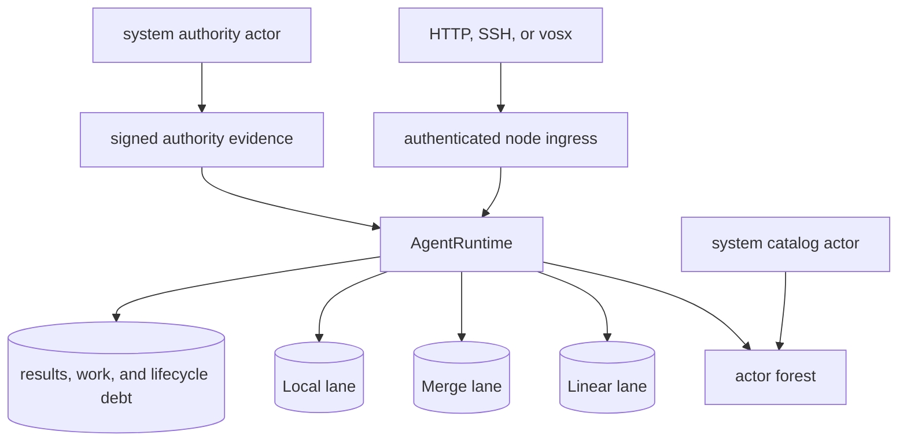

# Architecture

This page describes the Agent architecture and protocol contracts, not release
qualification across every profile. The current checkpoint qualifies a scoped
Local workflow. Ordinary Shared startup/finality, complete Private/Attested
lifecycle, post-bootstrap native backup/restore, and production scaling remain
acceptance gates. See [current saga status](agent-saga-status.md) for evidence
and remaining work, and [Operations](operations.md) for supported commands.

A VOS node belongs to one Space. Every Space contains a protected system
Agent with an authority actor and a catalog actor, plus any number of Local,
Shared, and Private Agents. An Agent is the durable unit of identity,
placement, replication, authorization, runtime selection, and resource
accounting. It may be empty.

## Identities

The protocol keeps three identities non-interchangeable:

| Identity | Meaning | Used for |
| --- | --- | --- |
| `PrincipalId` | person or durable application principal | ownership and roles |
| `NodeId` | exact machine transport identity | placement and replication |
| `CredentialId` | SSH key, token, or operator authenticator | authenticating a Principal |

Transport authentication compares the full `NodeId` derived from the
connection. Prefixes are display and routing hints only. Actor origins carry
the Principal and retain authenticated Node provenance separately; an SSH
credential never makes its client a replica.

`AgentId` is derived from the Space, creator Principal, and creation nonce.
It does not depend on the runtime or any installed actor. Names are mutable,
profile-separated aliases.

## Profiles

| Profile | Visibility and membership | Available lanes |
| --- | --- | --- |
| Local | one exact Node | Linear, Merge, Local |
| Shared | catalog-visible authorized replica set | Raft Linear, convergent Merge, per-replica Local |
| Private | one Principal's authorized Nodes; absent from catalog | encrypted Merge and Local |

All lanes in one Agent use the same authorized replica set. Shared Agents
default to all eligible Space replicas while retaining voter and observer
roles. A Private Agent rejects Linear actor schemas in this release.

## Runtime and actor boundary

The AgentRuntime is an admitted outer program; the bundled standard runtime is
one implementation of the public runtime contract. It owns actor discovery,
lifecycle, scheduling, state-lane projection, continuations, retained results,
and exactly-once acknowledgement. Actors execute through bounded inner
machines created and controlled by the runtime. At most 63 inner machines may
be live in one slice; a longer synchronous chain is captured as a continuation
and resumed later.

An actor package declares its ABI requirement, lane schemas, methods,
policies, Task dependencies, optional runtime capabilities, producer, and
signature. An AgentRuntime package declares the management ABI, supported
actor ABI range, lanes, optional capabilities, control schema, resource
limits, and migration policy. Both use the canonical signed `VOS3` envelope
with an explicit package kind.

The embedded standard runtime uses FIFO ready-work ordering, has no timer API,
and starts with `max_actors = 4096`. Custom runtimes implement the same
mandatory management ABI. Scheduling is an optional declared capability.

## State and methods

Field types determine state ownership:

- ordinary persisted fields are Linear;
- `crdt::*` fields are Merge;
- `#[state(local)]` fields are replica-local;
- `#[state(const)]` fields are immutable installation data;
- `#[state(skip)]` fields are derived and not persisted.

Method modes constrain access:

| Attribute | Allowed state |
| --- | --- |
| `#[msg(linear)]` | mutate Linear; read a pinned Merge frontier |
| `#[msg(merge)]` | read and mutate Merge only |
| `#[msg(local)]` | mutate Local; read immutable snapshots |
| `#[msg]` on `&self` | coherent replica-snapshot query |
| `#[msg(linearizable)]` | query after a Linear read barrier |

Generated views make forbidden cross-lane access fail during compilation.
The runtime independently checks every transition and rejects mutations
outside the declared lane. Linear work may emit durable exactly-once
`after_commit_merge` messages; those messages are intentionally not atomic
with the Linear commit.

## Lifecycle and durability

Managers can install, upgrade, suspend, resume, and remove actors, and upgrade
the runtime. Actors form a forest: managers install top-level actors and an
actor may spawn owned children. Removal is allowed only for a leaf with no
continuation, inbox, outbox, scheduled item, retained proof, unacknowledged
result, or other lifecycle debt.

Every accepted input and terminal result has a stable invocation identity.
Retries reproduce the same durable outcome; acknowledgement retires it only
after the caller has obtained the result. Same-Agent calls may run inline.
Cross-Agent calls use durable await, timeout, retry, and late-reply records.

## Authority

The authority actor issues signed evidence binding the policy and issuer,
Space and Agent, operation, runtime and actor deployments, package/proof
commitment, relevant lane commitments, logical epoch, and exact request hash.
Every replica verifies that evidence inside the AgentRuntime before applying a
transition. Denials remain local and never enter replicated state.

There is no actor-visible device-signing host interaction. A Local signer is
an ordinary explicit actor: a workflow first obtains a signature, then submits
and verifies it in a separate Shared operation.

## Private Agents

Each authorized owner Node has an X25519 key signed by its transport identity
and bound to the owner Principal by authority evidence. Creation generates
separate owner-signing, data-epoch, and offline-recovery keys. Owner and data
keys are sealed independently to each authorized Node.

Private packages, CRDT objects, indexes, snapshots, and backups are encrypted
with authenticated associated data binding the Space, Agent, epoch, object
kind, and content identity. Owner-signed control records form a monotonic
chain covering actor lifecycle, invitations, revocations, resource policy,
and key epochs. Revocation removes one exact Node and rotates the data key; it
protects future state but cannot erase already observed data. Offline recovery
can supersede divergent control heads and admit replacement Nodes.

Anti-entropy authenticates the peer before reading state, then exchanges
bounded chunks. Private Agents are never advertised by the shared catalog.

## Proofs

An attested transition binds the outer runtime and inner actor identities,
method and mode, exact `RuntimeWork`, exact transition, and before/after lane
commitments. Execution is tentative until the nested execution transcript is
proved, producer-signed, independently verified, and durably associated with
the transition. Producer-private witnesses stay in a node-local sidecar and
never enter replicated state or public proof records.
