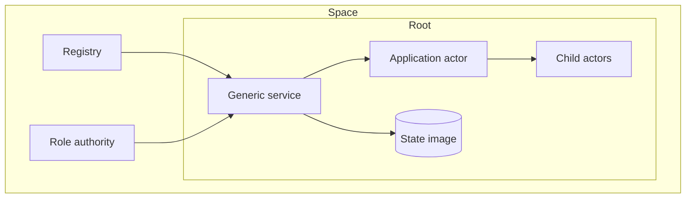

# Architecture

A space is an operator-controlled network. Its registry names packages,
actors, nodes, and grants. Each installed package creates a root service that
owns one actor tree and one durable state image.



## Request path

```mermaid
sequenceDiagram
    participant Client
    participant Node
    participant Service
    participant Actor
    participant Store
    Client->>Node: typed invocation
    Node->>Service: authenticated work
    Service->>Actor: private state + origin
    Actor-->>Service: reply + effects
    Service->>Store: validate and commit
    Service-->>Client: committed result
```

The host proposes work, but the generic service guest validates package
identity, method policy, credentials, causal state, effects, and transition
shape before state changes become durable.

## Consistency

| Mode | Use when | Commit rule |
| --- | --- | --- |
| Local | one operator owns the state | local durable commit |
| Raft | nodes need one total order | voter quorum |
| CRDT | nodes accept concurrent work | causal merge |

All modes execute the same package and actor API. Consistency changes how
accepted transitions are ordered and exchanged, not what an actor is.

## Content identity

Packages, programs, proofs, and state artifacts are content-addressed. Human
names are catalog labels. Durable work binds the exact hashes and deployment
identities it used, so a label change cannot silently change execution.
