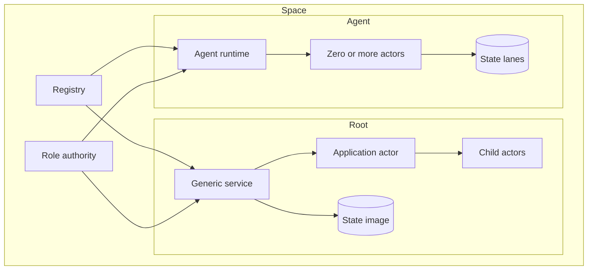
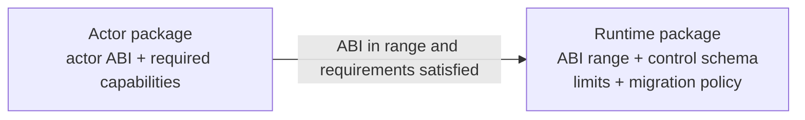

# Architecture

A space is an operator-controlled network. Its registry names packages,
actors, nodes, and grants. The production service path creates one root service
and actor tree per installed `VOSP` package. The agent foundation hosts many
actors inside one runtime and stores each actor's Linear, Merge, and Local
state separately; `VOSK` publication is the next node-integration boundary.



## Request path

```mermaid
sequenceDiagram
    participant Client
    participant Ingress as HTTP or SSH
    participant Node
    participant Service
    participant Actor
    participant Store
    Client->>Ingress: protocol request
    Ingress->>Node: authenticated subject + typed invocation
    Node->>Service: authenticated work
    Service->>Actor: private state + origin
    Actor-->>Service: reply + effects
    Service->>Store: validate and commit
    Service-->>Client: committed result
```

The host proposes work, but the guest runtime validates package identity,
method policy, credentials, state ownership, effects, and transition shape
before state changes become durable. The production diagram currently follows
the generic service path; the standard agent runtime applies the same rule to
its actor directory and state lanes.

Ingress adapters are node infrastructure. HTTP serves machine clients. SSH
serves the built-in semantic space application used by people. Both terminate
their protocol, enforce resource limits, authenticate a credential into a
stable member subject, and then submit ordinary actor work. Native extensions
instead serve bounded typed requests from actors; they do not own listeners.

## Consistency

| Mode | Use when | Commit rule |
| --- | --- | --- |
| Local | one operator owns the state | local durable commit |
| Raft | nodes need one total order | voter quorum |
| CRDT | nodes accept concurrent work | causal merge |

Service roots currently provide all three modes. The process-local agent
driver provides Local execution and fails closed for Shared/Private profiles
until their consensus and causal adapters land. Consistency changes how
accepted transitions are ordered and exchanged, not what an actor is.

## Content identity

Packages, programs, proofs, and state artifacts are content-addressed. Human
names are catalog labels. Durable work binds the exact hashes and deployment
identities it used, so a label change cannot silently change execution.

## Signed agent contracts

Actor packages and agent-runtime packages are independently signed. An actor
does not pin one runtime program; it declares the actor ABI and capabilities it
needs. A runtime declares an inclusive actor-ABI range, the canonical lifecycle
and control-schema identities it implements, resource ceilings, and its state
migration policy.



The standard runtime accepts the canonical actor ABI, supports a directory of
up to 4,096 actors, and implements no state-migration protocol. Actor count is
separate from the signed state-image byte ceiling: reaching either limit fails
closed. Unknown ABI ranges, control schemas, or migration policies are rejected
before installation.
