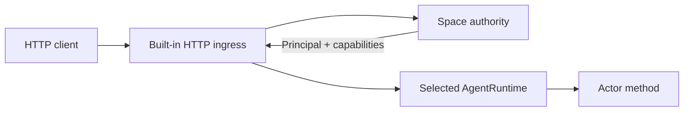

# HTTP ingress

HTTP ingress is optional node infrastructure, not an actor or extension. It
owns HTTP/TLS parsing and converts an authenticated request into a canonical
actor invocation.



## Configure a listener

Add a node-local listener to the space data directory's `local.toml`:

```toml
[[ingress.http]]
name = "public-api"
listen = "127.0.0.1:8080"
max_connections = 1024

# Optional; both fields are required together.
# tls_cert = "/etc/vos/api.crt"
# tls_key = "/etc/vos/api.key"
```

The listener is host-local. It is neither replicated nor advertised as an
actor. Compile embedders with `vos/http-ingress`; the standard `vosx` binary
already enables it.

## Authorization boundary

The listener requires credentials admitted by the clean Space authority. The
current `vosx` cutover does not issue, list, or revoke credentials, so merely
adding this listener to `local.toml` does not create usable production access.
Embedders may provision authority state through the typed host interfaces; a
public operator command returns only with the clean system bootstrap.

## Routes

### Clean invocation transport (saga branch)

`POST /__agents/prepare` accepts canonical `ATQ1` (binary content type) and
requires a live bearer credential with `agent.invoke`. The request selects
only Space/Agent/Actor and invocation intent. The live supervisor supplies the
installed generation, runtime/package identity, method policy and availability;
Private routes have no plaintext fallback. The binary `ATP1` response must be
decoded and checked with `AgentTargetedPreparationResponse::for_request` before
using its work. This binds the response to the exact target and intent, but is
not an independent host attestation, identity authentication for the intent,
or an Authority receipt. Preparing does not execute the requested method.

`POST /__agents/invoke` accepts an exact canonical `ASQ1` body with
`Content-Type: application/octet-stream`, bounded by the HTTP request limit.
Query parameters are rejected. The Space/Agent/Actor and installed generation
come from the envelope and must match the active clean supervisor route; there
is no legacy name-route fallback. The canonical work may carry the existing
tagged `Msg` actor payload; ASQ1 supplies the clean identity and authorization
boundary around it.

Authorization is in the envelope, not a bearer-header rewrite. Authority
receipts remain signature/policy-verified by the selected runtime. Unsigned
`PublicPreflight` requests must be anonymous, without principal, credential,
actor provenance, capability, or roles; the runtime must still resolve the
installed method policy as Public. HTTP never accepts transport-node claims.
Attested requests currently return 501 before dispatch because the generic
dispatcher cannot provide verified attested delivery yet.

A 200 binary response is canonical `ASR1`, bound to the exact request. Inspect
its runtime outcome: HTTP 200 does not itself mean actor success. On transport
failure or 503, retain the original bytes; do not assume execution did not
occur or generate a new invocation identity. The transport does not yet supply
fresh client preparation/receipt issuance or continuation/acknowledgement transport,
or the friendly JSON route below. A full live invocation/restart campaign is
still required before ordinary-agent testing is considered ready.

An already prepared Direct ASQ1 can be durably delivered with:

```sh
vosx space submit-agent-invocation /private/delivery-dir \
  --request call.asq1 --http 127.0.0.1:8080
vosx space submit-agent-invocation /private/delivery-dir --http 127.0.0.1:8080
```

Use a dedicated delivery directory beneath a mode-0700 parent. The command
publishes the immutable request before sending and holds its exclusive lease
through response persistence. Once retained, `--request` is ignored even if
its input file is missing. A saved, request-bound response is returned offline
on retry. Output is JSON containing the canonical response as hex and a
`delivery_retained` marker, not an actor-success assertion: errors and yielded
outcomes are also responses. Direct reply binding trusts the selected local
daemon; it is not a signed finality proof. The command does not generate
authorization or drive a yielded continuation.

### Existing name-based routes

| Route | Required authority |
| --- | --- |
| `GET /__status` | none |
| `GET /__schema`, `GET /__schema/<actor>` | `space.discover` |
| `GET /openapi.json` | `space.discover` |
| `GET /__metrics` | `space.metrics.read` |
| `/<agent>/<actor>/<method>` | `agent.invoke`, then the actor's method capability |

Queries use `GET` query parameters. Array query values use comma-separated
OpenAPI form encoding; byte values use hexadecimal text. Mutating methods use
a JSON object in a `POST`, `PUT`, or `PATCH` body and require an
`Idempotency-Key` header. Reusing the key with the same authenticated caller
recovers the original durable result; reusing it for different work is
rejected. Result recovery is stored independently from publication delivery,
so acknowledgement can retire outbox, proof, attestation, and exported-blob
transport state without losing the caller response or redriving its effects.
For Local and Shared Linear Agents, the recovery window is deliberately finite:
each Agent retains at most 256 keyed results and 16 MiB of response artifacts,
selecting the greatest canonical receipt sequence and invocation IDs. CRDT
Agents recover from their causal history instead. The fixed-size Linear index
lives in AgentRuntime state; response and proof bytes remain in a
content-addressed side store and travel separately during snapshot catch-up.
Authentication, queries, and calls without an idempotency key do not consume
this budget.
After each durable commit and on restart, the side store is reconciled against
the live pending-proof and keyed-result references; evicted response bytes are
removed from memory, disk, and subsequent backups.
Clients should reconcile old evicted operations through application state
rather than submit them under a new key.
The schema and OpenAPI endpoints describe the installed packages that the
listener can route locally. An attested method returns the decoded reply plus
the canonical public transition-proof record and its content-addressed proof;
producer-private witness bytes never cross ingress.
