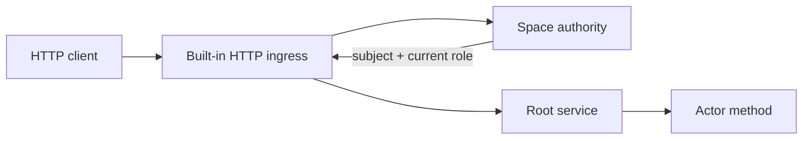

# HTTP ingress

HTTP ingress is optional node infrastructure, not an actor or extension. It
owns HTTP/TLS parsing and converts an authenticated request into a canonical
actor invocation.



## Configure a listener

Add a node-local listener to the space data directory's `local.toml`:

```toml
[[ingress.http]]
name = "public-api"
listen = "127.0.0.1:8080"
max_connections = 1024

# Optional; both fields are required together.
# tls_cert = "/etc/vos/api.crt"
# tls_key = "/etc/vos/api.key"
```

The listener is host-local. It is neither replicated nor advertised as an
actor. Compile embedders with `vos/http-ingress`; the standard `vosx` binary
already enables it.

## Issue access

An Admin can issue Member or Developer access. Only the immutable root
operator can issue Admin access.

```bash
TOKEN=$(vosx space access demo issue --role member --expires 24h)
vosx space access demo list
curl -H "Authorization: Bearer $TOKEN" http://127.0.0.1:8080/openapi.json
vosx space access demo revoke <credential-prefix>
```

The bearer secret is printed and durably written to the reported mode-0600
recovery file before the authority is asked to activate it. A lost CLI or
daemon response therefore cannot leave an active credential whose bearer is
unrecoverable. The authority stores only a
domain-separated credential identifier, its subject, role, expiry, issuer,
and revocation state. Every request asks the live authority, so revocation and
issuer-role changes take effect immediately.

## Routes

| Route | Required authority |
| --- | --- |
| `GET /__status` | none |
| `GET /__schema`, `GET /__schema/<actor>` | Member |
| `GET /openapi.json` | Member |
| `GET /__metrics` | Admin |
| `/<actor>/<method>` | Member, then the actor's method policy |

Queries use `GET` query parameters. Array query values use comma-separated
OpenAPI form encoding; byte values use hexadecimal text. Mutating methods use
a JSON object in a `POST`, `PUT`, or `PATCH` body and require an
`Idempotency-Key` header. Reusing the key with the same authenticated caller
recovers the original durable result; reusing it for different work is
rejected. The schema and OpenAPI endpoints describe the installed packages
that the listener can route locally. An attested method returns an object with
the decoded `reply` and `attestation_wire`, the hex form of the canonical
committed `RootTreeAttestedResult` wire.
