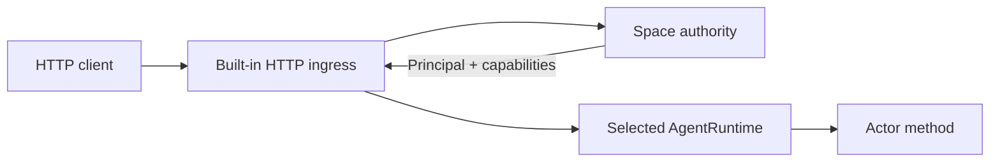

# HTTP ingress

HTTP ingress is optional node infrastructure, not an actor or extension. It
owns HTTP/TLS parsing and converts an authenticated request into a canonical
actor invocation.



## Configure a listener

Add a node-local listener to the space data directory's `local.toml`:

```toml
[[ingress.http]]
name = "public-api"
listen = "127.0.0.1:8080"
max_connections = 1024

# Optional; both fields are required together.
# tls_cert = "/etc/vos/api.crt"
# tls_key = "/etc/vos/api.key"
```

The listener is host-local. It is neither replicated nor advertised as an
actor. Compile embedders with `vos/http-ingress`; the standard `vosx` binary
already enables it.

## Authorization boundary

The listener requires credentials admitted by the clean Space authority. The
current `vosx` cutover does not issue, list, or revoke credentials, so merely
adding this listener to `local.toml` does not create usable production access.
Embedders may provision authority state through the typed host interfaces; a
public operator command returns only with the clean system bootstrap.

## Routes

### Operation authorization

`POST /__agents/prepare-authorization` accepts canonical signed `AOC5` as
`application/octet-stream`. API signatures are checked before queue admission;
transport-node claims are rejected. It shares the four-entry lifecycle queue.
HTTP 200 returns canonical `AOQ1` only after native dispatch retention, with the
host-captured observation slot also selected as issuance time. This is preparation,
not policy approval, issuance or admission release. Retry the identical retained
AOC5 after 503/504; never generate a replacement call to recover an unknown outcome.

`POST /__agents/authorize` accepts `application/octet-stream` containing canonical
`AOQ1`: the signed operation call, exact authorization context and issuance slot.
It authenticates the embedded call and rejects transport-node claims over HTTP.
The existing bounded lifecycle queue processes the request; acceptance alone is
not durable completion.

HTTP 200 contains a request-bound signed `AOR1` decision, either issued evidence
or a terminal denial. Clients must verify the payload against their retained
request, not interpret HTTP 200 as approval or actor execution. HTTP 503/504
does not prove non-execution; retry the identical request. The server's existing
120-second wait does not cancel accepted work.

For an already prepared and signed AOQ1 file:

```sh
vosx space submit-agent-authorization /private/authorization-dir \
  --request authorization.aoq1 --http 127.0.0.1:8080
vosx space submit-agent-authorization /private/authorization-dir \
  --http 127.0.0.1:8080
```

The CLI retains the first request before HTTP delivery and the verified response
before reporting a decision. Later input is ignored; a saved decision is verified
locally without sending another request. Output includes `decision: issued` or
`decision: denied`, canonical response bytes, and `applied: false`. Delivery is
loopback-only, with no proxies or redirects. This command does not yet prepare or
sign a fresh operation, apply it to an actor, or prove application retirement.

The development-only managed authorization interface accepts an exact **ATQ1**
intent rather than a pre-signed AOQ1:

```sh
vosx space authorize-local-invocation my-space --intent invocation.atq1
vosx space authorize-local-invocation my-space --resume
```

ATQ1 must already contain a stable nonzero invocation ID, full target and selected
operator principal/API credential origin. The command discovers the Local Agent,
retains physical preparation, signs in the operation sequence domain, and retains
the AOC5 before host-clock preparation. It verifies and retains the returned AOQ1
before authorization delivery. The host clock cannot precede the retained actor
observation. Once AOC5 exists, preparation retry skips discovery and signing;
once AOQ1 exists, authorization retry skips host preparation too. Existing AOQ1
is never rebased, including requests saved by the earlier client-clock path.
It supports operator-owned Local Agents of this node,
not ordinary Shared finality or actor/transport impersonation. `--resume` never
reads a new intent file. Retrying the same invocation ID uses any already retained
intent and signed authorization; it does not replace their content.

The credential-wide reservation remains pending on delivery errors **and on
issuance**. Only a verified retained signed denial releases it here. Output is
explicitly `applied: false`. Issuance now also retains the exact receipt-bearing
ASQ1 under the operation's `application/` child, after verifying that the retained
ATQ1/ATP1 work matches the signed AOQ1/AOR1. Missing preparation or conflicting
application state fails closed without replacing retained data. It is not sent
to the actor by this command; an issued result still needs protected application
and retirement. Do not treat this authorization-only command as a usable
end-to-end production invocation or delete its reservation to bypass pending work.

The managed invocation command uses the same intent/reservation and then performs
delivery, continuation and positive acknowledgement:

```sh
vosx space invoke-local my-space --intent invocation.atq1
vosx space invoke-local my-space --resume
```

It can resume an issued `authorize-local-invocation` operation. Every application
or continuation request is retained before HTTP. Transport failure, yield,
missing response and failed acknowledgement leave the credential pending. Only
the verified, synchronized positive acknowledgement of that exact receipt-bearing
invocation completes it. Completion is idempotent after reopen.

Successful retirement reports `delivery_retired: true` and
`reservation_pending: false`, **not actor success**: a completed actor error can
also be positively retired. This client path has protocol/loopback tests, not yet
a live protected mutation/restart campaign. Production latency remains blocking.

### Invocation and application routes

### Clean invocation transport (saga branch)

`POST /__agents/prepare` accepts canonical `ATQ1` (binary content type) and
requires a live enrolled API bearer credential, resolved by a freshly signed
query to the attached clean Authority. It uses clean non-Private inventory
visibility, not legacy `agent.invoke` capability mapping. The request selects
only Space/Agent/Actor and invocation intent. The live supervisor supplies the
installed generation, runtime/package identity, method policy and availability;
Private routes have no plaintext fallback. The binary `ATP1` response must be
decoded and checked with `AgentTargetedPreparationResponse::for_request` before
using its work. This binds the response to the exact target and intent, but is
not an independent host attestation, identity authentication for the intent,
or an Authority receipt. Preparing does not execute the requested method.

`POST /__agents/invoke` accepts an exact canonical `ASQ1` body with
`Content-Type: application/octet-stream`, bounded by the HTTP request limit.
Query parameters are rejected. The Space/Agent/Actor and installed generation
come from the envelope and must match the active clean supervisor route; there
is no legacy name-route fallback. The canonical work may carry the existing
tagged `Msg` actor payload; ASQ1 supplies the clean identity and authorization
boundary around it.

Authorization is in the envelope, not a bearer-header rewrite. Authority
receipts remain signature/policy-verified by the selected runtime. Unsigned
`PublicPreflight` requests must be anonymous, without principal, credential,
actor provenance, capability, or roles; the runtime must still resolve the
installed method policy as Public. HTTP never accepts transport-node claims.
Attested requests currently return 501 before dispatch because the generic
dispatcher cannot provide verified attested delivery yet.

A 200 binary response is canonical `ASR1`, bound to the exact request. Inspect
its runtime outcome: HTTP 200 does not itself mean actor success. On transport
failure or 503, retain the original bytes; do not assume execution did not
occur or generate a new invocation identity. The transport does not yet supply
fresh client preparation/receipt issuance,
or the friendly JSON route below. A full live invocation/restart campaign is
still required before ordinary-agent testing is considered ready.

An already prepared Direct ASQ1 can be durably delivered with:

```sh
vosx space submit-agent-invocation /private/delivery-dir \
  --request call.asq1 --http 127.0.0.1:8080
vosx space submit-agent-invocation /private/delivery-dir --http 127.0.0.1:8080
```

Use a dedicated delivery directory beneath a mode-0700 parent. The command
publishes the immutable request before sending and holds its exclusive lease
through response persistence. Once retained, `--request` is ignored even if
its input file is missing. A saved, request-bound response is returned offline
on retry. Output is JSON containing the canonical response as hex and a
`delivery_retained` marker, not an actor-success assertion: errors and yielded
outcomes are also responses. Direct reply binding trusts the selected local
daemon; it is not a signed finality proof. The command does not generate
authorization or drive a yielded continuation.

The same binary, Direct-only transport also exposes continuation and delivery
retirement:

| Endpoint | Request | Response |
| --- | --- | --- |
| `/__agents/invoke` | ASQ1 | ASR1 |
| `/__agents/resume` | ARQ3 | ARR3 |
| `/__agents/acknowledge` | AAQ3 | AAR3 |

Each endpoint rejects frames from the other operation domains. Resume carries
the original work/authorization and exact yielded selector; the physical host
reconstructs continuation work from its durable FIFO. Acknowledgement retires
delivery for the original invocation, not a new actor call. All three preserve
the same anonymous-Public/receipt boundary, exact live route checks, bounded
framing and request-bound responses. An HTTP error does not prove non-execution
or non-retirement. Native terminal Public-query retirement and exact HTTP
acknowledgement retries pass before and after restart on disposable Local
state. Native guest yield/resume and protected mutation remain unverified;
this is not a full ordinary-agent readiness pass.

After retaining initial delivery, continue it with:

```sh
vosx space continue-agent-invocation /private/delivery-dir --http 127.0.0.1:8080
```

The command derives each resume from the saved yielded selector and original
work/authorization. It saves the exact step before sending, persists only a
matching reply, and finally acknowledges terminal delivery. Repeating the
command resumes an interrupted pending step; a saved successful acknowledgement
returns offline. `delivery_retired: true` confirms delivery retirement, not
actor success. A negative acknowledgement is retained and reported as failure.

The same exclusive store lease protects the entire workflow. `invocation.progress`
is a CSF1-protected, canonical CIP1 JSON history with hex-encoded protocol frames,
bounded to 64 exchanges and 64 MiB. Only appending a pending request or filling
its response is allowed; predecessors cannot be rewritten. At capacity the
command preserves history and stops without silently discarding evidence.

### Existing name-based routes

| Route | Required authority |
| --- | --- |
| `GET /__status` | none |
| `GET /__schema`, `GET /__schema/<actor>` | `space.discover` |
| `GET /openapi.json` | `space.discover` |
| `GET /__metrics` | `space.metrics.read` |
| `/<agent>/<actor>/<method>` | `agent.invoke`, then the actor's method capability |

Queries use `GET` query parameters. Array query values use comma-separated
OpenAPI form encoding; byte values use hexadecimal text. Mutating methods use
a JSON object in a `POST`, `PUT`, or `PATCH` body and require an
`Idempotency-Key` header. Reusing the key with the same authenticated caller
recovers the original durable result; reusing it for different work is
rejected. Result recovery is stored independently from publication delivery,
so acknowledgement can retire outbox, proof, attestation, and exported-blob
transport state without losing the caller response or redriving its effects.
For Local and Shared Linear Agents, the recovery window is deliberately finite:
each Agent retains at most 256 keyed results and 16 MiB of response artifacts,
selecting the greatest canonical receipt sequence and invocation IDs. CRDT
Agents recover from their causal history instead. The fixed-size Linear index
lives in AgentRuntime state; response and proof bytes remain in a
content-addressed side store and travel separately during snapshot catch-up.
Authentication, queries, and calls without an idempotency key do not consume
this budget.
After each durable commit and on restart, the side store is reconciled against
the live pending-proof and keyed-result references; evicted response bytes are
removed from memory, disk, and subsequent backups.
Clients should reconcile old evicted operations through application state
rather than submit them under a new key.
The schema and OpenAPI endpoints describe the installed packages that the
listener can route locally. An attested method returns the decoded reply plus
the canonical public transition-proof record and its content-addressed proof;
producer-private witness bytes never cross ingress.
