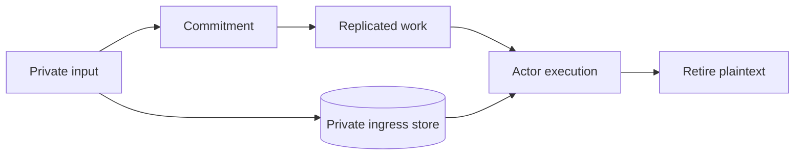

# Authority and privacy

VOS separates four kinds of trust:

1. Network identity authenticates the peer connection.
2. The space authority assigns editable capability roles to stable members.
3. Actor policy names the exact capability required by each method.
4. Proof verification decides whether an attested result is acceptable.

The node transports evidence. The installed AgentRuntime binds accepted
evidence to the exact Agent, runtime and actor deployments, programs, method,
invocation, and logical time.

## Ingress identity

Built-in protocol adapters authenticate protocol credentials into a canonical
`PrincipalId`. One Principal may have several HTTP bearer tokens and SSH
public keys. Roles belong to the Principal, not the device, so adding a laptop
does not copy authority into another policy row. The node checks the live
authority before every request; revocation and role changes therefore affect
the next operation. Bearer secrets and SSH private keys never become actor
arguments or replicated state.

Roles have a stable ID, a name, a numeric power, and a set of stable capability
names. A Principal may hold several roles; effective power is the maximum and
effective authority is the union of their capabilities. Delegation is
strictly downward: a Principal can grant only lower-power roles whose
capabilities are a subset of their own. Recovery authority is separately
provisioned and is never inferred from a Node or ordinary login credential.

The default catalogue is editable:

| Role | Power | Intended scope |
| --- | ---: | --- |
| Guest | 0 | discover public space and agent information |
| Member | 100 | invoke ordinary Agents |
| Developer | 200 | create Local agents |
| Admin | 300 | manage Principals, Nodes, roles, credentials, and Shared Agents |

Actor packages declare capabilities directly, for example
`#[msg(capability = "ledger.transfer")]`. Actor-local roles remain a separate
mechanism for authority defined by one actor's own state.

## Private ingress

Some calls contain input that must not enter Raft logs, CRDT history, Agent
state snapshots, or actor state. The public work record carries only a commitment.
The plaintext is stored in a host-owned private ingress store until execution.

For Raft, every voter must durably acknowledge the same committed plaintext
before admission can commit. Lifecycle metadata distinguishes staged,
admitted, and terminal data so restart reconciliation retains only work that
can still execute.

## Shared application durability

A Shared Agent binds its Raft application log, deterministic disposition
audit, replica generation, and guest journal to one stable Agent generation.
Every physical Raft entry is covered, including leader no-ops and membership
changes. Application and its audit cursor advance atomically. Restart rejects
gaps, foreign-generation rows, unauthenticated commands, and membership changes
without the matching authority decision.

## Proof material

Public claims, receipts, and proof references may replicate. Secret witnesses
remain in a producer-owned store. Snapshots carry only artifacts required to
recover pending public work, and production Agent hosts verify those artifacts
before exposing a route.

## Production trust

A production node uses an operator-configured verifier for packages,
credentials, receipts, proofs, and logical time. The selected policy identity
is bound into Agent configuration and replicated state; a voter with a
different policy cannot join or replay the Agent.
