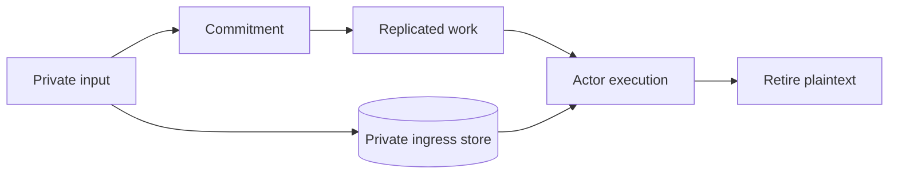

# Authority and privacy

VOS separates four kinds of trust:

1. Network identity authenticates the peer connection.
2. The space authority assigns space roles.
3. Actor policy decides which role may call each method.
4. Proof verification decides whether an attested result is acceptable.

The node transports evidence. The generic service guest binds accepted
evidence to the exact service, actor, deployment, program, method, invocation,
and logical time.

## Private ingress

Some calls contain input that must not enter Raft logs, CRDT history, service
snapshots, or actor state. The public work record carries only a commitment.
The plaintext is stored in a root-owned private ingress store until execution.

For Raft, every voter must durably acknowledge the same committed plaintext
before admission can commit. Lifecycle metadata distinguishes staged,
admitted, and terminal data so restart reconciliation retains only work that
can still execute.

## Proof material

Public claims, receipts, and proof references may replicate. Secret witnesses
remain in a producer-owned store. Snapshots carry only artifacts required to
recover pending public work, and production roots verify those artifacts
before exposing a route.

## Production trust

A production node uses an operator-configured verifier for packages,
credentials, receipts, proofs, and logical time. The selected policy identity
is bound into root configuration and replicated state; a voter with a
different policy cannot join or replay the root.
