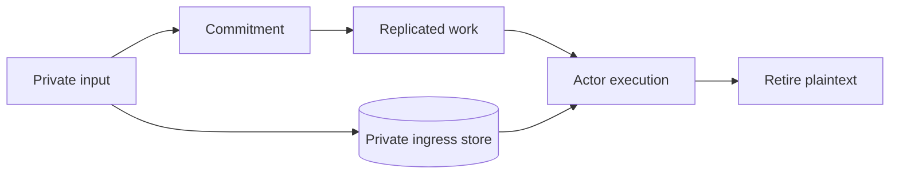

# Authority and privacy

VOS separates four kinds of trust:

1. Network identity authenticates the peer connection.
2. The space authority assigns editable capability roles to stable members.
3. Actor policy names the exact capability required by each method.
4. Proof verification decides whether an attested result is acceptable.

The node transports evidence. The generic service guest binds accepted
evidence to the exact service, actor, deployment, program, method, invocation,
and logical time.

## Ingress identity

Built-in protocol adapters authenticate protocol credentials into a canonical
`SubjectId`. One member may have several HTTP bearer tokens and SSH public
keys. Roles belong to the member, not the device, so adding a laptop does not
copy authority into another policy row. The node checks the live authority
before every request; revocation and role changes therefore affect the next
operation. Bearer secrets and SSH private keys never become actor arguments or
replicated state.

Roles have a stable ID, a name, a numeric power, and a set of stable capability
names. A member may hold several roles; effective power is the maximum and
effective authority is the union of their capabilities. Delegation is
strictly downward: a member can grant only lower-power roles whose capabilities
are a subset of their own. The immutable space root is the recovery authority.

The default catalogue is editable:

| Role | Power | Intended scope |
| --- | ---: | --- |
| Guest | 0 | discover public space and agent information |
| Member | 100 | invoke ordinary agents |
| Developer | 200 | create Local agents |
| Admin | 300 | manage members, roles, credentials, and shared agents |

Actor packages declare capabilities directly, for example
`#[msg(capability = "ledger.transfer")]`. Actor-local roles remain a separate
mechanism for authority defined by one actor's own state.

## Private ingress

Some calls contain input that must not enter Raft logs, CRDT history, service
snapshots, or actor state. The public work record carries only a commitment.
The plaintext is stored in a root-owned private ingress store until execution.

For Raft, every voter must durably acknowledge the same committed plaintext
before admission can commit. Lifecycle metadata distinguishes staged,
admitted, and terminal data so restart reconciliation retains only work that
can still execute.

## Shared Raft application format

The clean-generation Shared application ledger uses only the V2 redb tables
`agent_shared_raft_application_config_v2`,
`agent_shared_raft_apply_meta_v2`, and
`agent_shared_raft_apply_audit_v2`. Their canonical records use the `AGC2`,
`AGM2`, and `AGA2` tags; dispositions use `AGD2`. A database is bound to
exactly one stable Agent generation and journal-store instance. Any V1 Shared
evidence table, foreign V2 generation row, extra cursor row, or audit row
outside the bound generation prefix makes open/recovery fail closed.

The audit cursor covers every physical Raft index, including leader no-ops and
membership entries. Each row binds index, term, the commitment of the complete
encoded Raft entry kind, and the deterministic disposition. Advancing that
row, its cursor, and Raft `last_applied` is one redb transaction. Restart
requires a consecutive, nondecreasing-term audit chain and the exact retained
Raft rows. This first V2 slice has no snapshot format, so it refuses a compacted
prefix; it also refuses Shared commands without an execution receipt and every
membership change without a later committee-transition authorization.

## Proof material

Public claims, receipts, and proof references may replicate. Secret witnesses
remain in a producer-owned store. Snapshots carry only artifacts required to
recover pending public work, and production roots verify those artifacts
before exposing a route.

## Production trust

A production node uses an operator-configured verifier for packages,
credentials, receipts, proofs, and logical time. The selected policy identity
is bound into root configuration and replicated state; a voter with a
different policy cannot join or replay the root.
