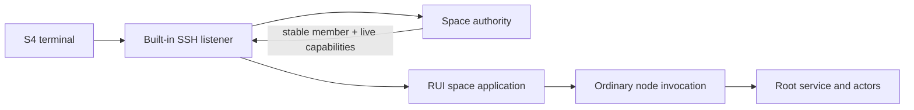

# SSH space shell

SSH ingress is an optional listener built into the node. It serves the S4
semantic terminal application: members can inspect the space, edit capability
roles, manage member assignments, browse packages and agents, and invoke
no-argument actor methods.



## Configure

Add a listener to the node-local `<space-data>/local.toml`:

```toml
[[ingress.ssh]]
name = "space-shell"
listen = "127.0.0.1:2222"
max_connections = 128
max_sessions_per_member = 4
```

The standard `vosx` binary enables SSH ingress. Library embedders enable the
`vos/ssh-ingress` feature.

The first start creates
`<space-data>/private/ssh/<name>/host_ed25519` atomically with mode `0600`.
The host key is per node and included in an offline whole-space backup. It is
not the node's network identity and not a certificate authority. Symlinks,
non-regular files, and insecure existing modes are rejected.

## Authorize a key

```bash
vosx space access demo issue-ssh ~/.ssh/id_ed25519.pub --expires 30d
s4 127.0.0.1:2222
```

The public key is one credential for the caller's stable member subject. An
administrator can add a device for another member with `--subject <hex>`.
Several keys and bearer tokens may name the same member; connection and
session quotas are charged to that member, not evaded by rotating keys.

Every host-service action revalidates the exact key credential and stable
member against the live authority. Revoking the key or changing any role in
its delegation chain affects the next operation. Durable mutations require an
operation key. Retrying the same member, target, and key recovers the exact
committed result; reusing a key for different work is rejected.

Attested methods return a structured S4 result containing the rendered actor
reply and the complete canonical `VARW` attestation wire. The built-in terminal
prints that wire as hex so the proof package is never silently discarded.

Once a root accepts an invocation, the shell waits for its terminal result and
does not apply S4's ordinary 30-second host-service timeout. Accepted work
cannot be safely cancelled and may commit after the SSH session disconnects;
the listener's bounded execution pool limits concurrent accepted operations.

The current built-in routes are:

| Route | Purpose | Minimum capability |
| --- | --- | --- |
| `/` | session and authority summary | `space.discover` |
| `/members` | enrolled-node/member roster | `space.members.manage` |
| `/roles` | list/edit roles and assignments | discover; management actions require the matching management capability |
| `/catalog` | published packages | `agent.discover` |
| `/agents` | installed agents | `agent.discover` |
| `/agents/<name>` | schema and no-argument invocation | `agent.discover`; invocation requires `agent.invoke` and package policy |

The UI session may resume on the same running node. It is intentionally not
durable or replicated; reconnecting after restart or to another node creates a
fresh view over durable space state. Social applications and actor-defined RUI
surfaces belong in ordinary signed packages and are not hidden state in the
listener.
